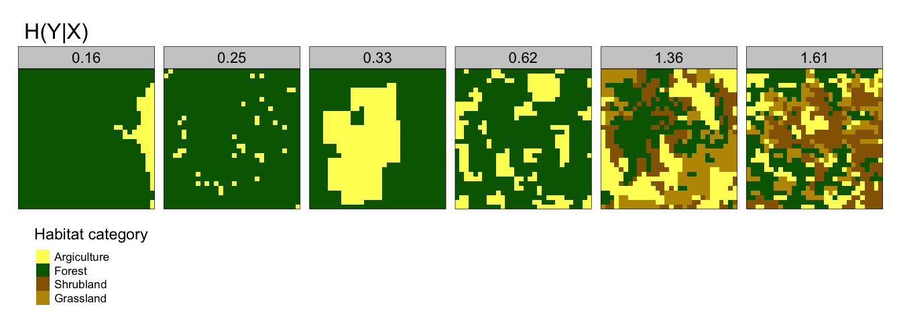
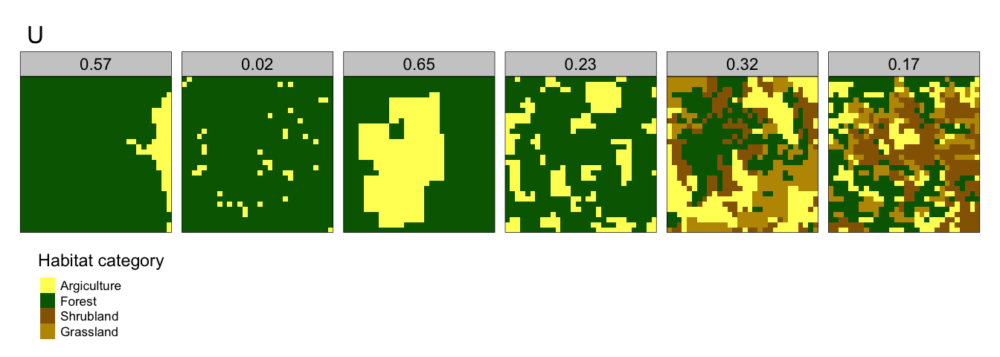

# Materials and Methods

## Study site

The Shetland archipelago (see Section \@ref(shetland) was used as the study area. The remote islands of Foula and Fair Isle were removed from the study area inorder to reduce computational performance when generating results.

## Shetland Breeding Bird Survey

The Shetland Breeding Bird Survey (BBS) is a citizen science project that is overseen by the Shetland Biological Records Centre (ref), the primary objective of which is to  assess the population trends Shetlands more common breeding song birds and waders. The survey has been ongoing since 2002, where 36 local volunteers surveyed a total of 49 1km Ordnance Survey 1km$^2$ squares. It is important to note that to encourage volunteer uptake, these squares are not randomly allocated in space; typically the location of the survey is selected by the volunteer. There are 3992 1km squares that cover the Shetland archipelago; excluding Fair Isle and Foula. A significant proportion of these squares only partially cover the landscape, hence why there are 3992 1km squares to cover the 1,466 km$^2$ area of Shetland.

When under taking the Shetland BBS volunteers walk either a 2km transect around their chosen square, or two 1km transects that bisect the square. All breeding bird species observed 100m either side of the transect are recorded by the volunteer. All transects were walked twice, typically April to mid-May and mid-May to late June. All surveys were undertaken before 9am and in good weather (wind force four or less, and dry). The annual abundance recorded for each breeding species within a given square is the maximum count from the two separate visits. Upto 2019 there have been 139 different OS 1km squares surveyed as part of the SBBS. Although the survey runs every year, not all 139 survey squares have been covered annually. Since 2002, new squares have been introduced over the years, some are no longer covered, and there are some gaps when volunteers have been unable to carry out surveys.

<!--
The RSPB have undertaken annual field based surveys across a number of well-known Shetland breeding wader sites since 1987 [@Campbell1]. The initial survey covered 33,000 ha or 293 sites of *in-by* land; this is land that is lowland rough grassland, and is typically not farmed intensively. From the 1987 survey, 6900 ha or 122 sites were identified. The survey data used in this study was recorded between 2013 and 2018 and are taken from up-to 29 sites, a subset of the original 1987 sites. The survey method [@OBrien1998-iy] required observers to walk to within 100m of every part of the survey site and to complete their survey between dawn and 12:00 hours. Three visits were made, one in each of the periods 15 April-30 April, 1 May-21 May and 22 May-18 June. Successive visits were separated by at least a week. Cold, wet or windy weather conditions were avoided. Each wader observed was recorded against a specific field. The method for calculating the breeding wader abundance recorded was species specific: Lapwing, Oystercatcher and Redshank abundance was recorded as the total numbers of birds seen in each field; Snipe—the number of drumming plus chipping birds in each field; for Curlew the mean count of individual Curlew (MNI) over three standard survey visits to each site was calculated, and the numbers of nesting pairs was calculated as 0.71 MNI + 0.10 [@Grant2000-ns]. -->

## Estimating detectability

The Shetland BBS assumes perfect detectability of the survey species. Due to the imprecise nature of field surveys this could result in a bias in species detectability, which could further result in inaccurate population estimates. To account for this bias, there are a number of more sophisticated survey techniques such as *distance sampling* that account for this, in order to reduce the standard error associated with a population estimate [@Newson2008-oq]. Such techniques typically require more structured survey techniques such as precisely measuring the distance and angle, between the target species and the transect line. Unfortunately this data was not available for the two survey datasets used within the study. In-order to generate a probability of detection, and therefore account for detectability bias, the `r` package `unmarked` [@Fiske2011-xf] was used to generate a probability of detection for each species. Unmarked adopts a generative modelling process whereby observations are modelled through a combination of (1) a state process determining abundance  at each site and (2) a detection process that yields observations conditional on the state process. Probability of detection (detectability) was modelled using `unmarked` for each species by using count data across multiple sites and years, using day of year as a covariate. An average was then taken across years to give an average detectability for each species.

## Exploratory Data Analysis

An exploratory data analysis (EDA) was undertaken on the Shetland BBS dataset as per the protocol outlined in Zuur [@Zuur2010-kp]. Applying basic EDA tests and visualisation techniques on to the survey count data helps to avoid rejection of a true null hypothesis, or type I error, or non-rejection of a false null hypothesis, a type II error. This analysis was also used to help formulate the survey hypotheses as set out in Section \@ref(hypothesis). The scope of the EDA undertaken comprised the following:

1. The survey effort (the number of surveys undertaken for a given 1km square) were plotted spatially in order to gauge survey effort, across the 139 different 1km squares that were surveyed between 2002 and 2019
3. Visualisation of the status of population change of each 1km square surveyed between 2002 and 2019 was undertaken, by species. This provides a simple overview of any significant population trends overtime.
3. A cleveland dot-plot was generated for the count data of each species, in-order to spot any outliers.
4. The count data were tested for normality, Poisson distribution fit and zero inflation. This enables the correct error distribution to be selected when selecting a suitable configuration for fitting regression model.
5. Homogeneity of variance was tested as this is an important assumption in certain regression model techniques.
6. As volunteers select the 1km square they want to survey, it is probable that the overall survey will be biased towards habitat that is easily accessible by volunteers. To assess the degree of any bias for grassland, heathland and bog habitats a bootstrap of habitat coverage was undertaken across the surveyed squares and compared to a bootstrap across all (n=3992) 1km squares across Shetland.

## Environmental covariates

Environmental covariates were generated with values spatially assigned to each Ordnance Survey (OS) 1km square (n=3992). The set of environmental covariates were also spatially joined to the Shetland BBS survey data. The spatial extent of the covariate grid excluded the remote islands of Foula and Fair Isle in order to reduce computational time when fitting spatial abundance models. The sub-sections below detal the environmental covariates that were generated for each of the 1km squares across Shetland.

### EUNIS habitat classification raster

The EUNIS habitat classification is a European wide system for habitat classification [@Eunis2019-dy]. EUNIS classification habitat data for all of Scotland is available as a `raster` [@raster]; a data format used to store spatial data. For the purposes of EUNIS classification, a ‘habitat’ is defined as: 

> *‘a place where plants or animals normally live, characterized primarily by its physical features (topography, plant or animal physiognomy, soil characteristics, climate, water quality etc.) and secondarily by the species of plants and animals that live there’* 

Each habitat type is identified by a specific code that is hierarchical and comprises three levels. For the purpose of this study the level 1 classification was used so as not to over-disperse the response variable (breeding wader abundance). The EUNIS dataset is available as a categorical GeoTiff file, at a resolution of 10x10m, and the level 1 EUNIS categorisation is shown in Table \@ref(tab:eunisTable). 

Table: (\#tab:eunisTable)EUNIS Level 1 habiat classificaiton

L1 Classification   Habitat Description                                                                
------------------  -----------------------------------------------------------------------------------
A                   Marine habitats                                                                    
B                   Coastal habitats                                                                   
C                   Inland surface waters                                                              
D                   Mires, bogs and fens                                                               
E                   Grasslands and lands dominated by forbs, mosses or lichens                         
F                   Heathland, scrub and tundra                                                        
G                   Woodland, forest and other wooded land                                             
H                   Inland unvegetated or sparsely vegetated habitats                                  
I                   Regularly or recently cultivated agricultural, horticultural and domestic habitats 
J                   Constructed, industrial and other artificial habitats                              
K                   Montane habitats                                                                   
X                   Habitat complexes                                                                  

A `raster` file containing the EUNIS habitat classification for Scotland in 2019 was cropped to the extent of the Shetland archipelago, and the percentage coverage of habitat classes *D, E and F* (bog, grassland and heathland) were calculated for each 1km square (n=3992). Wader breeding sites are assumed to be predominantly within D, E and F habitats.

### Improved grassland

Across Shetland crofters have *improved* parcels of low-lying grassland in-order to take an annual crop of haylage or silage. It is typically used as fodder for sheep and cattle during the long winter season. This habitat is an important environmental covariate for studying breeding waders, as it has been suggested that improved grasslands are an important feeding habitat for nesting waders and their chicks [@McCallum2018-gx]. Improved grassland is not a specific category within the EUNIS habitat classification, rather it is included within Grasslands class (E), which also covers unimproved and rough grasslands. Consequently remotely sensed satellite image data were used together with supervised machine learning techniques [@Abdi2020-aa] to generate a spatial classification for Shetland improved grassland. 
 
A Sentinel-2 satellite image of the Shetland archipelago, comprising 11 different spectral bands [@sentinel-ovr] , was used to produce an improved grassland raster layer. This was achieved by using the `r` programming language [@R-lang] to train both a support vector machine (SVM) and extreme gradient boosting (XGBoost) machine learning algorithms. The algorithms used in conjunction with the `tidymodels` package [@tidymodels] to classify each raster cell, according to the spectral band values within it. Training datasets comprising polygons were created across five different habitat classes: improved grassland, unimproved grassland, upland, bare peat and crops. 1000 spatial samples were randomly drawn from each class training dataset; a sample comprising a value for each of the 11 spectral bands, for the specific sample location. The aggregate training dataset , comprising 5000 samples, was then split into training and testing data. The training data was subsequently resampled using 5-Fold cross-validation in order to reduce variability of the model classification. The hyperparameters of a radial basis SVM were tuned and the best model was selected based on an accuracy metric validated against the test data split. The model fit was then used to make a prediction for improved grassland over the entire Shetland archipelago.

### Median topsoil pH content

A shape file detailing the median topsoil pH content across Shetland was provided by the James Hutton Institute. A higher soil pH has been shown to be associated with greater earthworm abundance [McCallum2016-jt], which is one of the main food sources of breeding farmland waders and their chicks. The weighted median pH was calculated for each SBBS OS 1km square at a resolution of 10m x 10m, using the `spatial features` package [@spatial-features] within `r`.

### Topsoil organic carbon content

A shape file containing the topsoil organic carbon content (by percentage of overall weight) was downloaded from the James Hutton Institue [@Lilly_A_and_Baggaley_N_and_Donnelly_D2012-tq]. The topsoil of grasslands store significant amount of Carbon [@Eze2018-pd] through the accumulation of organic matter. Therefore fertile grasslands favoured by waders may have significant carbon stored within the topsoil, whilst grassland that is heavily grazed by livestock may have relatively low carbon storage.The mean topsoil organic carbon content was calculated for each SBBS OS 1km square at a resolution of 10m x 10m, using the `spatial features` package [@spatial-features] within `r`.

### Available water capacity

Available water capacity (AWC) is the amount of water a soil can provide for plants, and so is a useful indicator of the ability of soils to grow crops. The amount of moisture in the soil is thought to be an important aspect of wader abundance [@Smart2006-dt]. A shape file detailing the AWC across Shetland was downloaded from the James Hutton Institute [@Gagkas_Z_Lilly_A_Baggaley_N_Donnelly_D2019-pv], and the mean AWC across each SBBS 1km square was calculated at a resolution of 10m x 10m, using the `spatial features` package [@spatial-features] within `r`.

### Bare peatland

Shetland has a significant amount of degraded peatland, due to natural wind and water erosion, worsened by past land management practices such as overgrazing and damaging methods of peat cutting for use as fuel. It is expected that the resulting bare peat is negatively associated with breeding waders. Scottish Natural Heritage have produced a shapefile of bare peat, at a resolution of 10x10m [@Blake2020-zj]. The percentage cover of bare peat for each SBBS 1km square was calculated, using the `spatial features` package [@spatial-features] within `r`.

### Distance to sea

Proximity of breeding wader territory to the coast as in-land breeding sites could be more sheltered from Shetland's maritime weather. For each SBBS 1km square the mean distance to the coast was calculated using a raster for the Shetland landmass.

### Elevation

The `r` package `elevatr` [@elevatr] was used to generate a mean elevation above sea level for each SBBS 1km square.  

## Bootstrap analysis of SBBS survey squares

As SBBS survey volunteers were able to choose which squares  to survey, they are not randomly allocated. As such this may not be a true representation of the distribution of habitat types across Shetland. In order to analyse any potential bias in the habitat types surveyed, a bootstrap analysis was performed across all OS 1km squares, using the EUNIS habitat categorisation. This was then compared against a bootstrap of surveyed 1km squares from a single SBBS survey year (2018). This provides a quantification of how biased survey samples are with respect to the overall Shetland landmass.

## Wader food response

## Breeding wader density response to environmental covariates

To investigate how breeding wader abundance responds to environmental covariates a generalised additive model (GAM) was used. The approach is an extension of work undertaken to look at breeding Curlew density undertaken by the BTO [@Franks2017-co]. Species count data from the SBBS was split into two time periods, each covering nine years; 2002-10 and 2011-19. Then for each species and each surveyed square within the two time periods, a mean count was derived for each of the two time periods and joined with the respective environmental covariates, as a function of spatial location.

Breeding wader counts were modelled using a log link function with a *poisson* distribution in R using the `gam` function in the mgcv package [@mgcv]. Location coordinates of survey squares were converted to planar OSGB36 national Grid coordinates as normalized easting and northing (in meters). Spatial variability in wader abundance was modelled as a spatial smooth, with the number of knots constrained (k = 20) and environmental covariates included as a parametric term. A different gam was generated for each environmental covariate, in order to explore univariate associations between response and covariate. To explore absolute abundance of breeding wader species per 1km$^2$ the natural log of the average detectability per species was included as an offset within each gam model. The gam structure is summarised in  equation \@ref(eq:gam).

\begin{equation} 
log(E(Y)) = s(easting, northing, k=20) + \beta _1 X_{i1} + log(Z_i) + \epsilon _i
(\#eq:gam)
\end{equation}

, where *X* is the environmental covariate, *Y* is species count per surveyed square, *Z* is average species detectability and \epsilon is random error. Associations between response and the spatial effect of environmental covariate were determined by the resulting p value of the gam fit. Only those models with p < 0.05 were considered statistically significant. 

Plots of density (abundance per 1km$^2$) against each environmental covariate were generated in order to visualise the trend of any association between response and covariate.

## Breeding wader population change as a response to environmental covariates

Given models for breeding wader density response against environmental covariates across two distinct time ranges, a new set of models were created to model the change in abundance between 2002-10 and 2011-19 by using the count in 2011-19 as the response, and the natural log of the 2002-10 count as an offset. It is assumed that detectability remained constant within each $1km^2$ square, which in turn means that changes in count reflect changes in density, against a given environmental covariate. Only SBBS squares that were surveyed in
both periods and where breeding waders were present in 2002-10 where used, as it is not possible to take the natural log of zero.

the population change ration was then plotted against each environmental covariate, in order to determine the nature of any popultion decline (or increase) as a function of the given environmental covariate.

## Habitat spatial complexity response

In order to investigate an association between breeding wader abundance and the complexity of habitat spatial patterns within the landscape, metrics using information theory (IT) [@Nowosad2019-bo] were applied to quantify habitat pattern complexity of all SBBS squares across Shetland. Results from each metric were then incorporated into gam density response and population change models as covariates, in order to explore if varying degrees of habitat spatial pattern are statistically correlated with breeding wader abundance.

The `r` package `landscapemetrics` [@landscapemetrics] was used to generate all IT metrics, using the EUNIS habitat raster for Shetland as a spatially distributed categorisation of landscape habitat. A description of the different metrics incorporated in the analysis is as follows:

* *Marginal Entropy, H(X)* - measures the compositional diversity of habitats in space; from mono-thematic patterns (lower H(X)) to multi-thematic patterns (large (H(X)). So landscapes with one dominating habitat (for example, peatland on the Shetland island of Yell) have a relatively low H(X), whilst landscapes with multiple different types of habitat that are evenly distributed (such as a village with a patch work of gardens, housing and undeveloped land) have a relatively high H(X). This can be seen in Figure \@ref(fig:marginalEntropy), with H(X) shown above each landscape sample.

(\#fig:marginalEntropy)Marginal Entropy

* *Conditional Entropy, H(Y|X)* - quantifies the geometric intricacy of a spatial pattern within a landscape. If habitat type A is predominantly adjacent to habitat type B, H(Y|X) will be relatively low. Conversely if habitat type A is adjacent to many different habitat categories, then H(Y|X) will be relatively high. Figure \@ref(fig:condEntropy)  gives some examples of this.

(\#fig:condEntropy)Conditional Entropy

* *Joint Entropy, H(X,Y)* - this provides a measure of the uncertainty in determining the habitat category of a focus cell and an adjacent cell. So landscapes with high H(X,Y) are typically spatially complex with many different habitat types. Note that joint entropy is not capable of distinguishing between patterns that have high spatial aggregation. The variation can be seen in Figure \@ref(fig:jointEntropy) .

(\#fig:jointEntropy)Joint Entropy

* *Relative mutual information, U* - quantifies the degree of aggregation (clumpliness) of spatial habitat categories from fragmented patterns (lower U) to consolidated patterns (higher U). A landscape comprising a loch within a forest would have a relatively high U, whilst a landscape comprising many different crop types spread across many small fields would have low U. Figure \@ref(fig:mutEntropy) gives a mutual entropy landscape  

(\#fig:mutEntropy)Relative Mututal Entropy

## Wader population abundance modelling {#method-pop-abun}

Given the set of environmental covariates for each SBBS 1km$^2$ square and the associated SBBS count data, a machine learning approach using `r`and the  `tidymodels` [@tidymodels] package was taken to fit a regression model. The resulting model enabled an annual population to be generated for each breeding wader species across all of Shetland, from the 2002 to 2019, as a function of environmental covariates. In order to fit the model the count data for each species were adjusted according to their mean detectability. All count data for a given SBBS 1km square was joined with the associated environmental covariate data. The joined data were then split such that 70% was allocated to model training and 30% to model testing.  The training data were then processed so that covariates that have 80% absolute correlations with other covariates are removed; this ensures that possible adverse outcomes due to co-linearity are minimised [@Zuur2010-kp]. The covariate data within the training dataset were then normalised to a mean of zero and a standard deviation of one. An extreme gradient boosting (xgboost) algorithm was used to fit a regression model using a poisson distribution. 10-fold cross validation was used to resample the data in order to ensure any bias in SBBS survey squares was minimised. Hyperparameters used to fit the xgboost model were selected using a grid containing 20 random variations for each hyperparameter:

* `min_n` - the minimum number of data points in a node that are required for the node to be split further)
* `trees` - the number of trees contained in the ensemble
* `mtry` - the number of predictors (covariates) that will be randomly sampled at each split when creating the tree models.

A model was fit for each hyperparameter combination and for each species; giving 200 different models. The best model fit for each each species was selected according to the lowest root mean squared error (rmse). The hyperparamters associated with each best fit were then used to further tune the model for a final fit. The rmse for the final fit was then evaluated against the test dataset, for each species. Finally, to generate an annual population account across all over Shetland for each species, the final model fit was used across all SBBS 1km squares (n=?). This gave a mean estimate for abundance for each square, plus a lower and upper confidence interval. Summing up these values across all squares, for each species by year, gave an overall population estimate across Shetland for the years 2002 to 2019.

## Lapwing population association with reseeded grassland

Given the population abundance estimate method as outlined in \@ref(method-pop-abun) , a specific association between the Lapwing population trend over time and agricultural census data [@Scottish_Government2003-gf] was investigated. Specifically different types of annual grassland holdings in Shetland were used as covariate in a regression analysis between 2002 and 2017. The data were tested for normality and it was found that they were log-normally distributed, and a generalised additive model for location scale and shape was used to fit the response variable, Lapwing population over time.

## Wader spatial distribution modelling

Having generated an abundance prediction for each SBBS square, the spatial abundance can be plotted using the spatial coordinates for each SBBS square. Spatial distributions were plotted for 2002 and 2019 in order to visualise spatial abundance distribution between the two periods, for each species. The net change between the two periods was also plotted so as to visualise the areas of Shetland that have seen a net increase or decrease in species abundance between 2002 and 2019. 
