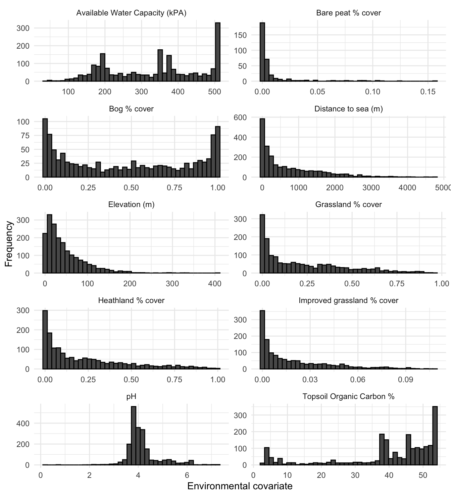

# Results

## Explororatory Data Analysis of SBBS survey data

Where relevant a protocol for exploratory data analysis was followed [@Zuur2010-kp] to ensure that before any problems in the structure of the data are identified prior to undertaking any statistical analysis.

### Survey effort over time

The spatial location of surveyed squares is shown in Figure \@ref(fig:spatSum). It seems that there has been ongoing surveying effort in the south and central mainland and on the islands of Unst, Bressay and Noss, but less coverage elsewhere.

<div class="figure" style="text-align: center">

<p class="caption">(\#fig:spatSum)Number of years a SBBS 1km square was survyered (n) between 2002 and 2019</p>
</div>

### Outliers

The *Cleveland dot plot* [@Zuur2010-kp] is a chart in which the row number of an observation is plotted versus the observation variable, thereby providing a more detailed view of individual observations than a boxplot. Points that stick out on the right-hand side, or on the left-hand side, are observed values that are considerably larger, or smaller, than the majority of the observations. Figure \@ref(fig:countDotPlot) appears to show that there are no major outliers across all species, but that there are many counts equal to zero indicating that the data might be zero-inflated.

<div class="figure" style="text-align: center">

<p class="caption">(\#fig:countDotPlot)Cleveland dot plot of species counts in Shetland BBS data from 2002 to 2018 </p>
</div>
### Testing for normality

A large number of statistical regression techniques assume normality. Visualising the SBBS count data as a histogram can help assess if it is normally distributed. This is shown in the plot in Figure \@ref(fig:normality).

<div class="figure" style="text-align: center">

<p class="caption">(\#fig:normality)Histogram of SBBS count data across all years, by species</p>
</div>
Inorder to validate the outcome of the plots in Figure \@ref(fig:normality) a significance test was undertaken and the results are shown in Table \@ref(tab:normSig).


Species            W   p-value
--------  ----------  --------
OC         0.8628058         0
L          0.7546102         0
CU         0.8327195         0
RK         0.6995970         0
SN         0.8000661         0

The p-value for each species in \@ref(tab:normSig) is << 0.05. This suggests that the count data for all species are significantly different from the normal distribution.

### Poisson distribution and zero inflation

The histograms of species counts in Figure \@ref(fig:normality) suggest that count data is poisson distribution. Also there are a significant number of zeros in the count data, for all species. This suggests that the zero-inflation poisson distribution describes the data. Table \@ref(tab:zipTest) below shows the results of a significance test [@Van_den_Broek1995-ml] for zero inflation in a poisson distribution.


Species    Expected zeros   Zeros observed   Chi squared   p-value
--------  ---------------  ---------------  ------------  --------
CU               223.9173              433      384.2445         0
L                323.5230              585      547.5071         0
OC               119.1142              309      446.9641         0
RK               520.3458              694      271.6801         0
SN               134.4406              359      577.9990         0

All results have a significant statistical significance (p<0.05) and therefore the count distribution across species is assumed to be a zero-inflated poisson process. The statistical modelling methods used on the data must support a poisson distribution and zero inflation where possible.

### Homogeniety of variance

Homogeneity of variance within the data is an important assumption in analysis of variance (ANOVA) and other regression-related models. The series of boxplots in Figure \@ref(fig:homoVariance) show how counts across all surveyed BBS squares vary across years 2002 to 2018, for each breeding wader species.

<div class="figure" style="text-align: center">

<p class="caption">(\#fig:homoVariance)Box plot showing variance of counts across all surveyed Shetland BBS squares and all years, by species</p>
</div>

To test the homogeneity of variance of species counts between years, for each species, we can apply the Fligner-Killeen test. This is used as the count data are shown to be non-normal. Table \@ref(tab:fKTest) shows the results of the test applied to the Shetland BBS data. For p-values > 0.05 the data variance are homogeneous.


Table: (\#tab:fKTest)Fligner-Killeen test of homogeneity of variance for Shetland SBBS species counts, across all years

Species    Chi-squared     p-value   df
--------  ------------  ----------  ---
OC            18.11614   0.3171401   16
L             29.11514   0.0231712   16
CU            18.36325   0.3030590   16
RK            26.72879   0.0445979   16
SN            47.40824   0.0000588   16


Lapwing, Redshank and Snipe variances are heterogeneous according to the test results in Table \@ref(tab:fKTest). The solution to heterogeneity of
variance is to transform the response variable to stabilize the variance year-on-year, or applying statistical regression techniques that do not require homogeneity. 

### Status of surveys between 2002 and 2019


Before any detailed statistical modelling was undertaken a simple analysis into how the population changed in each surveyed 1km square between 2002-2011 and 2012-2019. The 1 km squares shown (n=139) were those surveyed in both periods and where farmland waders colonized, increased, remained stable, declined or went extinct. This gave an initial view as to potential population trends between the two stated periods. Figure \@ref(fig:popStatusChg) shows the state changes between the two analysis periods.

<div class="figure" style="text-align: center">

<p class="caption">(\#fig:popStatusChg)Population status change per Shetland BBS square - between 2002-10 and 2011-19</p>
</div>
Figure \@ref(fig:aggPopChg) below shows an aggregation of certain categories; whereby extinct and decreased are grouped, and colonised and increased are grouped.

<div class="figure" style="text-align: center">

<p class="caption">(\#fig:aggPopChg)Aggregate population status change per Shetland BBS square - between 2002-10 and 2011-19</p>
</div>
## Survey  Bootstrap

Shetland BBS volunteers were able to choose which squares they surveyed. The survey squares are therefore not randomly allocated across the Shetland archipelago. As a result of this non-randomised allocation there could be potential bias in the habitat types surveyed; for example, in-bye is closer to roads and housing than upland habitats. To test this a bootstrap of percentage cover of EUNIS habitat categories D, E and F (see \@ref(tab:eunisTable)) across all OS 1km squares was undertaken, and then compared to a bootstrap of the same data, but only those OS squares surveyed by volunteers as part of the Shetland BBS.


<div class="figure" style="text-align: center">

<p class="caption">(\#fig:bootstrap)Mean % cover per 1km$^2$ of EUNIS habitat types D, E and F, bootstrap sample of OSGB squares v boostrap of surveyed squares. R=1000</p>
</div>
This shows that grassland and heathland are significantly oversampled within the Shetland BBS surveys.

## Improved grassland classification

Spectral response charts


## Environmental covariate histograms

Each of the covariates described in \ref was generated for each Shetland BBS squares (n=3992). Figure [ref] shows histograms of how these covariates are distributed across Shetland.

<div class="figure" style="text-align: center">

<p class="caption">(\#fig:covarHisto)Histograms of environmental covariates across all of Shetland</p>
</div>

This can be contrasted with covariate histograms for only those OS squares that were surveyed as part of the Shetland BBS.

<div class="figure" style="text-align: center">

<p class="caption">(\#fig:sbbsHisto)Histograms of environmental covariates across only those squares surveyed as part of the Shetland BBS</p>
</div>
##  Detectability

Show workings from unmarked.

## Density plots

Density plot of all breeding wader count data against environmental covariates are shown in figure [ref]

<div class="figure" style="text-align: center">

<p class="caption">(\#fig:densityPlot)Density plots of environmental covariates against breeding wader count data</p>
</div>

## Environmental covariate response


Table [ref] shows the GAM model paramter results for the model fits for the two periods were abundance response was modelled.

<table class="table" style="font-size: 10px; width: auto !important; margin-left: auto; margin-right: auto;">
 <thead>
  <tr>
   <th style="text-align:center;"> Species </th>
   <th style="text-align:left;"> Response </th>
   <th style="text-align:left;"> Covariate </th>
   <th style="text-align:center;"> Estimate </th>
   <th style="text-align:center;"> se </th>
   <th style="text-align:center;"> z </th>
   <th style="text-align:center;"> p-value </th>
  </tr>
 </thead>
<tbody>
  <tr>
   <td style="text-align:center;font-weight: bold;vertical-align: top !important;" rowspan="20"> CU </td>
   <td style="text-align:left;vertical-align: top !important;" rowspan="10"> 2002-2010 </td>
   <td style="text-align:left;"> Elevation (m) </td>
   <td style="text-align:center;"> -0.0047660 </td>
   <td style="text-align:center;"> 0.0012923 </td>
   <td style="text-align:center;"> -3.6881254 </td>
   <td style="text-align:center;"> 0.0002259 </td>
  </tr>
  <tr>
   
   
   <td style="text-align:left;"> Bog % cover </td>
   <td style="text-align:center;"> -0.5978205 </td>
   <td style="text-align:center;"> 0.1431517 </td>
   <td style="text-align:center;"> -4.1761322 </td>
   <td style="text-align:center;"> 0.0000297 </td>
  </tr>
  <tr>
   
   
   <td style="text-align:left;"> Grassland % cover </td>
   <td style="text-align:center;"> 1.5957249 </td>
   <td style="text-align:center;"> 0.1493591 </td>
   <td style="text-align:center;"> 10.6838176 </td>
   <td style="text-align:center;"> 0.0000000 </td>
  </tr>
  <tr>
   
   
   <td style="text-align:left;"> Heathland % cover </td>
   <td style="text-align:center;"> 0.0091149 </td>
   <td style="text-align:center;"> 0.1774234 </td>
   <td style="text-align:center;"> 0.0513737 </td>
   <td style="text-align:center;"> 0.9590277 </td>
  </tr>
  <tr>
   
   
   <td style="text-align:left;"> pH </td>
   <td style="text-align:center;"> -0.0538407 </td>
   <td style="text-align:center;"> 0.0529630 </td>
   <td style="text-align:center;"> -1.0165715 </td>
   <td style="text-align:center;"> 0.3093573 </td>
  </tr>
  <tr>
   
   
   <td style="text-align:left;"> Topsoil Organic Carbon % </td>
   <td style="text-align:center;"> -0.0071180 </td>
   <td style="text-align:center;"> 0.0025020 </td>
   <td style="text-align:center;"> -2.8449063 </td>
   <td style="text-align:center;"> 0.0044424 </td>
  </tr>
  <tr>
   
   
   <td style="text-align:left;"> Available Water Capacity (kPA) </td>
   <td style="text-align:center;"> -0.0016417 </td>
   <td style="text-align:center;"> 0.0003635 </td>
   <td style="text-align:center;"> -4.5160087 </td>
   <td style="text-align:center;"> 0.0000063 </td>
  </tr>
  <tr>
   
   
   <td style="text-align:left;"> Distance to sea (m) </td>
   <td style="text-align:center;"> 0.0003244 </td>
   <td style="text-align:center;"> 0.0000542 </td>
   <td style="text-align:center;"> 5.9833759 </td>
   <td style="text-align:center;"> 0.0000000 </td>
  </tr>
  <tr>
   
   
   <td style="text-align:left;"> Bare peat % cover </td>
   <td style="text-align:center;"> -149.7968058 </td>
   <td style="text-align:center;"> 46.6291133 </td>
   <td style="text-align:center;"> -3.2125167 </td>
   <td style="text-align:center;"> 0.0013158 </td>
  </tr>
  <tr>
   
   
   <td style="text-align:left;"> Improved grassland % cover </td>
   <td style="text-align:center;"> 3.0053196 </td>
   <td style="text-align:center;"> 1.2307390 </td>
   <td style="text-align:center;"> 2.4418821 </td>
   <td style="text-align:center;"> 0.0146109 </td>
  </tr>
  <tr>
   
   <td style="text-align:left;vertical-align: top !important;" rowspan="10"> 2011-2019 </td>
   <td style="text-align:left;"> Elevation (m) </td>
   <td style="text-align:center;"> -0.0029241 </td>
   <td style="text-align:center;"> 0.0011530 </td>
   <td style="text-align:center;"> -2.5361057 </td>
   <td style="text-align:center;"> 0.0112093 </td>
  </tr>
  <tr>
   
   
   <td style="text-align:left;"> Bog % cover </td>
   <td style="text-align:center;"> -0.5285263 </td>
   <td style="text-align:center;"> 0.1417328 </td>
   <td style="text-align:center;"> -3.7290335 </td>
   <td style="text-align:center;"> 0.0001922 </td>
  </tr>
  <tr>
   
   
   <td style="text-align:left;"> Grassland % cover </td>
   <td style="text-align:center;"> 1.3222096 </td>
   <td style="text-align:center;"> 0.1416748 </td>
   <td style="text-align:center;"> 9.3327057 </td>
   <td style="text-align:center;"> 0.0000000 </td>
  </tr>
  <tr>
   
   
   <td style="text-align:left;"> Heathland % cover </td>
   <td style="text-align:center;"> 0.5013633 </td>
   <td style="text-align:center;"> 0.1602352 </td>
   <td style="text-align:center;"> 3.1289210 </td>
   <td style="text-align:center;"> 0.0017545 </td>
  </tr>
  <tr>
   
   
   <td style="text-align:left;"> pH </td>
   <td style="text-align:center;"> 0.1014162 </td>
   <td style="text-align:center;"> 0.0488042 </td>
   <td style="text-align:center;"> 2.0780229 </td>
   <td style="text-align:center;"> 0.0377073 </td>
  </tr>
  <tr>
   
   
   <td style="text-align:left;"> Topsoil Organic Carbon % </td>
   <td style="text-align:center;"> -0.0071234 </td>
   <td style="text-align:center;"> 0.0023084 </td>
   <td style="text-align:center;"> -3.0858314 </td>
   <td style="text-align:center;"> 0.0020298 </td>
  </tr>
  <tr>
   
   
   <td style="text-align:left;"> Available Water Capacity (kPA) </td>
   <td style="text-align:center;"> -0.0010745 </td>
   <td style="text-align:center;"> 0.0003394 </td>
   <td style="text-align:center;"> -3.1659146 </td>
   <td style="text-align:center;"> 0.0015460 </td>
  </tr>
  <tr>
   
   
   <td style="text-align:left;"> Distance to sea (m) </td>
   <td style="text-align:center;"> 0.0001556 </td>
   <td style="text-align:center;"> 0.0000486 </td>
   <td style="text-align:center;"> 3.2015598 </td>
   <td style="text-align:center;"> 0.0013669 </td>
  </tr>
  <tr>
   
   
   <td style="text-align:left;"> Bare peat % cover </td>
   <td style="text-align:center;"> -143.8121516 </td>
   <td style="text-align:center;"> 41.9961883 </td>
   <td style="text-align:center;"> -3.4244096 </td>
   <td style="text-align:center;"> 0.0006161 </td>
  </tr>
  <tr>
   
   
   <td style="text-align:left;"> Improved grassland % cover </td>
   <td style="text-align:center;"> 5.4890572 </td>
   <td style="text-align:center;"> 1.1451489 </td>
   <td style="text-align:center;"> 4.7933132 </td>
   <td style="text-align:center;"> 0.0000016 </td>
  </tr>
  <tr>
   <td style="text-align:center;font-weight: bold;vertical-align: top !important;" rowspan="20"> L </td>
   <td style="text-align:left;vertical-align: top !important;" rowspan="10"> 2002-2010 </td>
   <td style="text-align:left;"> Elevation (m) </td>
   <td style="text-align:center;"> -0.0116020 </td>
   <td style="text-align:center;"> 0.0018571 </td>
   <td style="text-align:center;"> -6.2474785 </td>
   <td style="text-align:center;"> 0.0000000 </td>
  </tr>
  <tr>
   
   
   <td style="text-align:left;"> Bog % cover </td>
   <td style="text-align:center;"> -1.1722359 </td>
   <td style="text-align:center;"> 0.1998145 </td>
   <td style="text-align:center;"> -5.8666201 </td>
   <td style="text-align:center;"> 0.0000000 </td>
  </tr>
  <tr>
   
   
   <td style="text-align:left;"> Grassland % cover </td>
   <td style="text-align:center;"> 1.4793656 </td>
   <td style="text-align:center;"> 0.1722758 </td>
   <td style="text-align:center;"> 8.5871951 </td>
   <td style="text-align:center;"> 0.0000000 </td>
  </tr>
  <tr>
   
   
   <td style="text-align:left;"> Heathland % cover </td>
   <td style="text-align:center;"> 0.7753116 </td>
   <td style="text-align:center;"> 0.1910296 </td>
   <td style="text-align:center;"> 4.0585943 </td>
   <td style="text-align:center;"> 0.0000494 </td>
  </tr>
  <tr>
   
   
   <td style="text-align:left;"> pH </td>
   <td style="text-align:center;"> -0.0956080 </td>
   <td style="text-align:center;"> 0.0521447 </td>
   <td style="text-align:center;"> -1.8335129 </td>
   <td style="text-align:center;"> 0.0667263 </td>
  </tr>
  <tr>
   
   
   <td style="text-align:left;"> Topsoil Organic Carbon % </td>
   <td style="text-align:center;"> -0.0050744 </td>
   <td style="text-align:center;"> 0.0028493 </td>
   <td style="text-align:center;"> -1.7809448 </td>
   <td style="text-align:center;"> 0.0749215 </td>
  </tr>
  <tr>
   
   
   <td style="text-align:left;"> Available Water Capacity (kPA) </td>
   <td style="text-align:center;"> -0.0027432 </td>
   <td style="text-align:center;"> 0.0004465 </td>
   <td style="text-align:center;"> -6.1441209 </td>
   <td style="text-align:center;"> 0.0000000 </td>
  </tr>
  <tr>
   
   
   <td style="text-align:left;"> Distance to sea (m) </td>
   <td style="text-align:center;"> -0.0001574 </td>
   <td style="text-align:center;"> 0.0000716 </td>
   <td style="text-align:center;"> -2.1970063 </td>
   <td style="text-align:center;"> 0.0280200 </td>
  </tr>
  <tr>
   
   
   <td style="text-align:left;"> Bare peat % cover </td>
   <td style="text-align:center;"> -48.6255298 </td>
   <td style="text-align:center;"> 32.9964191 </td>
   <td style="text-align:center;"> -1.4736608 </td>
   <td style="text-align:center;"> 0.1405729 </td>
  </tr>
  <tr>
   
   
   <td style="text-align:left;"> Improved grassland % cover </td>
   <td style="text-align:center;"> -0.8575667 </td>
   <td style="text-align:center;"> 1.4587527 </td>
   <td style="text-align:center;"> -0.5878767 </td>
   <td style="text-align:center;"> 0.5566151 </td>
  </tr>
  <tr>
   
   <td style="text-align:left;vertical-align: top !important;" rowspan="10"> 2011-2019 </td>
   <td style="text-align:left;"> Elevation (m) </td>
   <td style="text-align:center;"> -0.0085036 </td>
   <td style="text-align:center;"> 0.0017825 </td>
   <td style="text-align:center;"> -4.7706336 </td>
   <td style="text-align:center;"> 0.0000018 </td>
  </tr>
  <tr>
   
   
   <td style="text-align:left;"> Bog % cover </td>
   <td style="text-align:center;"> -1.7422696 </td>
   <td style="text-align:center;"> 0.2446933 </td>
   <td style="text-align:center;"> -7.1202169 </td>
   <td style="text-align:center;"> 0.0000000 </td>
  </tr>
  <tr>
   
   
   <td style="text-align:left;"> Grassland % cover </td>
   <td style="text-align:center;"> 1.3640855 </td>
   <td style="text-align:center;"> 0.1733790 </td>
   <td style="text-align:center;"> 7.8676499 </td>
   <td style="text-align:center;"> 0.0000000 </td>
  </tr>
  <tr>
   
   
   <td style="text-align:left;"> Heathland % cover </td>
   <td style="text-align:center;"> 0.8882417 </td>
   <td style="text-align:center;"> 0.1890840 </td>
   <td style="text-align:center;"> 4.6976030 </td>
   <td style="text-align:center;"> 0.0000026 </td>
  </tr>
  <tr>
   
   
   <td style="text-align:left;"> pH </td>
   <td style="text-align:center;"> 0.0362716 </td>
   <td style="text-align:center;"> 0.0563323 </td>
   <td style="text-align:center;"> 0.6438867 </td>
   <td style="text-align:center;"> 0.5196489 </td>
  </tr>
  <tr>
   
   
   <td style="text-align:left;"> Topsoil Organic Carbon % </td>
   <td style="text-align:center;"> -0.0103562 </td>
   <td style="text-align:center;"> 0.0029467 </td>
   <td style="text-align:center;"> -3.5144487 </td>
   <td style="text-align:center;"> 0.0004407 </td>
  </tr>
  <tr>
   
   
   <td style="text-align:left;"> Available Water Capacity (kPA) </td>
   <td style="text-align:center;"> -0.0023495 </td>
   <td style="text-align:center;"> 0.0004682 </td>
   <td style="text-align:center;"> -5.0182718 </td>
   <td style="text-align:center;"> 0.0000005 </td>
  </tr>
  <tr>
   
   
   <td style="text-align:left;"> Distance to sea (m) </td>
   <td style="text-align:center;"> -0.0001670 </td>
   <td style="text-align:center;"> 0.0000696 </td>
   <td style="text-align:center;"> -2.3982314 </td>
   <td style="text-align:center;"> 0.0164745 </td>
  </tr>
  <tr>
   
   
   <td style="text-align:left;"> Bare peat % cover </td>
   <td style="text-align:center;"> -611.2812790 </td>
   <td style="text-align:center;"> 154.3431183 </td>
   <td style="text-align:center;"> -3.9605347 </td>
   <td style="text-align:center;"> 0.0000748 </td>
  </tr>
  <tr>
   
   
   <td style="text-align:left;"> Improved grassland % cover </td>
   <td style="text-align:center;"> 3.7644091 </td>
   <td style="text-align:center;"> 1.3459139 </td>
   <td style="text-align:center;"> 2.7969167 </td>
   <td style="text-align:center;"> 0.0051593 </td>
  </tr>
  <tr>
   <td style="text-align:center;font-weight: bold;vertical-align: top !important;" rowspan="20"> OC </td>
   <td style="text-align:left;vertical-align: top !important;" rowspan="10"> 2002-2010 </td>
   <td style="text-align:left;"> Elevation (m) </td>
   <td style="text-align:center;"> -0.0069456 </td>
   <td style="text-align:center;"> 0.0013528 </td>
   <td style="text-align:center;"> -5.1341978 </td>
   <td style="text-align:center;"> 0.0000003 </td>
  </tr>
  <tr>
   
   
   <td style="text-align:left;"> Bog % cover </td>
   <td style="text-align:center;"> -1.5159619 </td>
   <td style="text-align:center;"> 0.1685326 </td>
   <td style="text-align:center;"> -8.9950669 </td>
   <td style="text-align:center;"> 0.0000000 </td>
  </tr>
  <tr>
   
   
   <td style="text-align:left;"> Grassland % cover </td>
   <td style="text-align:center;"> 1.9029425 </td>
   <td style="text-align:center;"> 0.1413390 </td>
   <td style="text-align:center;"> 13.4636751 </td>
   <td style="text-align:center;"> 0.0000000 </td>
  </tr>
  <tr>
   
   
   <td style="text-align:left;"> Heathland % cover </td>
   <td style="text-align:center;"> 0.5420250 </td>
   <td style="text-align:center;"> 0.1596300 </td>
   <td style="text-align:center;"> 3.3955074 </td>
   <td style="text-align:center;"> 0.0006850 </td>
  </tr>
  <tr>
   
   
   <td style="text-align:left;"> pH </td>
   <td style="text-align:center;"> 0.0167137 </td>
   <td style="text-align:center;"> 0.0464099 </td>
   <td style="text-align:center;"> 0.3601316 </td>
   <td style="text-align:center;"> 0.7187487 </td>
  </tr>
  <tr>
   
   
   <td style="text-align:left;"> Topsoil Organic Carbon % </td>
   <td style="text-align:center;"> -0.0141199 </td>
   <td style="text-align:center;"> 0.0023567 </td>
   <td style="text-align:center;"> -5.9914867 </td>
   <td style="text-align:center;"> 0.0000000 </td>
  </tr>
  <tr>
   
   
   <td style="text-align:left;"> Available Water Capacity (kPA) </td>
   <td style="text-align:center;"> -0.0027407 </td>
   <td style="text-align:center;"> 0.0003489 </td>
   <td style="text-align:center;"> -7.8560777 </td>
   <td style="text-align:center;"> 0.0000000 </td>
  </tr>
  <tr>
   
   
   <td style="text-align:left;"> Distance to sea (m) </td>
   <td style="text-align:center;"> 0.0001348 </td>
   <td style="text-align:center;"> 0.0000515 </td>
   <td style="text-align:center;"> 2.6185702 </td>
   <td style="text-align:center;"> 0.0088299 </td>
  </tr>
  <tr>
   
   
   <td style="text-align:left;"> Bare peat % cover </td>
   <td style="text-align:center;"> -48.4679745 </td>
   <td style="text-align:center;"> 26.4110348 </td>
   <td style="text-align:center;"> -1.8351411 </td>
   <td style="text-align:center;"> 0.0664848 </td>
  </tr>
  <tr>
   
   
   <td style="text-align:left;"> Improved grassland % cover </td>
   <td style="text-align:center;"> -0.2004924 </td>
   <td style="text-align:center;"> 1.1809486 </td>
   <td style="text-align:center;"> -0.1697723 </td>
   <td style="text-align:center;"> 0.8651892 </td>
  </tr>
  <tr>
   
   <td style="text-align:left;vertical-align: top !important;" rowspan="10"> 2011-2019 </td>
   <td style="text-align:left;"> Elevation (m) </td>
   <td style="text-align:center;"> -0.0046176 </td>
   <td style="text-align:center;"> 0.0010919 </td>
   <td style="text-align:center;"> -4.2290824 </td>
   <td style="text-align:center;"> 0.0000235 </td>
  </tr>
  <tr>
   
   
   <td style="text-align:left;"> Bog % cover </td>
   <td style="text-align:center;"> -1.3024217 </td>
   <td style="text-align:center;"> 0.1507293 </td>
   <td style="text-align:center;"> -8.6407972 </td>
   <td style="text-align:center;"> 0.0000000 </td>
  </tr>
  <tr>
   
   
   <td style="text-align:left;"> Grassland % cover </td>
   <td style="text-align:center;"> 1.6716694 </td>
   <td style="text-align:center;"> 0.1274199 </td>
   <td style="text-align:center;"> 13.1193729 </td>
   <td style="text-align:center;"> 0.0000000 </td>
  </tr>
  <tr>
   
   
   <td style="text-align:left;"> Heathland % cover </td>
   <td style="text-align:center;"> 0.4353141 </td>
   <td style="text-align:center;"> 0.1415596 </td>
   <td style="text-align:center;"> 3.0751299 </td>
   <td style="text-align:center;"> 0.0021041 </td>
  </tr>
  <tr>
   
   
   <td style="text-align:left;"> pH </td>
   <td style="text-align:center;"> 0.1295746 </td>
   <td style="text-align:center;"> 0.0416677 </td>
   <td style="text-align:center;"> 3.1097135 </td>
   <td style="text-align:center;"> 0.0018727 </td>
  </tr>
  <tr>
   
   
   <td style="text-align:left;"> Topsoil Organic Carbon % </td>
   <td style="text-align:center;"> -0.0084269 </td>
   <td style="text-align:center;"> 0.0020514 </td>
   <td style="text-align:center;"> -4.1078160 </td>
   <td style="text-align:center;"> 0.0000399 </td>
  </tr>
  <tr>
   
   
   <td style="text-align:left;"> Available Water Capacity (kPA) </td>
   <td style="text-align:center;"> -0.0016516 </td>
   <td style="text-align:center;"> 0.0003100 </td>
   <td style="text-align:center;"> -5.3282818 </td>
   <td style="text-align:center;"> 0.0000001 </td>
  </tr>
  <tr>
   
   
   <td style="text-align:left;"> Distance to sea (m) </td>
   <td style="text-align:center;"> -0.0001179 </td>
   <td style="text-align:center;"> 0.0000461 </td>
   <td style="text-align:center;"> -2.5554062 </td>
   <td style="text-align:center;"> 0.0106064 </td>
  </tr>
  <tr>
   
   
   <td style="text-align:left;"> Bare peat % cover </td>
   <td style="text-align:center;"> -566.7981796 </td>
   <td style="text-align:center;"> 108.6161007 </td>
   <td style="text-align:center;"> -5.2183624 </td>
   <td style="text-align:center;"> 0.0000002 </td>
  </tr>
  <tr>
   
   
   <td style="text-align:left;"> Improved grassland % cover </td>
   <td style="text-align:center;"> 2.9790008 </td>
   <td style="text-align:center;"> 1.0430428 </td>
   <td style="text-align:center;"> 2.8560678 </td>
   <td style="text-align:center;"> 0.0042892 </td>
  </tr>
  <tr>
   <td style="text-align:center;font-weight: bold;vertical-align: top !important;" rowspan="20"> RK </td>
   <td style="text-align:left;vertical-align: top !important;" rowspan="10"> 2002-2010 </td>
   <td style="text-align:left;"> Elevation (m) </td>
   <td style="text-align:center;"> -0.0217511 </td>
   <td style="text-align:center;"> 0.0025999 </td>
   <td style="text-align:center;"> -8.3661544 </td>
   <td style="text-align:center;"> 0.0000000 </td>
  </tr>
  <tr>
   
   
   <td style="text-align:left;"> Bog % cover </td>
   <td style="text-align:center;"> -1.8520374 </td>
   <td style="text-align:center;"> 0.2704231 </td>
   <td style="text-align:center;"> -6.8486651 </td>
   <td style="text-align:center;"> 0.0000000 </td>
  </tr>
  <tr>
   
   
   <td style="text-align:left;"> Grassland % cover </td>
   <td style="text-align:center;"> 1.8121030 </td>
   <td style="text-align:center;"> 0.2037015 </td>
   <td style="text-align:center;"> 8.8958740 </td>
   <td style="text-align:center;"> 0.0000000 </td>
  </tr>
  <tr>
   
   
   <td style="text-align:left;"> Heathland % cover </td>
   <td style="text-align:center;"> 0.0692450 </td>
   <td style="text-align:center;"> 0.2258397 </td>
   <td style="text-align:center;"> 0.3066112 </td>
   <td style="text-align:center;"> 0.7591394 </td>
  </tr>
  <tr>
   
   
   <td style="text-align:left;"> pH </td>
   <td style="text-align:center;"> -0.0516209 </td>
   <td style="text-align:center;"> 0.0657742 </td>
   <td style="text-align:center;"> -0.7848204 </td>
   <td style="text-align:center;"> 0.4325588 </td>
  </tr>
  <tr>
   
   
   <td style="text-align:left;"> Topsoil Organic Carbon % </td>
   <td style="text-align:center;"> -0.0092177 </td>
   <td style="text-align:center;"> 0.0033311 </td>
   <td style="text-align:center;"> -2.7671471 </td>
   <td style="text-align:center;"> 0.0056549 </td>
  </tr>
  <tr>
   
   
   <td style="text-align:left;"> Available Water Capacity (kPA) </td>
   <td style="text-align:center;"> -0.0035239 </td>
   <td style="text-align:center;"> 0.0005318 </td>
   <td style="text-align:center;"> -6.6265269 </td>
   <td style="text-align:center;"> 0.0000000 </td>
  </tr>
  <tr>
   
   
   <td style="text-align:left;"> Distance to sea (m) </td>
   <td style="text-align:center;"> -0.0001484 </td>
   <td style="text-align:center;"> 0.0000848 </td>
   <td style="text-align:center;"> -1.7503084 </td>
   <td style="text-align:center;"> 0.0800651 </td>
  </tr>
  <tr>
   
   
   <td style="text-align:left;"> Bare peat % cover </td>
   <td style="text-align:center;"> -222.4706573 </td>
   <td style="text-align:center;"> 81.2839584 </td>
   <td style="text-align:center;"> -2.7369565 </td>
   <td style="text-align:center;"> 0.0062010 </td>
  </tr>
  <tr>
   
   
   <td style="text-align:left;"> Improved grassland % cover </td>
   <td style="text-align:center;"> 3.9142068 </td>
   <td style="text-align:center;"> 1.5788757 </td>
   <td style="text-align:center;"> 2.4791101 </td>
   <td style="text-align:center;"> 0.0131711 </td>
  </tr>
  <tr>
   
   <td style="text-align:left;vertical-align: top !important;" rowspan="10"> 2011-2019 </td>
   <td style="text-align:left;"> Elevation (m) </td>
   <td style="text-align:center;"> -0.0117473 </td>
   <td style="text-align:center;"> 0.0022212 </td>
   <td style="text-align:center;"> -5.2886287 </td>
   <td style="text-align:center;"> 0.0000001 </td>
  </tr>
  <tr>
   
   
   <td style="text-align:left;"> Bog % cover </td>
   <td style="text-align:center;"> -1.8457222 </td>
   <td style="text-align:center;"> 0.2704145 </td>
   <td style="text-align:center;"> -6.8255304 </td>
   <td style="text-align:center;"> 0.0000000 </td>
  </tr>
  <tr>
   
   
   <td style="text-align:left;"> Grassland % cover </td>
   <td style="text-align:center;"> 1.6009581 </td>
   <td style="text-align:center;"> 0.2016600 </td>
   <td style="text-align:center;"> 7.9388980 </td>
   <td style="text-align:center;"> 0.0000000 </td>
  </tr>
  <tr>
   
   
   <td style="text-align:left;"> Heathland % cover </td>
   <td style="text-align:center;"> 0.8966410 </td>
   <td style="text-align:center;"> 0.2119171 </td>
   <td style="text-align:center;"> 4.2310926 </td>
   <td style="text-align:center;"> 0.0000233 </td>
  </tr>
  <tr>
   
   
   <td style="text-align:left;"> pH </td>
   <td style="text-align:center;"> 0.1101980 </td>
   <td style="text-align:center;"> 0.0647762 </td>
   <td style="text-align:center;"> 1.7012115 </td>
   <td style="text-align:center;"> 0.0889033 </td>
  </tr>
  <tr>
   
   
   <td style="text-align:left;"> Topsoil Organic Carbon % </td>
   <td style="text-align:center;"> -0.0140561 </td>
   <td style="text-align:center;"> 0.0032904 </td>
   <td style="text-align:center;"> -4.2718490 </td>
   <td style="text-align:center;"> 0.0000194 </td>
  </tr>
  <tr>
   
   
   <td style="text-align:left;"> Available Water Capacity (kPA) </td>
   <td style="text-align:center;"> -0.0027088 </td>
   <td style="text-align:center;"> 0.0005260 </td>
   <td style="text-align:center;"> -5.1500606 </td>
   <td style="text-align:center;"> 0.0000003 </td>
  </tr>
  <tr>
   
   
   <td style="text-align:left;"> Distance to sea (m) </td>
   <td style="text-align:center;"> -0.0000609 </td>
   <td style="text-align:center;"> 0.0000765 </td>
   <td style="text-align:center;"> -0.7959369 </td>
   <td style="text-align:center;"> 0.4260687 </td>
  </tr>
  <tr>
   
   
   <td style="text-align:left;"> Bare peat % cover </td>
   <td style="text-align:center;"> -414.1379412 </td>
   <td style="text-align:center;"> 147.9790931 </td>
   <td style="text-align:center;"> -2.7986247 </td>
   <td style="text-align:center;"> 0.0051321 </td>
  </tr>
  <tr>
   
   
   <td style="text-align:left;"> Improved grassland % cover </td>
   <td style="text-align:center;"> 6.4344180 </td>
   <td style="text-align:center;"> 1.5839643 </td>
   <td style="text-align:center;"> 4.0622240 </td>
   <td style="text-align:center;"> 0.0000486 </td>
  </tr>
  <tr>
   <td style="text-align:center;font-weight: bold;vertical-align: top !important;" rowspan="20"> SN </td>
   <td style="text-align:left;vertical-align: top !important;" rowspan="10"> 2002-2010 </td>
   <td style="text-align:left;"> Elevation (m) </td>
   <td style="text-align:center;"> 0.0018441 </td>
   <td style="text-align:center;"> 0.0010938 </td>
   <td style="text-align:center;"> 1.6860074 </td>
   <td style="text-align:center;"> 0.0917944 </td>
  </tr>
  <tr>
   
   
   <td style="text-align:left;"> Bog % cover </td>
   <td style="text-align:center;"> -0.2308204 </td>
   <td style="text-align:center;"> 0.1186574 </td>
   <td style="text-align:center;"> -1.9452675 </td>
   <td style="text-align:center;"> 0.0517428 </td>
  </tr>
  <tr>
   
   
   <td style="text-align:left;"> Grassland % cover </td>
   <td style="text-align:center;"> 0.4118038 </td>
   <td style="text-align:center;"> 0.1380146 </td>
   <td style="text-align:center;"> 2.9837704 </td>
   <td style="text-align:center;"> 0.0028472 </td>
  </tr>
  <tr>
   
   
   <td style="text-align:left;"> Heathland % cover </td>
   <td style="text-align:center;"> 1.1818400 </td>
   <td style="text-align:center;"> 0.1253160 </td>
   <td style="text-align:center;"> 9.4308795 </td>
   <td style="text-align:center;"> 0.0000000 </td>
  </tr>
  <tr>
   
   
   <td style="text-align:left;"> pH </td>
   <td style="text-align:center;"> 0.1096664 </td>
   <td style="text-align:center;"> 0.0413008 </td>
   <td style="text-align:center;"> 2.6553081 </td>
   <td style="text-align:center;"> 0.0079236 </td>
  </tr>
  <tr>
   
   
   <td style="text-align:left;"> Topsoil Organic Carbon % </td>
   <td style="text-align:center;"> -0.0064149 </td>
   <td style="text-align:center;"> 0.0021637 </td>
   <td style="text-align:center;"> -2.9648495 </td>
   <td style="text-align:center;"> 0.0030283 </td>
  </tr>
  <tr>
   
   
   <td style="text-align:left;"> Available Water Capacity (kPA) </td>
   <td style="text-align:center;"> -0.0001379 </td>
   <td style="text-align:center;"> 0.0003122 </td>
   <td style="text-align:center;"> -0.4417631 </td>
   <td style="text-align:center;"> 0.6586606 </td>
  </tr>
  <tr>
   
   
   <td style="text-align:left;"> Distance to sea (m) </td>
   <td style="text-align:center;"> 0.0005127 </td>
   <td style="text-align:center;"> 0.0000496 </td>
   <td style="text-align:center;"> 10.3312840 </td>
   <td style="text-align:center;"> 0.0000000 </td>
  </tr>
  <tr>
   
   
   <td style="text-align:left;"> Bare peat % cover </td>
   <td style="text-align:center;"> -231.6826310 </td>
   <td style="text-align:center;"> 62.7317169 </td>
   <td style="text-align:center;"> -3.6932296 </td>
   <td style="text-align:center;"> 0.0002214 </td>
  </tr>
  <tr>
   
   
   <td style="text-align:left;"> Improved grassland % cover </td>
   <td style="text-align:center;"> -5.0266110 </td>
   <td style="text-align:center;"> 1.2228559 </td>
   <td style="text-align:center;"> -4.1105504 </td>
   <td style="text-align:center;"> 0.0000395 </td>
  </tr>
  <tr>
   
   <td style="text-align:left;vertical-align: top !important;" rowspan="10"> 2011-2019 </td>
   <td style="text-align:left;"> Elevation (m) </td>
   <td style="text-align:center;"> 0.0017756 </td>
   <td style="text-align:center;"> 0.0009556 </td>
   <td style="text-align:center;"> 1.8580979 </td>
   <td style="text-align:center;"> 0.0631551 </td>
  </tr>
  <tr>
   
   
   <td style="text-align:left;"> Bog % cover </td>
   <td style="text-align:center;"> -0.2958454 </td>
   <td style="text-align:center;"> 0.1204209 </td>
   <td style="text-align:center;"> -2.4567614 </td>
   <td style="text-align:center;"> 0.0140196 </td>
  </tr>
  <tr>
   
   
   <td style="text-align:left;"> Grassland % cover </td>
   <td style="text-align:center;"> 0.3284704 </td>
   <td style="text-align:center;"> 0.1348396 </td>
   <td style="text-align:center;"> 2.4360084 </td>
   <td style="text-align:center;"> 0.0148503 </td>
  </tr>
  <tr>
   
   
   <td style="text-align:left;"> Heathland % cover </td>
   <td style="text-align:center;"> 1.4971897 </td>
   <td style="text-align:center;"> 0.1258042 </td>
   <td style="text-align:center;"> 11.9009559 </td>
   <td style="text-align:center;"> 0.0000000 </td>
  </tr>
  <tr>
   
   
   <td style="text-align:left;"> pH </td>
   <td style="text-align:center;"> 0.0186663 </td>
   <td style="text-align:center;"> 0.0381012 </td>
   <td style="text-align:center;"> 0.4899129 </td>
   <td style="text-align:center;"> 0.6241955 </td>
  </tr>
  <tr>
   
   
   <td style="text-align:left;"> Topsoil Organic Carbon % </td>
   <td style="text-align:center;"> 0.0020863 </td>
   <td style="text-align:center;"> 0.0020773 </td>
   <td style="text-align:center;"> 1.0043440 </td>
   <td style="text-align:center;"> 0.3152129 </td>
  </tr>
  <tr>
   
   
   <td style="text-align:left;"> Available Water Capacity (kPA) </td>
   <td style="text-align:center;"> 0.0009557 </td>
   <td style="text-align:center;"> 0.0002903 </td>
   <td style="text-align:center;"> 3.2923069 </td>
   <td style="text-align:center;"> 0.0009937 </td>
  </tr>
  <tr>
   
   
   <td style="text-align:left;"> Distance to sea (m) </td>
   <td style="text-align:center;"> 0.0003552 </td>
   <td style="text-align:center;"> 0.0000451 </td>
   <td style="text-align:center;"> 7.8698317 </td>
   <td style="text-align:center;"> 0.0000000 </td>
  </tr>
  <tr>
   
   
   <td style="text-align:left;"> Bare peat % cover </td>
   <td style="text-align:center;"> -184.9356476 </td>
   <td style="text-align:center;"> 43.2356138 </td>
   <td style="text-align:center;"> -4.2773915 </td>
   <td style="text-align:center;"> 0.0000189 </td>
  </tr>
  <tr>
   
   
   <td style="text-align:left;"> Improved grassland % cover </td>
   <td style="text-align:center;"> -3.9498741 </td>
   <td style="text-align:center;"> 1.2345209 </td>
   <td style="text-align:center;"> -3.1995198 </td>
   <td style="text-align:center;"> 0.0013766 </td>
  </tr>
</tbody>
</table>

## Population change model

<table class="table" style="font-size: 10px; width: auto !important; margin-left: auto; margin-right: auto;">
 <thead>
  <tr>
   <th style="text-align:center;"> Species </th>
   <th style="text-align:left;"> Period </th>
   <th style="text-align:left;"> Covariate </th>
   <th style="text-align:center;"> Estimate </th>
   <th style="text-align:center;"> se </th>
   <th style="text-align:center;"> z </th>
   <th style="text-align:center;"> p-value </th>
  </tr>
 </thead>
<tbody>
  <tr>
   <td style="text-align:center;font-weight: bold;vertical-align: top !important;" rowspan="10"> CU </td>
   <td style="text-align:left;vertical-align: top !important;" rowspan="50"> 2002-2019 </td>
   <td style="text-align:left;"> Elevation (m) </td>
   <td style="text-align:center;"> -0.0044252 </td>
   <td style="text-align:center;"> 0.0016221 </td>
   <td style="text-align:center;"> -2.7280256 </td>
   <td style="text-align:center;"> 0.0063715 </td>
  </tr>
  <tr>
   
   
   <td style="text-align:left;"> Bog % cover </td>
   <td style="text-align:center;"> -0.4903977 </td>
   <td style="text-align:center;"> 0.2077126 </td>
   <td style="text-align:center;"> -2.3609436 </td>
   <td style="text-align:center;"> 0.0182285 </td>
  </tr>
  <tr>
   
   
   <td style="text-align:left;"> Grassland % cover </td>
   <td style="text-align:center;"> 0.0611598 </td>
   <td style="text-align:center;"> 0.1739180 </td>
   <td style="text-align:center;"> 0.3516588 </td>
   <td style="text-align:center;"> 0.7250942 </td>
  </tr>
  <tr>
   
   
   <td style="text-align:left;"> Heathland % cover </td>
   <td style="text-align:center;"> 0.4971792 </td>
   <td style="text-align:center;"> 0.1950054 </td>
   <td style="text-align:center;"> 2.5495660 </td>
   <td style="text-align:center;"> 0.0107857 </td>
  </tr>
  <tr>
   
   
   <td style="text-align:left;"> pH </td>
   <td style="text-align:center;"> -0.0755352 </td>
   <td style="text-align:center;"> 0.0677069 </td>
   <td style="text-align:center;"> -1.1156208 </td>
   <td style="text-align:center;"> 0.2645845 </td>
  </tr>
  <tr>
   
   
   <td style="text-align:left;"> Topsoil Organic Carbon % </td>
   <td style="text-align:center;"> 0.0006391 </td>
   <td style="text-align:center;"> 0.0030657 </td>
   <td style="text-align:center;"> 0.2084719 </td>
   <td style="text-align:center;"> 0.8348605 </td>
  </tr>
  <tr>
   
   
   <td style="text-align:left;"> Available Water Capacity (kPA) </td>
   <td style="text-align:center;"> -0.0005634 </td>
   <td style="text-align:center;"> 0.0005096 </td>
   <td style="text-align:center;"> -1.1055718 </td>
   <td style="text-align:center;"> 0.2689119 </td>
  </tr>
  <tr>
   
   
   <td style="text-align:left;"> Distance to sea (m) </td>
   <td style="text-align:center;"> -0.0002346 </td>
   <td style="text-align:center;"> 0.0000688 </td>
   <td style="text-align:center;"> -3.4087409 </td>
   <td style="text-align:center;"> 0.0006526 </td>
  </tr>
  <tr>
   
   
   <td style="text-align:left;"> Bare peat % cover </td>
   <td style="text-align:center;"> -242.9908022 </td>
   <td style="text-align:center;"> 131.2538344 </td>
   <td style="text-align:center;"> -1.8513044 </td>
   <td style="text-align:center;"> 0.0641258 </td>
  </tr>
  <tr>
   
   
   <td style="text-align:left;"> Improved grassland % cover </td>
   <td style="text-align:center;"> 1.9681856 </td>
   <td style="text-align:center;"> 1.6910521 </td>
   <td style="text-align:center;"> 1.1638823 </td>
   <td style="text-align:center;"> 0.2444717 </td>
  </tr>
  <tr>
   <td style="text-align:center;font-weight: bold;vertical-align: top !important;" rowspan="10"> L </td>
   
   <td style="text-align:left;"> Elevation (m) </td>
   <td style="text-align:center;"> 0.0033806 </td>
   <td style="text-align:center;"> 0.0029251 </td>
   <td style="text-align:center;"> 1.1557450 </td>
   <td style="text-align:center;"> 0.2477855 </td>
  </tr>
  <tr>
   
   
   <td style="text-align:left;"> Bog % cover </td>
   <td style="text-align:center;"> -0.6382168 </td>
   <td style="text-align:center;"> 0.3484742 </td>
   <td style="text-align:center;"> -1.8314610 </td>
   <td style="text-align:center;"> 0.0670318 </td>
  </tr>
  <tr>
   
   
   <td style="text-align:left;"> Grassland % cover </td>
   <td style="text-align:center;"> -0.1568682 </td>
   <td style="text-align:center;"> 0.2349447 </td>
   <td style="text-align:center;"> -0.6676816 </td>
   <td style="text-align:center;"> 0.5043369 </td>
  </tr>
  <tr>
   
   
   <td style="text-align:left;"> Heathland % cover </td>
   <td style="text-align:center;"> 0.5662540 </td>
   <td style="text-align:center;"> 0.2304386 </td>
   <td style="text-align:center;"> 2.4572877 </td>
   <td style="text-align:center;"> 0.0139991 </td>
  </tr>
  <tr>
   
   
   <td style="text-align:left;"> pH </td>
   <td style="text-align:center;"> 0.1977710 </td>
   <td style="text-align:center;"> 0.0831372 </td>
   <td style="text-align:center;"> 2.3788523 </td>
   <td style="text-align:center;"> 0.0173666 </td>
  </tr>
  <tr>
   
   
   <td style="text-align:left;"> Topsoil Organic Carbon % </td>
   <td style="text-align:center;"> -0.0107078 </td>
   <td style="text-align:center;"> 0.0037154 </td>
   <td style="text-align:center;"> -2.8819962 </td>
   <td style="text-align:center;"> 0.0039516 </td>
  </tr>
  <tr>
   
   
   <td style="text-align:left;"> Available Water Capacity (kPA) </td>
   <td style="text-align:center;"> -0.0019982 </td>
   <td style="text-align:center;"> 0.0007977 </td>
   <td style="text-align:center;"> -2.5050305 </td>
   <td style="text-align:center;"> 0.0122441 </td>
  </tr>
  <tr>
   
   
   <td style="text-align:left;"> Distance to sea (m) </td>
   <td style="text-align:center;"> -0.0002214 </td>
   <td style="text-align:center;"> 0.0001142 </td>
   <td style="text-align:center;"> -1.9381908 </td>
   <td style="text-align:center;"> 0.0525999 </td>
  </tr>
  <tr>
   
   
   <td style="text-align:left;"> Bare peat % cover </td>
   <td style="text-align:center;"> -155.4986378 </td>
   <td style="text-align:center;"> 118.8693119 </td>
   <td style="text-align:center;"> -1.3081479 </td>
   <td style="text-align:center;"> 0.1908232 </td>
  </tr>
  <tr>
   
   
   <td style="text-align:left;"> Improved grassland % cover </td>
   <td style="text-align:center;"> 6.2869114 </td>
   <td style="text-align:center;"> 2.4281821 </td>
   <td style="text-align:center;"> 2.5891433 </td>
   <td style="text-align:center;"> 0.0096215 </td>
  </tr>
  <tr>
   <td style="text-align:center;font-weight: bold;vertical-align: top !important;" rowspan="10"> OC </td>
   
   <td style="text-align:left;"> Elevation (m) </td>
   <td style="text-align:center;"> -0.0001056 </td>
   <td style="text-align:center;"> 0.0017256 </td>
   <td style="text-align:center;"> -0.0612144 </td>
   <td style="text-align:center;"> 0.9511885 </td>
  </tr>
  <tr>
   
   
   <td style="text-align:left;"> Bog % cover </td>
   <td style="text-align:center;"> 0.1669456 </td>
   <td style="text-align:center;"> 0.2395117 </td>
   <td style="text-align:center;"> 0.6970250 </td>
   <td style="text-align:center;"> 0.4857872 </td>
  </tr>
  <tr>
   
   
   <td style="text-align:left;"> Grassland % cover </td>
   <td style="text-align:center;"> 0.2525266 </td>
   <td style="text-align:center;"> 0.1858332 </td>
   <td style="text-align:center;"> 1.3588881 </td>
   <td style="text-align:center;"> 0.1741820 </td>
  </tr>
  <tr>
   
   
   <td style="text-align:left;"> Heathland % cover </td>
   <td style="text-align:center;"> 0.0407075 </td>
   <td style="text-align:center;"> 0.1873938 </td>
   <td style="text-align:center;"> 0.2172295 </td>
   <td style="text-align:center;"> 0.8280295 </td>
  </tr>
  <tr>
   
   
   <td style="text-align:left;"> pH </td>
   <td style="text-align:center;"> 0.1284483 </td>
   <td style="text-align:center;"> 0.0619126 </td>
   <td style="text-align:center;"> 2.0746704 </td>
   <td style="text-align:center;"> 0.0380171 </td>
  </tr>
  <tr>
   
   
   <td style="text-align:left;"> Topsoil Organic Carbon % </td>
   <td style="text-align:center;"> 0.0013767 </td>
   <td style="text-align:center;"> 0.0027713 </td>
   <td style="text-align:center;"> 0.4967733 </td>
   <td style="text-align:center;"> 0.6193489 </td>
  </tr>
  <tr>
   
   
   <td style="text-align:left;"> Available Water Capacity (kPA) </td>
   <td style="text-align:center;"> 0.0018330 </td>
   <td style="text-align:center;"> 0.0005206 </td>
   <td style="text-align:center;"> 3.5206627 </td>
   <td style="text-align:center;"> 0.0004305 </td>
  </tr>
  <tr>
   
   
   <td style="text-align:left;"> Distance to sea (m) </td>
   <td style="text-align:center;"> -0.0001906 </td>
   <td style="text-align:center;"> 0.0000660 </td>
   <td style="text-align:center;"> -2.8884168 </td>
   <td style="text-align:center;"> 0.0038719 </td>
  </tr>
  <tr>
   
   
   <td style="text-align:left;"> Bare peat % cover </td>
   <td style="text-align:center;"> -130.1217388 </td>
   <td style="text-align:center;"> 85.8613117 </td>
   <td style="text-align:center;"> -1.5154874 </td>
   <td style="text-align:center;"> 0.1296490 </td>
  </tr>
  <tr>
   
   
   <td style="text-align:left;"> Improved grassland % cover </td>
   <td style="text-align:center;"> 12.7061648 </td>
   <td style="text-align:center;"> 1.7518061 </td>
   <td style="text-align:center;"> 7.2531799 </td>
   <td style="text-align:center;"> 0.0000000 </td>
  </tr>
  <tr>
   <td style="text-align:center;font-weight: bold;vertical-align: top !important;" rowspan="10"> RK </td>
   
   <td style="text-align:left;"> Elevation (m) </td>
   <td style="text-align:center;"> 0.0133841 </td>
   <td style="text-align:center;"> 0.0036436 </td>
   <td style="text-align:center;"> 3.6732797 </td>
   <td style="text-align:center;"> 0.0002395 </td>
  </tr>
  <tr>
   
   
   <td style="text-align:left;"> Bog % cover </td>
   <td style="text-align:center;"> 1.2431232 </td>
   <td style="text-align:center;"> 0.3974623 </td>
   <td style="text-align:center;"> 3.1276503 </td>
   <td style="text-align:center;"> 0.0017621 </td>
  </tr>
  <tr>
   
   
   <td style="text-align:left;"> Grassland % cover </td>
   <td style="text-align:center;"> -1.1501105 </td>
   <td style="text-align:center;"> 0.3028565 </td>
   <td style="text-align:center;"> -3.7975431 </td>
   <td style="text-align:center;"> 0.0001461 </td>
  </tr>
  <tr>
   
   
   <td style="text-align:left;"> Heathland % cover </td>
   <td style="text-align:center;"> 0.8222708 </td>
   <td style="text-align:center;"> 0.2862284 </td>
   <td style="text-align:center;"> 2.8727788 </td>
   <td style="text-align:center;"> 0.0040688 </td>
  </tr>
  <tr>
   
   
   <td style="text-align:left;"> pH </td>
   <td style="text-align:center;"> -0.1761409 </td>
   <td style="text-align:center;"> 0.0964009 </td>
   <td style="text-align:center;"> -1.8271695 </td>
   <td style="text-align:center;"> 0.0676743 </td>
  </tr>
  <tr>
   
   
   <td style="text-align:left;"> Topsoil Organic Carbon % </td>
   <td style="text-align:center;"> -0.0017683 </td>
   <td style="text-align:center;"> 0.0049190 </td>
   <td style="text-align:center;"> -0.3594784 </td>
   <td style="text-align:center;"> 0.7192372 </td>
  </tr>
  <tr>
   
   
   <td style="text-align:left;"> Available Water Capacity (kPA) </td>
   <td style="text-align:center;"> 0.0042310 </td>
   <td style="text-align:center;"> 0.0010834 </td>
   <td style="text-align:center;"> 3.9052274 </td>
   <td style="text-align:center;"> 0.0000941 </td>
  </tr>
  <tr>
   
   
   <td style="text-align:left;"> Distance to sea (m) </td>
   <td style="text-align:center;"> -0.0002003 </td>
   <td style="text-align:center;"> 0.0001415 </td>
   <td style="text-align:center;"> -1.4159660 </td>
   <td style="text-align:center;"> 0.1567854 </td>
  </tr>
  <tr>
   
   
   <td style="text-align:left;"> Bare peat % cover </td>
   <td style="text-align:center;"> -65.3178017 </td>
   <td style="text-align:center;"> 162.5477586 </td>
   <td style="text-align:center;"> -0.4018376 </td>
   <td style="text-align:center;"> 0.6878035 </td>
  </tr>
  <tr>
   
   
   <td style="text-align:left;"> Improved grassland % cover </td>
   <td style="text-align:center;"> 3.6568260 </td>
   <td style="text-align:center;"> 2.9188267 </td>
   <td style="text-align:center;"> 1.2528411 </td>
   <td style="text-align:center;"> 0.2102635 </td>
  </tr>
  <tr>
   <td style="text-align:center;font-weight: bold;vertical-align: top !important;" rowspan="10"> SN </td>
   
   <td style="text-align:left;"> Elevation (m) </td>
   <td style="text-align:center;"> 0.0002584 </td>
   <td style="text-align:center;"> 0.0014553 </td>
   <td style="text-align:center;"> 0.1775626 </td>
   <td style="text-align:center;"> 0.8590665 </td>
  </tr>
  <tr>
   
   
   <td style="text-align:left;"> Bog % cover </td>
   <td style="text-align:center;"> -0.0977489 </td>
   <td style="text-align:center;"> 0.1549711 </td>
   <td style="text-align:center;"> -0.6307555 </td>
   <td style="text-align:center;"> 0.5282004 </td>
  </tr>
  <tr>
   
   
   <td style="text-align:left;"> Grassland % cover </td>
   <td style="text-align:center;"> -0.1703948 </td>
   <td style="text-align:center;"> 0.1644825 </td>
   <td style="text-align:center;"> -1.0359448 </td>
   <td style="text-align:center;"> 0.3002279 </td>
  </tr>
  <tr>
   
   
   <td style="text-align:left;"> Heathland % cover </td>
   <td style="text-align:center;"> 0.2975359 </td>
   <td style="text-align:center;"> 0.1646754 </td>
   <td style="text-align:center;"> 1.8068030 </td>
   <td style="text-align:center;"> 0.0707930 </td>
  </tr>
  <tr>
   
   
   <td style="text-align:left;"> pH </td>
   <td style="text-align:center;"> -0.2574097 </td>
   <td style="text-align:center;"> 0.0662196 </td>
   <td style="text-align:center;"> -3.8872141 </td>
   <td style="text-align:center;"> 0.0001014 </td>
  </tr>
  <tr>
   
   
   <td style="text-align:left;"> Topsoil Organic Carbon % </td>
   <td style="text-align:center;"> 0.0128373 </td>
   <td style="text-align:center;"> 0.0028554 </td>
   <td style="text-align:center;"> 4.4958027 </td>
   <td style="text-align:center;"> 0.0000069 </td>
  </tr>
  <tr>
   
   
   <td style="text-align:left;"> Available Water Capacity (kPA) </td>
   <td style="text-align:center;"> 0.0011336 </td>
   <td style="text-align:center;"> 0.0004332 </td>
   <td style="text-align:center;"> 2.6170099 </td>
   <td style="text-align:center;"> 0.0088704 </td>
  </tr>
  <tr>
   
   
   <td style="text-align:left;"> Distance to sea (m) </td>
   <td style="text-align:center;"> -0.0000646 </td>
   <td style="text-align:center;"> 0.0000707 </td>
   <td style="text-align:center;"> -0.9131343 </td>
   <td style="text-align:center;"> 0.3611719 </td>
  </tr>
  <tr>
   
   
   <td style="text-align:left;"> Bare peat % cover </td>
   <td style="text-align:center;"> -10.6491505 </td>
   <td style="text-align:center;"> 99.1348896 </td>
   <td style="text-align:center;"> -0.1074208 </td>
   <td style="text-align:center;"> 0.9144551 </td>
  </tr>
  <tr>
   
   
   <td style="text-align:left;"> Improved grassland % cover </td>
   <td style="text-align:center;"> -1.2811085 </td>
   <td style="text-align:center;"> 1.5645570 </td>
   <td style="text-align:center;"> -0.8188315 </td>
   <td style="text-align:center;"> 0.4128826 </td>
  </tr>
</tbody>
</table>

## IT covariate response

## Improved grassland connectivity

## Abundance spatial distribution

## Abundance population trends


## Response plots


```r
# Generate prediction data so that we can plot parametric terms
wader_df <- wader_df %>% 
  mutate(model_pred = map2(
    .x = model, 
    .y = covariate, 
    # A function to generate a response with parametric covariate only
    ~tidymv::get_gam_predictions(model = .x,
                                 series = .y, 
                                 # We want the response not link
                                 transform = exp)))
```
