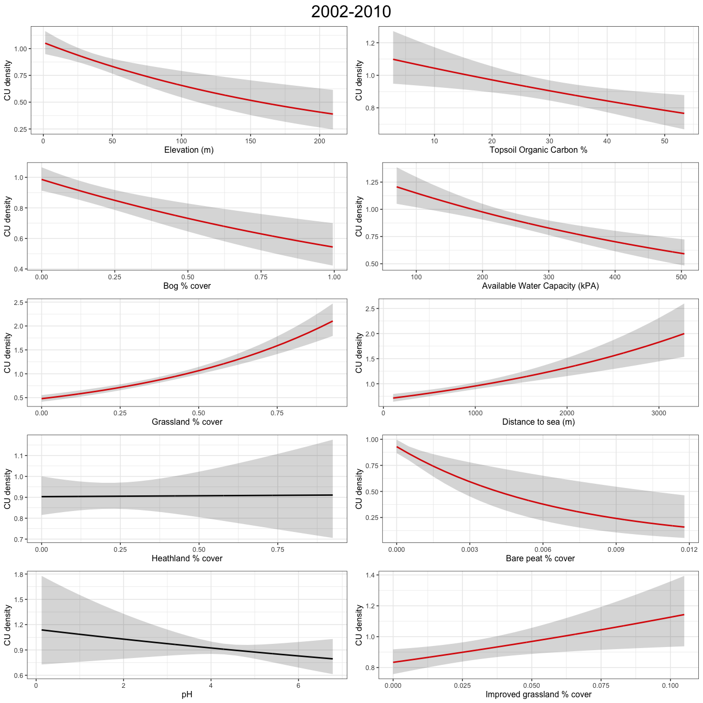
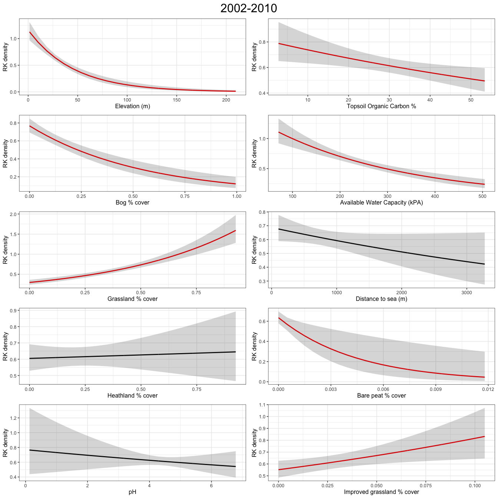
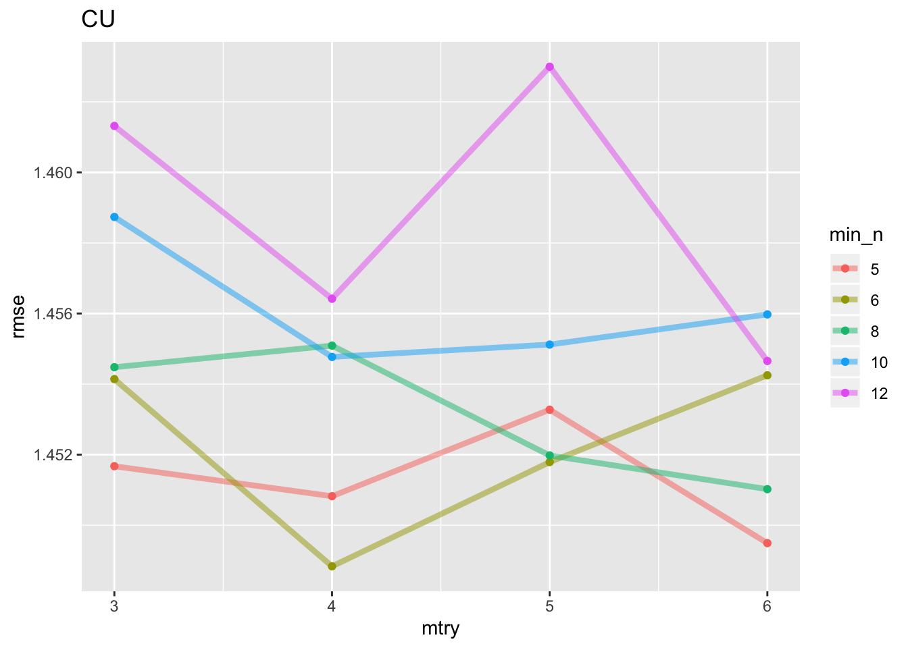
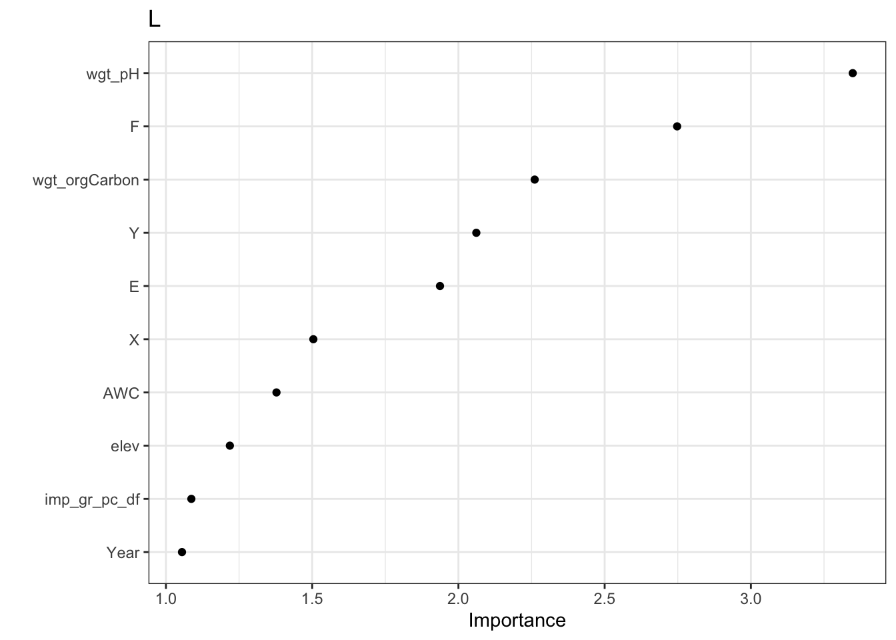
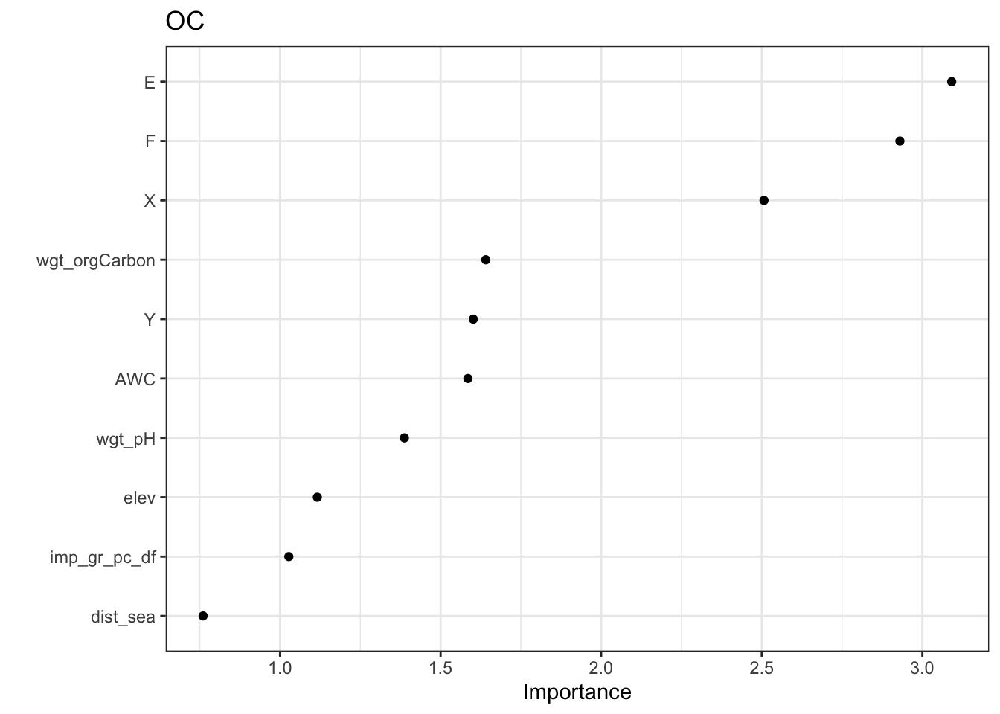
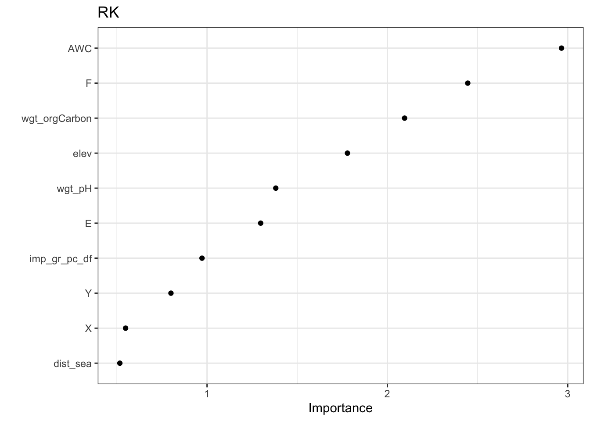

# Results

<!-- Exploratory Data Analysis
child doc is loaded in-line -->

## Explororatory Data Analysis of SBBS survey data

Where relevant a protocol for exploratory data analysis was followed [@Zuur2010-kp] to ensure that before any problems in the structure of the data are identified prior to undertaking any statistical analysis.

### Survey effort over time

The spatial location of surveyed squares is shown in Figure \@ref(fig:spatSum). It seems that there has been ongoing surveying effort in the south and central mainland and on the islands of Unst, Bressay and Noss, but less coverage elsewhere.

<div class="figure" style="text-align: center">

<p class="caption">(\#fig:spatSum)Number of years a SBBS 1km square was survyered (n) between 2002 and 2019</p>
</div>

### Outliers

The *Cleveland dot plot* [@Zuur2010-kp] is a chart in which the row number of an observation is plotted versus the observation variable, thereby providing a more detailed view of individual observations than a boxplot. Points that stick out on the right-hand side, or on the left-hand side, are observed values that are considerably larger, or smaller, than the majority of the observations. Figure \@ref(fig:countDotPlot) appears to show that there are no major outliers across all species, but that there are many counts equal to zero indicating that the data might be zero-inflated.

<div class="figure" style="text-align: center">

<p class="caption">(\#fig:countDotPlot)Cleveland dot plot of species counts in Shetland BBS data from 2002 to 2018 </p>
</div>
### Testing for normality

A large number of statistical regression techniques assume normality. Visualising the SBBS count data as a histogram can help assess if it is normally distributed. This is shown in the plot in Figure \@ref(fig:normality).

<div class="figure" style="text-align: center">

<p class="caption">(\#fig:normality)Histogram of SBBS count data across all years, by species</p>
</div>
Inorder to validate the outcome of the plots in Figure \@ref(fig:normality) a significance test was undertaken and the results are shown in Table \@ref(tab:normSig).


Species            W   p-value
--------  ----------  --------
OC         0.8628058         0
L          0.7546102         0
CU         0.8327195         0
RK         0.6995970         0
SN         0.8000661         0

The p-value for each species in \@ref(tab:normSig) is << 0.05. This suggests that the count data for all species are significantly different from the normal distribution.

### Poisson distribution and zero inflation

The histograms of species counts in Figure \@ref(fig:normality) suggest that count data is poisson distribution. Also there are a significant number of zeros in the count data, for all species. This suggests that the zero-inflation poisson distribution describes the data. Table \@ref(tab:zipTest) below shows the results of a significance test [@Van_den_Broek1995-ml] for zero inflation in a poisson distribution.


Species    Expected zeros   Zeros observed   Chi squared   p-value
--------  ---------------  ---------------  ------------  --------
CU               223.9173              433      384.2445         0
L                323.5230              585      547.5071         0
OC               119.1142              309      446.9641         0
RK               520.3458              694      271.6801         0
SN               134.4406              359      577.9990         0

All results have a significant statistical significance (p<0.05) and therefore the count distribution across species is assumed to be a zero-inflated poisson process. The statistical modelling methods used on the data must support a poisson distribution and zero inflation where possible.

### Homogeniety of variance

Homogeneity of variance within the data is an important assumption in analysis of variance (ANOVA) and other regression-related models. The series of boxplots in Figure \@ref(fig:homoVariance) show how counts across all surveyed BBS squares vary across years 2002 to 2018, for each breeding wader species.

<div class="figure" style="text-align: center">

<p class="caption">(\#fig:homoVariance)Box plot showing variance of counts across all surveyed Shetland BBS squares and all years, by species</p>
</div>

To test the homogeneity of variance of species counts between years, for each species, we can apply the Fligner-Killeen test. This is used as the count data are shown to be non-normal. Table \@ref(tab:fKTest) shows the results of the test applied to the Shetland BBS data. For p-values > 0.05 the data variance are homogeneous.


Table: (\#tab:fKTest)Fligner-Killeen test of homogeneity of variance for Shetland SBBS species counts, across all years

Species    Chi-squared     p-value   df
--------  ------------  ----------  ---
OC            18.11614   0.3171401   16
L             29.11514   0.0231712   16
CU            18.36325   0.3030590   16
RK            26.72879   0.0445979   16
SN            47.40824   0.0000588   16


Lapwing, Redshank and Snipe variances are heterogeneous according to the test results in Table \@ref(tab:fKTest). The solution to heterogeneity of
variance is to transform the response variable to stabilize the variance year-on-year, or applying statistical regression techniques that do not require homogeneity. 

### Status of surveys between 2002 and 2019


Before any detailed statistical modelling was undertaken a simple analysis into how the population changed in each surveyed 1km square between 2002-2011 and 2012-2019. The 1 km squares shown (n=139) were those surveyed in both periods and where farmland waders colonized, increased, remained stable, declined or went extinct. This gave an initial view as to potential population trends between the two stated periods. Figure \@ref(fig:popStatusChg) shows the state changes between the two analysis periods.

<div class="figure" style="text-align: center">

<p class="caption">(\#fig:popStatusChg)Population status change per Shetland BBS square - between 2002-10 and 2011-19</p>
</div>
Figure \@ref(fig:aggPopChg) below shows an aggregation of certain categories; whereby extinct and decreased are grouped, and colonised and increased are grouped.

<div class="figure" style="text-align: center">

<p class="caption">(\#fig:aggPopChg)Aggregate population status change per Shetland BBS square - between 2002-10 and 2011-19</p>
</div>
### Survey  Bootstrap

Shetland BBS volunteers were able to choose which squares they surveyed. The survey squares are therefore not randomly allocated across the Shetland archipelago. As a result of this non-randomised allocation there could be potential bias in the habitat types surveyed; for example, in-bye is closer to roads and housing than upland habitats. To test this a bootstrap of percentage cover of EUNIS habitat categories D, E and F (see \@ref(tab:eunisTable)) across all OS 1km squares was undertaken, and then compared to a bootstrap of the same data, but only those OS squares surveyed by volunteers as part of the Shetland BBS.


<div class="figure" style="text-align: center">

<p class="caption">(\#fig:bootstrap)Mean % cover per 1km$^2$ of EUNIS habitat types D, E and F, bootstrap sample of OSGB squares v boostrap of surveyed squares. R=1000</p>
</div>

This shows that grassland and heathland are significantly oversampled within the Shetland BBS surveys.

##  Detectability

The `r` package `unmarked` was used to generate an estimate for the probability of detection, or *detectability*. Table \@ref(tab:detectabilityTab) shows the average *detectability* across all survey years, for each species.


Species    Detectability
--------  --------------
OC                 0.803
L                  0.723
RK                 0.667
CU                 0.831
SN                 0.723

<!-- Improved grassland classification
child doc is loaded in-line -->


## Improved grassland classification

The results below detail how remotely sensed satellite data was processed using a Support Vector Machine to generate a classification for improved grassland across the various islands of Shetland.

### Shetland Sentinel 2 satelitte dataset

A Sentinel 2 satellite spatial dataset was clipped using the Integrated Administration And Control System (IACS) field boundary shapefile for Shetland. This gave a spatial dataset comprising of land-based habitat only, as shown in Figure \@ref(fig:loadSentinelImg)  

<div class="figure" style="text-align: center">

<p class="caption">(\#fig:loadSentinelImg)Clipped Sentinel 2 RGB composite of Shetland</p>
</div>


### Sentinel 2 spectral bands used in habitat classification

The Sentinel dataset is represented as a layered set of images (a raster) known as a `RasterBrick` [@raster]. Each raster layer is a spatial representation of one of 11 different spectral sensor readings. The sensors used within the Shetland sentinel dataset are shown in Table \@ref(tab:satBands). 


Band ID   Name         Wavelength(micrometer)
--------  ----------  -----------------------
1         Aerosol                       0.443
2         Blue                          0.490
3         Green                         0.560
4         Red                           0.655
5         Veg Red 1                     0.705
6         Veg Red 2                     0.865
7         Veg Red 3                     0.740
8         NIR                           0.783
8A        Veg Red 4                     0.842
11        SWIR 1                        1.610
12        SWIR 2                        2.190

### Habitiat classification training data

In order to classify improved grassland, four other distinctive and closely associated habitat types were classified: unimproved grassland, crops, bare peatland and upland. A number of areas representative of each habitat type were selected as can be seen in Figure \@ref(fig:habitatTraining). 


```
## Reading layer `Training_samples' from data source `/Users/anthony/Documents/GitHub/shetlandwaders/data/training_data_classification/Training_samples.shp' using driver `ESRI Shapefile'
## Simple feature collection with 161 features and 2 fields
## geometry type:  POLYGON
## dimension:      XY
## bbox:           xmin: 415800.5 ymin: 1108793 xmax: 466132.7 ymax: 1217616
## CRS:            EPSG:27700
```

<div class="figure" style="text-align: center">

<p class="caption">(\#fig:habitatTraining)Habitat classification training areas</p>
</div>

### Sampling of habitat training classes

Each habitat training dataset was randomly sampled in order to train a support vector machine classifier. Distributions for the sampled data for each training set are shown in Figure \@ref(fig:plotSampleDistributions). The NIR and red vegetation spectra appear to be the most distinct across different habitat types. 

<div class="figure" style="text-align: center">

<p class="caption">(\#fig:plotSampleDistributions)Sampled distributions for each training class, from the Sentinel 2 dataset of the Shetland landmass</p>
</div>
### Support vector machine classifier training

The SVM was trained to classify the five target habitat classes so that improved grassland can be separated and used as a covariate in wader response modelling.


### Search grid parameterisation

The SVM parameters used to create a number of different models are shown in Table \@ref(tab:searchGrid).


RBF sigma   Cost 
----------  -----
0.11        18   
0.12        18   
0.13        18   
0.11        19   
0.12        19   
0.13        19   
0.11        20   
0.12        20   
0.13        20   


### Best model results by root mean squared error

The best SVM mnodel parameters, as measured by classification accuracy, are shown in Table \@ref(tab:modelResults). Root-mean squared error (RMSE) was used to select the best fitting model. 


 Cost   RBF sigma    Accuracy          se
-----  ----------  ----------  ----------
   20        0.13   0.8233010   0.0094407
   19        0.13   0.8208738   0.0093362
   18        0.13   0.8194175   0.0093179
   19        0.12   0.8194175   0.0091478
   20        0.12   0.8194175   0.0090903

Figure \@ref(fig:viewMetrics) shows the parameters associated with each model fit and the resulting rmse used in the 10-fold cross validation against the trading data. 

<div class="figure" style="text-align: center">

<p class="caption">(\#fig:viewMetrics)RMSE for each model fit, as a function of model parameters `mtry` cost and `rbf_sigma`</p>
</div>


### Evaluate model performance using test data

A training data set was tested against the best model fit. The results of classifier accruracy are shown in Table \@ref(tab:evalPerf).


Metric     Estimate  
---------  ----------
accuracy   0.8534091 
kap        0.8240900 

The confusion matrix in Figure \@ref(fig:confusionMatrix) shows the results of the model prediction for each habitat class against thsoe of the test data set. The most incorrectly classified habitat is improved grassland versus crop, followed by Upland versus Bare Peatland. Both of these inaccuracies are not significant to the objective of producing an overall classification for improved grassland, in that crop habitat is often reseeded impproved grassland.

<div class="figure" style="text-align: center">

<p class="caption">(\#fig:confusionMatrix)Confusion Matrix from classificaton of test dataset</p>
</div>


### Classification across all Shetland habitat

The best fit model was then used across the raster dataset for all of Shetland, to enable classification of all habitat. The results are shown in \@ref(fig:plotPredictionShet). The improved grassland and crop habitat is predominantly in the south of the island. It can be seen that the main middle island, Yell, is predominantly upland and bare peat.

<div class="figure" style="text-align: center">

<p class="caption">(\#fig:plotPredictionShet)Classification of Shetland habitat in order to determine the location of improved grassland</p>
</div>

<!-- Environmental Covariate Analysis
child doc is loaded in-line -->

## Environmental covariate analysis

Each of the covariates described in {#environmental-covariates} was generated for each Shetland BBS squares (n=3992). 

### Histogram of environmental covariates 

Figure \@ref(fig:covarHisto) shows histograms of for these covariates for data taken across all Shetland OS GB 1km squares. It can be seen that bog type habitat predominates across Shetland, and that majority of the landscape is at less than 100m elevation. The mode for the pH is around 4, which is typical for acidic peatland. 

<div class="figure" style="text-align: center">

<p class="caption">(\#fig:covarHisto)Histograms of environmental covariates across all of Shetland</p>
</div>

### Histogram of environmental covariates for Shetland BBS squares only

This can be contrasted with covariate histograms for only those OS squares (n=139) that were surveyed as part of the Shetland BBS, as seen in Figure \@ref(fig:sbbsHisto). It seems across all nesting wader species, there is a preference for wet but not water-logged habitat as seen in the AWC histogram. Also, the majority of breeding waders appear to nest within 1km of the coast. It appears that breeding waders also have a preference for grassland (both improved and unimproved) presents the majority of the habitat cover, over heathland.

<div class="figure" style="text-align: center">

<p class="caption">(\#fig:sbbsHisto)Histograms of environmental covariates across only those squares surveyed as part of the Shetland BBS</p>
</div>

### Density plots

Density plots of all environmental covariates across Shetland BBS squares (n=139) are shown in Figure \@ref(fig:densityPlot). These figures provide an overlay to the histogramsin {#histogram-of-environmental-covariates-for-shetland-bbs-squares-only}, and represent a smoothed version of a histogram to show the probability density function of the variable. Some distributions are highly skewed, such as distance to sea and elevation. Whilst other covariates like topsoil organic carbon and bog cover are largely a uniformly distributed. None of the covariates appear to be normally distributed.

<div class="figure" style="text-align: center">

<p class="caption">(\#fig:densityPlot)Density plots of environmental covariates against breeding wader count data</p>
</div>

<!-- Environmental Covariate Response
child doc is loaded in-line -->

## Environmental covariate response

GAMs for breeding wader abundance response across the five different species were generated from 2002–10 and 2011-19. They included 10 environmental predictor variables (covariates), and the model parameters for all species across the two response periods can be seen in Table \@ref(tab:tableGamParamsAbundance). A third model was generated by taking the abundance response from the first two models to generate the ratio of population change between the two response periods.


### Environmental covariate GAM model parameters

Table \@ref(tab:tableGamParamsAbundance) shows the GAM model parameters for the model fits for the two periods where abundance response (density) was modelled, and the associated plots showing breeding wader density against each environmental covariate are shown in Figure \@ref(fig:responsePlots). The statistically significant correlations between breeding wader density and environmental covariate are summarised for each species in heatmaps; Figure \@ref(fig:heatMap200210) for 2002-10 and Figure \@ref(fig:heatMap201119) for 2011-2019. 

<div class="figure" style="text-align: center">

<p class="caption">(\#fig:heatMap200210)Summary of associations between breeding wader density and environmental covariate, between 2002 and 2010 inclusive</p>
</div>

For the 2002-10 survey period in Figure \@ref(fig:heatMap200210), it can be seen that pH is only statistically significant for one species (Snipe), whilst topsoil organic carbon and grassland are oppositely correlated. Distance to sea is perhaps the most interesting covariate in that Lapwing show greater density at the coast whilst Curlew, Oystercatcher and Snipe show greater densities inland. 

<div class="figure" style="text-align: center">

<p class="caption">(\#fig:heatMap201119)Summary of associations between breeding wader density and environmental covariate, between 2011 and 2019 inclusive</p>
</div>

In Figure \@ref(fig:heatMap201119) we can see that there are fewer associations that are not statistically significant. For Curlew it is seen that all covariate associations are now statistically significant (versus 2002-2010 where pH and Heathland cover were not significant). Oystercatcher also have all covariates with statistically significant associations, but for the later survey period the distance to association is now negative with increase distance. Lapwing only have one covariate, pH, that is not statistically significant. For Redshank the main change in the later survey period is that Heathland percentage cover is now statistically significant, and has a positive association. Snipe now have a positive association with available water capacity and a negative association with percentage bog cover.

<table class="table" style="font-size: 10px; width: auto !important; margin-left: auto; margin-right: auto;">
 <thead>
  <tr>
   <th style="text-align:center;"> Species </th>
   <th style="text-align:left;"> Response </th>
   <th style="text-align:left;"> Covariate </th>
   <th style="text-align:center;"> Estimate </th>
   <th style="text-align:center;"> se </th>
   <th style="text-align:center;"> z </th>
   <th style="text-align:center;"> p-value </th>
  </tr>
 </thead>
<tbody>
  <tr>
   <td style="text-align:center;font-weight: bold;vertical-align: top !important;" rowspan="20"> CU </td>
   <td style="text-align:left;vertical-align: top !important;" rowspan="10"> 2002-2010 </td>
   <td style="text-align:left;"> Elevation (m) </td>
   <td style="text-align:center;"> -0.0047660 </td>
   <td style="text-align:center;"> 0.0012923 </td>
   <td style="text-align:center;"> -3.6881254 </td>
   <td style="text-align:center;"> 0.0002259 </td>
  </tr>
  <tr>
   
   
   <td style="text-align:left;"> Bog % cover </td>
   <td style="text-align:center;"> -0.5978205 </td>
   <td style="text-align:center;"> 0.1431517 </td>
   <td style="text-align:center;"> -4.1761322 </td>
   <td style="text-align:center;"> 0.0000297 </td>
  </tr>
  <tr>
   
   
   <td style="text-align:left;"> Grassland % cover </td>
   <td style="text-align:center;"> 1.5957249 </td>
   <td style="text-align:center;"> 0.1493591 </td>
   <td style="text-align:center;"> 10.6838176 </td>
   <td style="text-align:center;"> 0.0000000 </td>
  </tr>
  <tr>
   
   
   <td style="text-align:left;"> Heathland % cover </td>
   <td style="text-align:center;"> 0.0091149 </td>
   <td style="text-align:center;"> 0.1774234 </td>
   <td style="text-align:center;"> 0.0513737 </td>
   <td style="text-align:center;"> 0.9590277 </td>
  </tr>
  <tr>
   
   
   <td style="text-align:left;"> pH </td>
   <td style="text-align:center;"> -0.0538407 </td>
   <td style="text-align:center;"> 0.0529630 </td>
   <td style="text-align:center;"> -1.0165715 </td>
   <td style="text-align:center;"> 0.3093573 </td>
  </tr>
  <tr>
   
   
   <td style="text-align:left;"> Topsoil Organic Carbon % </td>
   <td style="text-align:center;"> -0.0071180 </td>
   <td style="text-align:center;"> 0.0025020 </td>
   <td style="text-align:center;"> -2.8449063 </td>
   <td style="text-align:center;"> 0.0044424 </td>
  </tr>
  <tr>
   
   
   <td style="text-align:left;"> Available Water Capacity (kPA) </td>
   <td style="text-align:center;"> -0.0016417 </td>
   <td style="text-align:center;"> 0.0003635 </td>
   <td style="text-align:center;"> -4.5160087 </td>
   <td style="text-align:center;"> 0.0000063 </td>
  </tr>
  <tr>
   
   
   <td style="text-align:left;"> Distance to sea (m) </td>
   <td style="text-align:center;"> 0.0003244 </td>
   <td style="text-align:center;"> 0.0000542 </td>
   <td style="text-align:center;"> 5.9833759 </td>
   <td style="text-align:center;"> 0.0000000 </td>
  </tr>
  <tr>
   
   
   <td style="text-align:left;"> Bare peat % cover </td>
   <td style="text-align:center;"> -149.7968058 </td>
   <td style="text-align:center;"> 46.6291133 </td>
   <td style="text-align:center;"> -3.2125167 </td>
   <td style="text-align:center;"> 0.0013158 </td>
  </tr>
  <tr>
   
   
   <td style="text-align:left;"> Improved grassland % cover </td>
   <td style="text-align:center;"> 3.0053196 </td>
   <td style="text-align:center;"> 1.2307390 </td>
   <td style="text-align:center;"> 2.4418821 </td>
   <td style="text-align:center;"> 0.0146109 </td>
  </tr>
  <tr>
   
   <td style="text-align:left;vertical-align: top !important;" rowspan="10"> 2011-2019 </td>
   <td style="text-align:left;"> Elevation (m) </td>
   <td style="text-align:center;"> -0.0029241 </td>
   <td style="text-align:center;"> 0.0011530 </td>
   <td style="text-align:center;"> -2.5361057 </td>
   <td style="text-align:center;"> 0.0112093 </td>
  </tr>
  <tr>
   
   
   <td style="text-align:left;"> Bog % cover </td>
   <td style="text-align:center;"> -0.5285263 </td>
   <td style="text-align:center;"> 0.1417328 </td>
   <td style="text-align:center;"> -3.7290335 </td>
   <td style="text-align:center;"> 0.0001922 </td>
  </tr>
  <tr>
   
   
   <td style="text-align:left;"> Grassland % cover </td>
   <td style="text-align:center;"> 1.3222096 </td>
   <td style="text-align:center;"> 0.1416748 </td>
   <td style="text-align:center;"> 9.3327057 </td>
   <td style="text-align:center;"> 0.0000000 </td>
  </tr>
  <tr>
   
   
   <td style="text-align:left;"> Heathland % cover </td>
   <td style="text-align:center;"> 0.5013633 </td>
   <td style="text-align:center;"> 0.1602352 </td>
   <td style="text-align:center;"> 3.1289210 </td>
   <td style="text-align:center;"> 0.0017545 </td>
  </tr>
  <tr>
   
   
   <td style="text-align:left;"> pH </td>
   <td style="text-align:center;"> 0.1014162 </td>
   <td style="text-align:center;"> 0.0488042 </td>
   <td style="text-align:center;"> 2.0780229 </td>
   <td style="text-align:center;"> 0.0377073 </td>
  </tr>
  <tr>
   
   
   <td style="text-align:left;"> Topsoil Organic Carbon % </td>
   <td style="text-align:center;"> -0.0071234 </td>
   <td style="text-align:center;"> 0.0023084 </td>
   <td style="text-align:center;"> -3.0858314 </td>
   <td style="text-align:center;"> 0.0020298 </td>
  </tr>
  <tr>
   
   
   <td style="text-align:left;"> Available Water Capacity (kPA) </td>
   <td style="text-align:center;"> -0.0010745 </td>
   <td style="text-align:center;"> 0.0003394 </td>
   <td style="text-align:center;"> -3.1659146 </td>
   <td style="text-align:center;"> 0.0015460 </td>
  </tr>
  <tr>
   
   
   <td style="text-align:left;"> Distance to sea (m) </td>
   <td style="text-align:center;"> 0.0001556 </td>
   <td style="text-align:center;"> 0.0000486 </td>
   <td style="text-align:center;"> 3.2015598 </td>
   <td style="text-align:center;"> 0.0013669 </td>
  </tr>
  <tr>
   
   
   <td style="text-align:left;"> Bare peat % cover </td>
   <td style="text-align:center;"> -143.8121516 </td>
   <td style="text-align:center;"> 41.9961883 </td>
   <td style="text-align:center;"> -3.4244096 </td>
   <td style="text-align:center;"> 0.0006161 </td>
  </tr>
  <tr>
   
   
   <td style="text-align:left;"> Improved grassland % cover </td>
   <td style="text-align:center;"> 5.4890572 </td>
   <td style="text-align:center;"> 1.1451489 </td>
   <td style="text-align:center;"> 4.7933132 </td>
   <td style="text-align:center;"> 0.0000016 </td>
  </tr>
  <tr>
   <td style="text-align:center;font-weight: bold;vertical-align: top !important;" rowspan="20"> L </td>
   <td style="text-align:left;vertical-align: top !important;" rowspan="10"> 2002-2010 </td>
   <td style="text-align:left;"> Elevation (m) </td>
   <td style="text-align:center;"> -0.0116020 </td>
   <td style="text-align:center;"> 0.0018571 </td>
   <td style="text-align:center;"> -6.2474785 </td>
   <td style="text-align:center;"> 0.0000000 </td>
  </tr>
  <tr>
   
   
   <td style="text-align:left;"> Bog % cover </td>
   <td style="text-align:center;"> -1.1722359 </td>
   <td style="text-align:center;"> 0.1998145 </td>
   <td style="text-align:center;"> -5.8666201 </td>
   <td style="text-align:center;"> 0.0000000 </td>
  </tr>
  <tr>
   
   
   <td style="text-align:left;"> Grassland % cover </td>
   <td style="text-align:center;"> 1.4793656 </td>
   <td style="text-align:center;"> 0.1722758 </td>
   <td style="text-align:center;"> 8.5871951 </td>
   <td style="text-align:center;"> 0.0000000 </td>
  </tr>
  <tr>
   
   
   <td style="text-align:left;"> Heathland % cover </td>
   <td style="text-align:center;"> 0.7753116 </td>
   <td style="text-align:center;"> 0.1910296 </td>
   <td style="text-align:center;"> 4.0585943 </td>
   <td style="text-align:center;"> 0.0000494 </td>
  </tr>
  <tr>
   
   
   <td style="text-align:left;"> pH </td>
   <td style="text-align:center;"> -0.0956080 </td>
   <td style="text-align:center;"> 0.0521447 </td>
   <td style="text-align:center;"> -1.8335129 </td>
   <td style="text-align:center;"> 0.0667263 </td>
  </tr>
  <tr>
   
   
   <td style="text-align:left;"> Topsoil Organic Carbon % </td>
   <td style="text-align:center;"> -0.0050744 </td>
   <td style="text-align:center;"> 0.0028493 </td>
   <td style="text-align:center;"> -1.7809448 </td>
   <td style="text-align:center;"> 0.0749215 </td>
  </tr>
  <tr>
   
   
   <td style="text-align:left;"> Available Water Capacity (kPA) </td>
   <td style="text-align:center;"> -0.0027432 </td>
   <td style="text-align:center;"> 0.0004465 </td>
   <td style="text-align:center;"> -6.1441209 </td>
   <td style="text-align:center;"> 0.0000000 </td>
  </tr>
  <tr>
   
   
   <td style="text-align:left;"> Distance to sea (m) </td>
   <td style="text-align:center;"> -0.0001574 </td>
   <td style="text-align:center;"> 0.0000716 </td>
   <td style="text-align:center;"> -2.1970063 </td>
   <td style="text-align:center;"> 0.0280200 </td>
  </tr>
  <tr>
   
   
   <td style="text-align:left;"> Bare peat % cover </td>
   <td style="text-align:center;"> -48.6255298 </td>
   <td style="text-align:center;"> 32.9964191 </td>
   <td style="text-align:center;"> -1.4736608 </td>
   <td style="text-align:center;"> 0.1405729 </td>
  </tr>
  <tr>
   
   
   <td style="text-align:left;"> Improved grassland % cover </td>
   <td style="text-align:center;"> -0.8575667 </td>
   <td style="text-align:center;"> 1.4587527 </td>
   <td style="text-align:center;"> -0.5878767 </td>
   <td style="text-align:center;"> 0.5566151 </td>
  </tr>
  <tr>
   
   <td style="text-align:left;vertical-align: top !important;" rowspan="10"> 2011-2019 </td>
   <td style="text-align:left;"> Elevation (m) </td>
   <td style="text-align:center;"> -0.0085036 </td>
   <td style="text-align:center;"> 0.0017825 </td>
   <td style="text-align:center;"> -4.7706336 </td>
   <td style="text-align:center;"> 0.0000018 </td>
  </tr>
  <tr>
   
   
   <td style="text-align:left;"> Bog % cover </td>
   <td style="text-align:center;"> -1.7422696 </td>
   <td style="text-align:center;"> 0.2446933 </td>
   <td style="text-align:center;"> -7.1202169 </td>
   <td style="text-align:center;"> 0.0000000 </td>
  </tr>
  <tr>
   
   
   <td style="text-align:left;"> Grassland % cover </td>
   <td style="text-align:center;"> 1.3640855 </td>
   <td style="text-align:center;"> 0.1733790 </td>
   <td style="text-align:center;"> 7.8676499 </td>
   <td style="text-align:center;"> 0.0000000 </td>
  </tr>
  <tr>
   
   
   <td style="text-align:left;"> Heathland % cover </td>
   <td style="text-align:center;"> 0.8882417 </td>
   <td style="text-align:center;"> 0.1890840 </td>
   <td style="text-align:center;"> 4.6976030 </td>
   <td style="text-align:center;"> 0.0000026 </td>
  </tr>
  <tr>
   
   
   <td style="text-align:left;"> pH </td>
   <td style="text-align:center;"> 0.0362716 </td>
   <td style="text-align:center;"> 0.0563323 </td>
   <td style="text-align:center;"> 0.6438867 </td>
   <td style="text-align:center;"> 0.5196489 </td>
  </tr>
  <tr>
   
   
   <td style="text-align:left;"> Topsoil Organic Carbon % </td>
   <td style="text-align:center;"> -0.0103562 </td>
   <td style="text-align:center;"> 0.0029467 </td>
   <td style="text-align:center;"> -3.5144487 </td>
   <td style="text-align:center;"> 0.0004407 </td>
  </tr>
  <tr>
   
   
   <td style="text-align:left;"> Available Water Capacity (kPA) </td>
   <td style="text-align:center;"> -0.0023495 </td>
   <td style="text-align:center;"> 0.0004682 </td>
   <td style="text-align:center;"> -5.0182718 </td>
   <td style="text-align:center;"> 0.0000005 </td>
  </tr>
  <tr>
   
   
   <td style="text-align:left;"> Distance to sea (m) </td>
   <td style="text-align:center;"> -0.0001670 </td>
   <td style="text-align:center;"> 0.0000696 </td>
   <td style="text-align:center;"> -2.3982314 </td>
   <td style="text-align:center;"> 0.0164745 </td>
  </tr>
  <tr>
   
   
   <td style="text-align:left;"> Bare peat % cover </td>
   <td style="text-align:center;"> -611.2812790 </td>
   <td style="text-align:center;"> 154.3431183 </td>
   <td style="text-align:center;"> -3.9605347 </td>
   <td style="text-align:center;"> 0.0000748 </td>
  </tr>
  <tr>
   
   
   <td style="text-align:left;"> Improved grassland % cover </td>
   <td style="text-align:center;"> 3.7644091 </td>
   <td style="text-align:center;"> 1.3459139 </td>
   <td style="text-align:center;"> 2.7969167 </td>
   <td style="text-align:center;"> 0.0051593 </td>
  </tr>
  <tr>
   <td style="text-align:center;font-weight: bold;vertical-align: top !important;" rowspan="20"> OC </td>
   <td style="text-align:left;vertical-align: top !important;" rowspan="10"> 2002-2010 </td>
   <td style="text-align:left;"> Elevation (m) </td>
   <td style="text-align:center;"> -0.0069456 </td>
   <td style="text-align:center;"> 0.0013528 </td>
   <td style="text-align:center;"> -5.1341978 </td>
   <td style="text-align:center;"> 0.0000003 </td>
  </tr>
  <tr>
   
   
   <td style="text-align:left;"> Bog % cover </td>
   <td style="text-align:center;"> -1.5159619 </td>
   <td style="text-align:center;"> 0.1685326 </td>
   <td style="text-align:center;"> -8.9950669 </td>
   <td style="text-align:center;"> 0.0000000 </td>
  </tr>
  <tr>
   
   
   <td style="text-align:left;"> Grassland % cover </td>
   <td style="text-align:center;"> 1.9029425 </td>
   <td style="text-align:center;"> 0.1413390 </td>
   <td style="text-align:center;"> 13.4636751 </td>
   <td style="text-align:center;"> 0.0000000 </td>
  </tr>
  <tr>
   
   
   <td style="text-align:left;"> Heathland % cover </td>
   <td style="text-align:center;"> 0.5420250 </td>
   <td style="text-align:center;"> 0.1596300 </td>
   <td style="text-align:center;"> 3.3955074 </td>
   <td style="text-align:center;"> 0.0006850 </td>
  </tr>
  <tr>
   
   
   <td style="text-align:left;"> pH </td>
   <td style="text-align:center;"> 0.0167137 </td>
   <td style="text-align:center;"> 0.0464099 </td>
   <td style="text-align:center;"> 0.3601316 </td>
   <td style="text-align:center;"> 0.7187487 </td>
  </tr>
  <tr>
   
   
   <td style="text-align:left;"> Topsoil Organic Carbon % </td>
   <td style="text-align:center;"> -0.0141199 </td>
   <td style="text-align:center;"> 0.0023567 </td>
   <td style="text-align:center;"> -5.9914867 </td>
   <td style="text-align:center;"> 0.0000000 </td>
  </tr>
  <tr>
   
   
   <td style="text-align:left;"> Available Water Capacity (kPA) </td>
   <td style="text-align:center;"> -0.0027407 </td>
   <td style="text-align:center;"> 0.0003489 </td>
   <td style="text-align:center;"> -7.8560777 </td>
   <td style="text-align:center;"> 0.0000000 </td>
  </tr>
  <tr>
   
   
   <td style="text-align:left;"> Distance to sea (m) </td>
   <td style="text-align:center;"> 0.0001348 </td>
   <td style="text-align:center;"> 0.0000515 </td>
   <td style="text-align:center;"> 2.6185702 </td>
   <td style="text-align:center;"> 0.0088299 </td>
  </tr>
  <tr>
   
   
   <td style="text-align:left;"> Bare peat % cover </td>
   <td style="text-align:center;"> -48.4679745 </td>
   <td style="text-align:center;"> 26.4110348 </td>
   <td style="text-align:center;"> -1.8351411 </td>
   <td style="text-align:center;"> 0.0664848 </td>
  </tr>
  <tr>
   
   
   <td style="text-align:left;"> Improved grassland % cover </td>
   <td style="text-align:center;"> -0.2004924 </td>
   <td style="text-align:center;"> 1.1809486 </td>
   <td style="text-align:center;"> -0.1697723 </td>
   <td style="text-align:center;"> 0.8651892 </td>
  </tr>
  <tr>
   
   <td style="text-align:left;vertical-align: top !important;" rowspan="10"> 2011-2019 </td>
   <td style="text-align:left;"> Elevation (m) </td>
   <td style="text-align:center;"> -0.0046176 </td>
   <td style="text-align:center;"> 0.0010919 </td>
   <td style="text-align:center;"> -4.2290824 </td>
   <td style="text-align:center;"> 0.0000235 </td>
  </tr>
  <tr>
   
   
   <td style="text-align:left;"> Bog % cover </td>
   <td style="text-align:center;"> -1.3024217 </td>
   <td style="text-align:center;"> 0.1507293 </td>
   <td style="text-align:center;"> -8.6407972 </td>
   <td style="text-align:center;"> 0.0000000 </td>
  </tr>
  <tr>
   
   
   <td style="text-align:left;"> Grassland % cover </td>
   <td style="text-align:center;"> 1.6716694 </td>
   <td style="text-align:center;"> 0.1274199 </td>
   <td style="text-align:center;"> 13.1193729 </td>
   <td style="text-align:center;"> 0.0000000 </td>
  </tr>
  <tr>
   
   
   <td style="text-align:left;"> Heathland % cover </td>
   <td style="text-align:center;"> 0.4353141 </td>
   <td style="text-align:center;"> 0.1415596 </td>
   <td style="text-align:center;"> 3.0751299 </td>
   <td style="text-align:center;"> 0.0021041 </td>
  </tr>
  <tr>
   
   
   <td style="text-align:left;"> pH </td>
   <td style="text-align:center;"> 0.1295746 </td>
   <td style="text-align:center;"> 0.0416677 </td>
   <td style="text-align:center;"> 3.1097135 </td>
   <td style="text-align:center;"> 0.0018727 </td>
  </tr>
  <tr>
   
   
   <td style="text-align:left;"> Topsoil Organic Carbon % </td>
   <td style="text-align:center;"> -0.0084269 </td>
   <td style="text-align:center;"> 0.0020514 </td>
   <td style="text-align:center;"> -4.1078160 </td>
   <td style="text-align:center;"> 0.0000399 </td>
  </tr>
  <tr>
   
   
   <td style="text-align:left;"> Available Water Capacity (kPA) </td>
   <td style="text-align:center;"> -0.0016516 </td>
   <td style="text-align:center;"> 0.0003100 </td>
   <td style="text-align:center;"> -5.3282818 </td>
   <td style="text-align:center;"> 0.0000001 </td>
  </tr>
  <tr>
   
   
   <td style="text-align:left;"> Distance to sea (m) </td>
   <td style="text-align:center;"> -0.0001179 </td>
   <td style="text-align:center;"> 0.0000461 </td>
   <td style="text-align:center;"> -2.5554062 </td>
   <td style="text-align:center;"> 0.0106064 </td>
  </tr>
  <tr>
   
   
   <td style="text-align:left;"> Bare peat % cover </td>
   <td style="text-align:center;"> -566.7981796 </td>
   <td style="text-align:center;"> 108.6161007 </td>
   <td style="text-align:center;"> -5.2183624 </td>
   <td style="text-align:center;"> 0.0000002 </td>
  </tr>
  <tr>
   
   
   <td style="text-align:left;"> Improved grassland % cover </td>
   <td style="text-align:center;"> 2.9790008 </td>
   <td style="text-align:center;"> 1.0430428 </td>
   <td style="text-align:center;"> 2.8560678 </td>
   <td style="text-align:center;"> 0.0042892 </td>
  </tr>
  <tr>
   <td style="text-align:center;font-weight: bold;vertical-align: top !important;" rowspan="20"> RK </td>
   <td style="text-align:left;vertical-align: top !important;" rowspan="10"> 2002-2010 </td>
   <td style="text-align:left;"> Elevation (m) </td>
   <td style="text-align:center;"> -0.0217511 </td>
   <td style="text-align:center;"> 0.0025999 </td>
   <td style="text-align:center;"> -8.3661544 </td>
   <td style="text-align:center;"> 0.0000000 </td>
  </tr>
  <tr>
   
   
   <td style="text-align:left;"> Bog % cover </td>
   <td style="text-align:center;"> -1.8520374 </td>
   <td style="text-align:center;"> 0.2704231 </td>
   <td style="text-align:center;"> -6.8486651 </td>
   <td style="text-align:center;"> 0.0000000 </td>
  </tr>
  <tr>
   
   
   <td style="text-align:left;"> Grassland % cover </td>
   <td style="text-align:center;"> 1.8121030 </td>
   <td style="text-align:center;"> 0.2037015 </td>
   <td style="text-align:center;"> 8.8958740 </td>
   <td style="text-align:center;"> 0.0000000 </td>
  </tr>
  <tr>
   
   
   <td style="text-align:left;"> Heathland % cover </td>
   <td style="text-align:center;"> 0.0692450 </td>
   <td style="text-align:center;"> 0.2258397 </td>
   <td style="text-align:center;"> 0.3066112 </td>
   <td style="text-align:center;"> 0.7591394 </td>
  </tr>
  <tr>
   
   
   <td style="text-align:left;"> pH </td>
   <td style="text-align:center;"> -0.0516209 </td>
   <td style="text-align:center;"> 0.0657742 </td>
   <td style="text-align:center;"> -0.7848204 </td>
   <td style="text-align:center;"> 0.4325588 </td>
  </tr>
  <tr>
   
   
   <td style="text-align:left;"> Topsoil Organic Carbon % </td>
   <td style="text-align:center;"> -0.0092177 </td>
   <td style="text-align:center;"> 0.0033311 </td>
   <td style="text-align:center;"> -2.7671471 </td>
   <td style="text-align:center;"> 0.0056549 </td>
  </tr>
  <tr>
   
   
   <td style="text-align:left;"> Available Water Capacity (kPA) </td>
   <td style="text-align:center;"> -0.0035239 </td>
   <td style="text-align:center;"> 0.0005318 </td>
   <td style="text-align:center;"> -6.6265269 </td>
   <td style="text-align:center;"> 0.0000000 </td>
  </tr>
  <tr>
   
   
   <td style="text-align:left;"> Distance to sea (m) </td>
   <td style="text-align:center;"> -0.0001484 </td>
   <td style="text-align:center;"> 0.0000848 </td>
   <td style="text-align:center;"> -1.7503084 </td>
   <td style="text-align:center;"> 0.0800651 </td>
  </tr>
  <tr>
   
   
   <td style="text-align:left;"> Bare peat % cover </td>
   <td style="text-align:center;"> -222.4706573 </td>
   <td style="text-align:center;"> 81.2839584 </td>
   <td style="text-align:center;"> -2.7369565 </td>
   <td style="text-align:center;"> 0.0062010 </td>
  </tr>
  <tr>
   
   
   <td style="text-align:left;"> Improved grassland % cover </td>
   <td style="text-align:center;"> 3.9142068 </td>
   <td style="text-align:center;"> 1.5788757 </td>
   <td style="text-align:center;"> 2.4791101 </td>
   <td style="text-align:center;"> 0.0131711 </td>
  </tr>
  <tr>
   
   <td style="text-align:left;vertical-align: top !important;" rowspan="10"> 2011-2019 </td>
   <td style="text-align:left;"> Elevation (m) </td>
   <td style="text-align:center;"> -0.0117473 </td>
   <td style="text-align:center;"> 0.0022212 </td>
   <td style="text-align:center;"> -5.2886287 </td>
   <td style="text-align:center;"> 0.0000001 </td>
  </tr>
  <tr>
   
   
   <td style="text-align:left;"> Bog % cover </td>
   <td style="text-align:center;"> -1.8457222 </td>
   <td style="text-align:center;"> 0.2704145 </td>
   <td style="text-align:center;"> -6.8255304 </td>
   <td style="text-align:center;"> 0.0000000 </td>
  </tr>
  <tr>
   
   
   <td style="text-align:left;"> Grassland % cover </td>
   <td style="text-align:center;"> 1.6009581 </td>
   <td style="text-align:center;"> 0.2016600 </td>
   <td style="text-align:center;"> 7.9388980 </td>
   <td style="text-align:center;"> 0.0000000 </td>
  </tr>
  <tr>
   
   
   <td style="text-align:left;"> Heathland % cover </td>
   <td style="text-align:center;"> 0.8966410 </td>
   <td style="text-align:center;"> 0.2119171 </td>
   <td style="text-align:center;"> 4.2310926 </td>
   <td style="text-align:center;"> 0.0000233 </td>
  </tr>
  <tr>
   
   
   <td style="text-align:left;"> pH </td>
   <td style="text-align:center;"> 0.1101980 </td>
   <td style="text-align:center;"> 0.0647762 </td>
   <td style="text-align:center;"> 1.7012115 </td>
   <td style="text-align:center;"> 0.0889033 </td>
  </tr>
  <tr>
   
   
   <td style="text-align:left;"> Topsoil Organic Carbon % </td>
   <td style="text-align:center;"> -0.0140561 </td>
   <td style="text-align:center;"> 0.0032904 </td>
   <td style="text-align:center;"> -4.2718490 </td>
   <td style="text-align:center;"> 0.0000194 </td>
  </tr>
  <tr>
   
   
   <td style="text-align:left;"> Available Water Capacity (kPA) </td>
   <td style="text-align:center;"> -0.0027088 </td>
   <td style="text-align:center;"> 0.0005260 </td>
   <td style="text-align:center;"> -5.1500606 </td>
   <td style="text-align:center;"> 0.0000003 </td>
  </tr>
  <tr>
   
   
   <td style="text-align:left;"> Distance to sea (m) </td>
   <td style="text-align:center;"> -0.0000609 </td>
   <td style="text-align:center;"> 0.0000765 </td>
   <td style="text-align:center;"> -0.7959369 </td>
   <td style="text-align:center;"> 0.4260687 </td>
  </tr>
  <tr>
   
   
   <td style="text-align:left;"> Bare peat % cover </td>
   <td style="text-align:center;"> -414.1379412 </td>
   <td style="text-align:center;"> 147.9790931 </td>
   <td style="text-align:center;"> -2.7986247 </td>
   <td style="text-align:center;"> 0.0051321 </td>
  </tr>
  <tr>
   
   
   <td style="text-align:left;"> Improved grassland % cover </td>
   <td style="text-align:center;"> 6.4344180 </td>
   <td style="text-align:center;"> 1.5839643 </td>
   <td style="text-align:center;"> 4.0622240 </td>
   <td style="text-align:center;"> 0.0000486 </td>
  </tr>
  <tr>
   <td style="text-align:center;font-weight: bold;vertical-align: top !important;" rowspan="20"> SN </td>
   <td style="text-align:left;vertical-align: top !important;" rowspan="10"> 2002-2010 </td>
   <td style="text-align:left;"> Elevation (m) </td>
   <td style="text-align:center;"> 0.0018441 </td>
   <td style="text-align:center;"> 0.0010938 </td>
   <td style="text-align:center;"> 1.6860074 </td>
   <td style="text-align:center;"> 0.0917944 </td>
  </tr>
  <tr>
   
   
   <td style="text-align:left;"> Bog % cover </td>
   <td style="text-align:center;"> -0.2308204 </td>
   <td style="text-align:center;"> 0.1186574 </td>
   <td style="text-align:center;"> -1.9452675 </td>
   <td style="text-align:center;"> 0.0517428 </td>
  </tr>
  <tr>
   
   
   <td style="text-align:left;"> Grassland % cover </td>
   <td style="text-align:center;"> 0.4118038 </td>
   <td style="text-align:center;"> 0.1380146 </td>
   <td style="text-align:center;"> 2.9837704 </td>
   <td style="text-align:center;"> 0.0028472 </td>
  </tr>
  <tr>
   
   
   <td style="text-align:left;"> Heathland % cover </td>
   <td style="text-align:center;"> 1.1818400 </td>
   <td style="text-align:center;"> 0.1253160 </td>
   <td style="text-align:center;"> 9.4308795 </td>
   <td style="text-align:center;"> 0.0000000 </td>
  </tr>
  <tr>
   
   
   <td style="text-align:left;"> pH </td>
   <td style="text-align:center;"> 0.1096664 </td>
   <td style="text-align:center;"> 0.0413008 </td>
   <td style="text-align:center;"> 2.6553081 </td>
   <td style="text-align:center;"> 0.0079236 </td>
  </tr>
  <tr>
   
   
   <td style="text-align:left;"> Topsoil Organic Carbon % </td>
   <td style="text-align:center;"> -0.0064149 </td>
   <td style="text-align:center;"> 0.0021637 </td>
   <td style="text-align:center;"> -2.9648495 </td>
   <td style="text-align:center;"> 0.0030283 </td>
  </tr>
  <tr>
   
   
   <td style="text-align:left;"> Available Water Capacity (kPA) </td>
   <td style="text-align:center;"> -0.0001379 </td>
   <td style="text-align:center;"> 0.0003122 </td>
   <td style="text-align:center;"> -0.4417631 </td>
   <td style="text-align:center;"> 0.6586606 </td>
  </tr>
  <tr>
   
   
   <td style="text-align:left;"> Distance to sea (m) </td>
   <td style="text-align:center;"> 0.0005127 </td>
   <td style="text-align:center;"> 0.0000496 </td>
   <td style="text-align:center;"> 10.3312840 </td>
   <td style="text-align:center;"> 0.0000000 </td>
  </tr>
  <tr>
   
   
   <td style="text-align:left;"> Bare peat % cover </td>
   <td style="text-align:center;"> -231.6826310 </td>
   <td style="text-align:center;"> 62.7317169 </td>
   <td style="text-align:center;"> -3.6932296 </td>
   <td style="text-align:center;"> 0.0002214 </td>
  </tr>
  <tr>
   
   
   <td style="text-align:left;"> Improved grassland % cover </td>
   <td style="text-align:center;"> -5.0266110 </td>
   <td style="text-align:center;"> 1.2228559 </td>
   <td style="text-align:center;"> -4.1105504 </td>
   <td style="text-align:center;"> 0.0000395 </td>
  </tr>
  <tr>
   
   <td style="text-align:left;vertical-align: top !important;" rowspan="10"> 2011-2019 </td>
   <td style="text-align:left;"> Elevation (m) </td>
   <td style="text-align:center;"> 0.0017756 </td>
   <td style="text-align:center;"> 0.0009556 </td>
   <td style="text-align:center;"> 1.8580979 </td>
   <td style="text-align:center;"> 0.0631551 </td>
  </tr>
  <tr>
   
   
   <td style="text-align:left;"> Bog % cover </td>
   <td style="text-align:center;"> -0.2958454 </td>
   <td style="text-align:center;"> 0.1204209 </td>
   <td style="text-align:center;"> -2.4567614 </td>
   <td style="text-align:center;"> 0.0140196 </td>
  </tr>
  <tr>
   
   
   <td style="text-align:left;"> Grassland % cover </td>
   <td style="text-align:center;"> 0.3284704 </td>
   <td style="text-align:center;"> 0.1348396 </td>
   <td style="text-align:center;"> 2.4360084 </td>
   <td style="text-align:center;"> 0.0148503 </td>
  </tr>
  <tr>
   
   
   <td style="text-align:left;"> Heathland % cover </td>
   <td style="text-align:center;"> 1.4971897 </td>
   <td style="text-align:center;"> 0.1258042 </td>
   <td style="text-align:center;"> 11.9009559 </td>
   <td style="text-align:center;"> 0.0000000 </td>
  </tr>
  <tr>
   
   
   <td style="text-align:left;"> pH </td>
   <td style="text-align:center;"> 0.0186663 </td>
   <td style="text-align:center;"> 0.0381012 </td>
   <td style="text-align:center;"> 0.4899129 </td>
   <td style="text-align:center;"> 0.6241955 </td>
  </tr>
  <tr>
   
   
   <td style="text-align:left;"> Topsoil Organic Carbon % </td>
   <td style="text-align:center;"> 0.0020863 </td>
   <td style="text-align:center;"> 0.0020773 </td>
   <td style="text-align:center;"> 1.0043440 </td>
   <td style="text-align:center;"> 0.3152129 </td>
  </tr>
  <tr>
   
   
   <td style="text-align:left;"> Available Water Capacity (kPA) </td>
   <td style="text-align:center;"> 0.0009557 </td>
   <td style="text-align:center;"> 0.0002903 </td>
   <td style="text-align:center;"> 3.2923069 </td>
   <td style="text-align:center;"> 0.0009937 </td>
  </tr>
  <tr>
   
   
   <td style="text-align:left;"> Distance to sea (m) </td>
   <td style="text-align:center;"> 0.0003552 </td>
   <td style="text-align:center;"> 0.0000451 </td>
   <td style="text-align:center;"> 7.8698317 </td>
   <td style="text-align:center;"> 0.0000000 </td>
  </tr>
  <tr>
   
   
   <td style="text-align:left;"> Bare peat % cover </td>
   <td style="text-align:center;"> -184.9356476 </td>
   <td style="text-align:center;"> 43.2356138 </td>
   <td style="text-align:center;"> -4.2773915 </td>
   <td style="text-align:center;"> 0.0000189 </td>
  </tr>
  <tr>
   
   
   <td style="text-align:left;"> Improved grassland % cover </td>
   <td style="text-align:center;"> -3.9498741 </td>
   <td style="text-align:center;"> 1.2345209 </td>
   <td style="text-align:center;"> -3.1995198 </td>
   <td style="text-align:center;"> 0.0013766 </td>
  </tr>
</tbody>
</table>

### Environmental covariate GAM model plots 

Figures \@ref(fig:responsePlots)show the response of wader density to each environmental covariate, for the survey periods 2002-10 and 2011-19.


```
## [[1]]
```

<div class="figure" style="text-align: center">

<p class="caption">(\#fig:responsePlots1)Plots show abundance response to environmental covariates for a GAM</p>
</div><div class="figure" style="text-align: center">

<p class="caption">(\#fig:responsePlots2)Plots show abundance response to environmental covariates for a GAM</p>
</div><div class="figure" style="text-align: center">

<p class="caption">(\#fig:responsePlots3)Plots show abundance response to environmental covariates for a GAM</p>
</div><div class="figure" style="text-align: center">

<p class="caption">(\#fig:responsePlots4)Plots show abundance response to environmental covariates for a GAM</p>
</div><div class="figure" style="text-align: center">

<p class="caption">(\#fig:responsePlots5)Plots show abundance response to environmental covariates for a GAM</p>
</div>

```
## 
## [[2]]
```

<div class="figure" style="text-align: center">

<p class="caption">(\#fig:responsePlots6)Plots show abundance response to environmental covariates for a GAM</p>
</div><div class="figure" style="text-align: center">

<p class="caption">(\#fig:responsePlots7)Plots show abundance response to environmental covariates for a GAM</p>
</div><div class="figure" style="text-align: center">

<p class="caption">(\#fig:responsePlots8)Plots show abundance response to environmental covariates for a GAM</p>
</div><div class="figure" style="text-align: center">

<p class="caption">(\#fig:responsePlots9)Plots show abundance response to environmental covariates for a GAM</p>
</div><div class="figure" style="text-align: center">

<p class="caption">(\#fig:responsePlots10)Plots show abundance response to environmental covariates for a GAM</p>
</div>

## Population change model against environmental covariates

By using the response of the 2002-2010 wader densities as the offset for the 2011-19 densities, a third series of GAMs were fitted to show the ratio of population change in response to environmental covariates. This is shown in Figure \@ref(fig:heatMapPopChg).

<div class="figure" style="text-align: center">

<p class="caption">(\#fig:heatMapPopChg)Summary of population change ratio associations between breeding wader density and environmental covariate, between 2002 and 2019 inclusive</p>
</div>

Figure \@ref(fig:heatMapPopChg) suggests that the environmental covariates with that have had the most positive associations with breeding wader density are heathland percentage cover and available water capacity, whilst the percentage of bare peatland has had no statistical significance, followed by the percentage grassland cover that has only one negative association with the population change ratio of Redshank.

The model parameters and associated plots for population change ratio modelling are shown in Figures \@ref(popChgPlots) and Table \@ref(tab:tableGamParamsPopChg) respectively.

<table class="table" style="font-size: 10px; width: auto !important; margin-left: auto; margin-right: auto;">
 <thead>
  <tr>
   <th style="text-align:center;"> Species </th>
   <th style="text-align:left;"> Period </th>
   <th style="text-align:left;"> Covariate </th>
   <th style="text-align:center;"> Estimate </th>
   <th style="text-align:center;"> se </th>
   <th style="text-align:center;"> z </th>
   <th style="text-align:center;"> p-value </th>
  </tr>
 </thead>
<tbody>
  <tr>
   <td style="text-align:center;font-weight: bold;vertical-align: top !important;" rowspan="10"> CU </td>
   <td style="text-align:left;vertical-align: top !important;" rowspan="50"> 2002-2019 </td>
   <td style="text-align:left;"> Elevation (m) </td>
   <td style="text-align:center;"> -0.0044252 </td>
   <td style="text-align:center;"> 0.0016221 </td>
   <td style="text-align:center;"> -2.7280256 </td>
   <td style="text-align:center;"> 0.0063715 </td>
  </tr>
  <tr>
   
   
   <td style="text-align:left;"> Bog % cover </td>
   <td style="text-align:center;"> -0.4903977 </td>
   <td style="text-align:center;"> 0.2077126 </td>
   <td style="text-align:center;"> -2.3609436 </td>
   <td style="text-align:center;"> 0.0182285 </td>
  </tr>
  <tr>
   
   
   <td style="text-align:left;"> Grassland % cover </td>
   <td style="text-align:center;"> 0.0611598 </td>
   <td style="text-align:center;"> 0.1739180 </td>
   <td style="text-align:center;"> 0.3516588 </td>
   <td style="text-align:center;"> 0.7250942 </td>
  </tr>
  <tr>
   
   
   <td style="text-align:left;"> Heathland % cover </td>
   <td style="text-align:center;"> 0.4971792 </td>
   <td style="text-align:center;"> 0.1950054 </td>
   <td style="text-align:center;"> 2.5495660 </td>
   <td style="text-align:center;"> 0.0107857 </td>
  </tr>
  <tr>
   
   
   <td style="text-align:left;"> pH </td>
   <td style="text-align:center;"> -0.0755352 </td>
   <td style="text-align:center;"> 0.0677069 </td>
   <td style="text-align:center;"> -1.1156208 </td>
   <td style="text-align:center;"> 0.2645845 </td>
  </tr>
  <tr>
   
   
   <td style="text-align:left;"> Topsoil Organic Carbon % </td>
   <td style="text-align:center;"> 0.0006391 </td>
   <td style="text-align:center;"> 0.0030657 </td>
   <td style="text-align:center;"> 0.2084719 </td>
   <td style="text-align:center;"> 0.8348605 </td>
  </tr>
  <tr>
   
   
   <td style="text-align:left;"> Available Water Capacity (kPA) </td>
   <td style="text-align:center;"> -0.0005634 </td>
   <td style="text-align:center;"> 0.0005096 </td>
   <td style="text-align:center;"> -1.1055718 </td>
   <td style="text-align:center;"> 0.2689119 </td>
  </tr>
  <tr>
   
   
   <td style="text-align:left;"> Distance to sea (m) </td>
   <td style="text-align:center;"> -0.0002346 </td>
   <td style="text-align:center;"> 0.0000688 </td>
   <td style="text-align:center;"> -3.4087409 </td>
   <td style="text-align:center;"> 0.0006526 </td>
  </tr>
  <tr>
   
   
   <td style="text-align:left;"> Bare peat % cover </td>
   <td style="text-align:center;"> -242.9908022 </td>
   <td style="text-align:center;"> 131.2538344 </td>
   <td style="text-align:center;"> -1.8513044 </td>
   <td style="text-align:center;"> 0.0641258 </td>
  </tr>
  <tr>
   
   
   <td style="text-align:left;"> Improved grassland % cover </td>
   <td style="text-align:center;"> 1.9681856 </td>
   <td style="text-align:center;"> 1.6910521 </td>
   <td style="text-align:center;"> 1.1638823 </td>
   <td style="text-align:center;"> 0.2444717 </td>
  </tr>
  <tr>
   <td style="text-align:center;font-weight: bold;vertical-align: top !important;" rowspan="10"> L </td>
   
   <td style="text-align:left;"> Elevation (m) </td>
   <td style="text-align:center;"> 0.0033806 </td>
   <td style="text-align:center;"> 0.0029251 </td>
   <td style="text-align:center;"> 1.1557450 </td>
   <td style="text-align:center;"> 0.2477855 </td>
  </tr>
  <tr>
   
   
   <td style="text-align:left;"> Bog % cover </td>
   <td style="text-align:center;"> -0.6382168 </td>
   <td style="text-align:center;"> 0.3484742 </td>
   <td style="text-align:center;"> -1.8314610 </td>
   <td style="text-align:center;"> 0.0670318 </td>
  </tr>
  <tr>
   
   
   <td style="text-align:left;"> Grassland % cover </td>
   <td style="text-align:center;"> -0.1568682 </td>
   <td style="text-align:center;"> 0.2349447 </td>
   <td style="text-align:center;"> -0.6676816 </td>
   <td style="text-align:center;"> 0.5043369 </td>
  </tr>
  <tr>
   
   
   <td style="text-align:left;"> Heathland % cover </td>
   <td style="text-align:center;"> 0.5662540 </td>
   <td style="text-align:center;"> 0.2304386 </td>
   <td style="text-align:center;"> 2.4572877 </td>
   <td style="text-align:center;"> 0.0139991 </td>
  </tr>
  <tr>
   
   
   <td style="text-align:left;"> pH </td>
   <td style="text-align:center;"> 0.1977710 </td>
   <td style="text-align:center;"> 0.0831372 </td>
   <td style="text-align:center;"> 2.3788523 </td>
   <td style="text-align:center;"> 0.0173666 </td>
  </tr>
  <tr>
   
   
   <td style="text-align:left;"> Topsoil Organic Carbon % </td>
   <td style="text-align:center;"> -0.0107078 </td>
   <td style="text-align:center;"> 0.0037154 </td>
   <td style="text-align:center;"> -2.8819962 </td>
   <td style="text-align:center;"> 0.0039516 </td>
  </tr>
  <tr>
   
   
   <td style="text-align:left;"> Available Water Capacity (kPA) </td>
   <td style="text-align:center;"> -0.0019982 </td>
   <td style="text-align:center;"> 0.0007977 </td>
   <td style="text-align:center;"> -2.5050305 </td>
   <td style="text-align:center;"> 0.0122441 </td>
  </tr>
  <tr>
   
   
   <td style="text-align:left;"> Distance to sea (m) </td>
   <td style="text-align:center;"> -0.0002214 </td>
   <td style="text-align:center;"> 0.0001142 </td>
   <td style="text-align:center;"> -1.9381908 </td>
   <td style="text-align:center;"> 0.0525999 </td>
  </tr>
  <tr>
   
   
   <td style="text-align:left;"> Bare peat % cover </td>
   <td style="text-align:center;"> -155.4986378 </td>
   <td style="text-align:center;"> 118.8693119 </td>
   <td style="text-align:center;"> -1.3081479 </td>
   <td style="text-align:center;"> 0.1908232 </td>
  </tr>
  <tr>
   
   
   <td style="text-align:left;"> Improved grassland % cover </td>
   <td style="text-align:center;"> 6.2869114 </td>
   <td style="text-align:center;"> 2.4281821 </td>
   <td style="text-align:center;"> 2.5891433 </td>
   <td style="text-align:center;"> 0.0096215 </td>
  </tr>
  <tr>
   <td style="text-align:center;font-weight: bold;vertical-align: top !important;" rowspan="10"> OC </td>
   
   <td style="text-align:left;"> Elevation (m) </td>
   <td style="text-align:center;"> -0.0001056 </td>
   <td style="text-align:center;"> 0.0017256 </td>
   <td style="text-align:center;"> -0.0612144 </td>
   <td style="text-align:center;"> 0.9511885 </td>
  </tr>
  <tr>
   
   
   <td style="text-align:left;"> Bog % cover </td>
   <td style="text-align:center;"> 0.1669456 </td>
   <td style="text-align:center;"> 0.2395117 </td>
   <td style="text-align:center;"> 0.6970250 </td>
   <td style="text-align:center;"> 0.4857872 </td>
  </tr>
  <tr>
   
   
   <td style="text-align:left;"> Grassland % cover </td>
   <td style="text-align:center;"> 0.2525266 </td>
   <td style="text-align:center;"> 0.1858332 </td>
   <td style="text-align:center;"> 1.3588881 </td>
   <td style="text-align:center;"> 0.1741820 </td>
  </tr>
  <tr>
   
   
   <td style="text-align:left;"> Heathland % cover </td>
   <td style="text-align:center;"> 0.0407075 </td>
   <td style="text-align:center;"> 0.1873938 </td>
   <td style="text-align:center;"> 0.2172295 </td>
   <td style="text-align:center;"> 0.8280295 </td>
  </tr>
  <tr>
   
   
   <td style="text-align:left;"> pH </td>
   <td style="text-align:center;"> 0.1284483 </td>
   <td style="text-align:center;"> 0.0619126 </td>
   <td style="text-align:center;"> 2.0746704 </td>
   <td style="text-align:center;"> 0.0380171 </td>
  </tr>
  <tr>
   
   
   <td style="text-align:left;"> Topsoil Organic Carbon % </td>
   <td style="text-align:center;"> 0.0013767 </td>
   <td style="text-align:center;"> 0.0027713 </td>
   <td style="text-align:center;"> 0.4967733 </td>
   <td style="text-align:center;"> 0.6193489 </td>
  </tr>
  <tr>
   
   
   <td style="text-align:left;"> Available Water Capacity (kPA) </td>
   <td style="text-align:center;"> 0.0018330 </td>
   <td style="text-align:center;"> 0.0005206 </td>
   <td style="text-align:center;"> 3.5206627 </td>
   <td style="text-align:center;"> 0.0004305 </td>
  </tr>
  <tr>
   
   
   <td style="text-align:left;"> Distance to sea (m) </td>
   <td style="text-align:center;"> -0.0001906 </td>
   <td style="text-align:center;"> 0.0000660 </td>
   <td style="text-align:center;"> -2.8884168 </td>
   <td style="text-align:center;"> 0.0038719 </td>
  </tr>
  <tr>
   
   
   <td style="text-align:left;"> Bare peat % cover </td>
   <td style="text-align:center;"> -130.1217388 </td>
   <td style="text-align:center;"> 85.8613117 </td>
   <td style="text-align:center;"> -1.5154874 </td>
   <td style="text-align:center;"> 0.1296490 </td>
  </tr>
  <tr>
   
   
   <td style="text-align:left;"> Improved grassland % cover </td>
   <td style="text-align:center;"> 12.7061648 </td>
   <td style="text-align:center;"> 1.7518061 </td>
   <td style="text-align:center;"> 7.2531799 </td>
   <td style="text-align:center;"> 0.0000000 </td>
  </tr>
  <tr>
   <td style="text-align:center;font-weight: bold;vertical-align: top !important;" rowspan="10"> RK </td>
   
   <td style="text-align:left;"> Elevation (m) </td>
   <td style="text-align:center;"> 0.0133841 </td>
   <td style="text-align:center;"> 0.0036436 </td>
   <td style="text-align:center;"> 3.6732797 </td>
   <td style="text-align:center;"> 0.0002395 </td>
  </tr>
  <tr>
   
   
   <td style="text-align:left;"> Bog % cover </td>
   <td style="text-align:center;"> 1.2431232 </td>
   <td style="text-align:center;"> 0.3974623 </td>
   <td style="text-align:center;"> 3.1276503 </td>
   <td style="text-align:center;"> 0.0017621 </td>
  </tr>
  <tr>
   
   
   <td style="text-align:left;"> Grassland % cover </td>
   <td style="text-align:center;"> -1.1501105 </td>
   <td style="text-align:center;"> 0.3028565 </td>
   <td style="text-align:center;"> -3.7975431 </td>
   <td style="text-align:center;"> 0.0001461 </td>
  </tr>
  <tr>
   
   
   <td style="text-align:left;"> Heathland % cover </td>
   <td style="text-align:center;"> 0.8222708 </td>
   <td style="text-align:center;"> 0.2862284 </td>
   <td style="text-align:center;"> 2.8727788 </td>
   <td style="text-align:center;"> 0.0040688 </td>
  </tr>
  <tr>
   
   
   <td style="text-align:left;"> pH </td>
   <td style="text-align:center;"> -0.1761409 </td>
   <td style="text-align:center;"> 0.0964009 </td>
   <td style="text-align:center;"> -1.8271695 </td>
   <td style="text-align:center;"> 0.0676743 </td>
  </tr>
  <tr>
   
   
   <td style="text-align:left;"> Topsoil Organic Carbon % </td>
   <td style="text-align:center;"> -0.0017683 </td>
   <td style="text-align:center;"> 0.0049190 </td>
   <td style="text-align:center;"> -0.3594784 </td>
   <td style="text-align:center;"> 0.7192372 </td>
  </tr>
  <tr>
   
   
   <td style="text-align:left;"> Available Water Capacity (kPA) </td>
   <td style="text-align:center;"> 0.0042310 </td>
   <td style="text-align:center;"> 0.0010834 </td>
   <td style="text-align:center;"> 3.9052274 </td>
   <td style="text-align:center;"> 0.0000941 </td>
  </tr>
  <tr>
   
   
   <td style="text-align:left;"> Distance to sea (m) </td>
   <td style="text-align:center;"> -0.0002003 </td>
   <td style="text-align:center;"> 0.0001415 </td>
   <td style="text-align:center;"> -1.4159660 </td>
   <td style="text-align:center;"> 0.1567854 </td>
  </tr>
  <tr>
   
   
   <td style="text-align:left;"> Bare peat % cover </td>
   <td style="text-align:center;"> -65.3178017 </td>
   <td style="text-align:center;"> 162.5477586 </td>
   <td style="text-align:center;"> -0.4018376 </td>
   <td style="text-align:center;"> 0.6878035 </td>
  </tr>
  <tr>
   
   
   <td style="text-align:left;"> Improved grassland % cover </td>
   <td style="text-align:center;"> 3.6568260 </td>
   <td style="text-align:center;"> 2.9188267 </td>
   <td style="text-align:center;"> 1.2528411 </td>
   <td style="text-align:center;"> 0.2102635 </td>
  </tr>
  <tr>
   <td style="text-align:center;font-weight: bold;vertical-align: top !important;" rowspan="10"> SN </td>
   
   <td style="text-align:left;"> Elevation (m) </td>
   <td style="text-align:center;"> 0.0002584 </td>
   <td style="text-align:center;"> 0.0014553 </td>
   <td style="text-align:center;"> 0.1775626 </td>
   <td style="text-align:center;"> 0.8590665 </td>
  </tr>
  <tr>
   
   
   <td style="text-align:left;"> Bog % cover </td>
   <td style="text-align:center;"> -0.0977489 </td>
   <td style="text-align:center;"> 0.1549711 </td>
   <td style="text-align:center;"> -0.6307555 </td>
   <td style="text-align:center;"> 0.5282004 </td>
  </tr>
  <tr>
   
   
   <td style="text-align:left;"> Grassland % cover </td>
   <td style="text-align:center;"> -0.1703948 </td>
   <td style="text-align:center;"> 0.1644825 </td>
   <td style="text-align:center;"> -1.0359448 </td>
   <td style="text-align:center;"> 0.3002279 </td>
  </tr>
  <tr>
   
   
   <td style="text-align:left;"> Heathland % cover </td>
   <td style="text-align:center;"> 0.2975359 </td>
   <td style="text-align:center;"> 0.1646754 </td>
   <td style="text-align:center;"> 1.8068030 </td>
   <td style="text-align:center;"> 0.0707930 </td>
  </tr>
  <tr>
   
   
   <td style="text-align:left;"> pH </td>
   <td style="text-align:center;"> -0.2574097 </td>
   <td style="text-align:center;"> 0.0662196 </td>
   <td style="text-align:center;"> -3.8872141 </td>
   <td style="text-align:center;"> 0.0001014 </td>
  </tr>
  <tr>
   
   
   <td style="text-align:left;"> Topsoil Organic Carbon % </td>
   <td style="text-align:center;"> 0.0128373 </td>
   <td style="text-align:center;"> 0.0028554 </td>
   <td style="text-align:center;"> 4.4958027 </td>
   <td style="text-align:center;"> 0.0000069 </td>
  </tr>
  <tr>
   
   
   <td style="text-align:left;"> Available Water Capacity (kPA) </td>
   <td style="text-align:center;"> 0.0011336 </td>
   <td style="text-align:center;"> 0.0004332 </td>
   <td style="text-align:center;"> 2.6170099 </td>
   <td style="text-align:center;"> 0.0088704 </td>
  </tr>
  <tr>
   
   
   <td style="text-align:left;"> Distance to sea (m) </td>
   <td style="text-align:center;"> -0.0000646 </td>
   <td style="text-align:center;"> 0.0000707 </td>
   <td style="text-align:center;"> -0.9131343 </td>
   <td style="text-align:center;"> 0.3611719 </td>
  </tr>
  <tr>
   
   
   <td style="text-align:left;"> Bare peat % cover </td>
   <td style="text-align:center;"> -10.6491505 </td>
   <td style="text-align:center;"> 99.1348896 </td>
   <td style="text-align:center;"> -0.1074208 </td>
   <td style="text-align:center;"> 0.9144551 </td>
  </tr>
  <tr>
   
   
   <td style="text-align:left;"> Improved grassland % cover </td>
   <td style="text-align:center;"> -1.2811085 </td>
   <td style="text-align:center;"> 1.5645570 </td>
   <td style="text-align:center;"> -0.8188315 </td>
   <td style="text-align:center;"> 0.4128826 </td>
  </tr>
</tbody>
</table>


```
## [[1]]
```

<div class="figure" style="text-align: center">

<p class="caption">(\#fig:popChgPlots1)Plots show population change to environmental covariates for a GAM, acrossall wader species</p>
</div><div class="figure" style="text-align: center">

<p class="caption">(\#fig:popChgPlots2)Plots show population change to environmental covariates for a GAM, acrossall wader species</p>
</div><div class="figure" style="text-align: center">

<p class="caption">(\#fig:popChgPlots3)Plots show population change to environmental covariates for a GAM, acrossall wader species</p>
</div><div class="figure" style="text-align: center">

<p class="caption">(\#fig:popChgPlots4)Plots show population change to environmental covariates for a GAM, acrossall wader species</p>
</div><div class="figure" style="text-align: center">

<p class="caption">(\#fig:popChgPlots5)Plots show population change to environmental covariates for a GAM, acrossall wader species</p>
</div>

<!-- Information Theory Response
child doc is loaded in-line -->

## Information Theory (IT) covariates 

GAMs for breeding wader abundance response across the five different species were generated from 2002–10 and 2011-19. They included 5 IT predictor variables (covariates), and the model parameters for all species across the two response periods can be seen in Table \@ref(tab:tableGamParamsIT). A third model was generated by taking the abundance response from the first two models to generate the ratio of population change between the two response periods.

### Histograms of Information theory covariates

Histograms of IT covariates using the EUNIS landscape categorisation, across all of Shetland are shown in figure \@ref(fig:itHisto). The *marginal entropy* for the Shetland landscape is approximately normally distributed, indicating that habitat within the Shetland landscape is spatially diverse but that very low and highly diverse habitat within Shetland are relatively rare. The mode of the *conditional entropy* is relatively low with a distribution that shows significant positive skew; this suggests that the Shetland landscape has relatively low geometric intricacy. This arises when cells of one category within a landscape raster are predominantly adjacent to cells of the same category. The overall spatio-thematic complexity is measured by *joint entropy*. This can be thought of as quantifying the uncertainty in determining the habitat type of a focus cell and an adjacent cell. For Shetland, joint entropy appears to be approximately normally distributed. This indicates that habitat with very high or low spatio-thematic complexity is relatively rare on Shetland. Due to the spatial autocorrelation, the value of *mutual information* tends to grow with a diversity of the landscape (marginal entropy). To adjust this tendency, it is possible to calculate *relative mutual information* by dividing the mutual information by the marginal entropy. Relative mutual information always has a range between 0 and 1, and quantifies the degree of aggregation of spatial habitat. It can be seen that for Shetland, relative mutual information is distributed with significant negative skew. This implies that habitat types across Shetland are predominantly aggregated - small relatively information values indicate significant fragmentation in landscape habitat patterns.

<div class="figure" style="text-align: center">

<p class="caption">(\#fig:itHisto)Histograms of Information Theory covariates across all Shetland OS 1km squares</p>
</div>

### Histograms of Information Theory covariates for surveyed squares only

1km squares surveyed as part of the Shetland BBS were used to generate IT covariates histograms using the EUNIS landscape categorisation, as shown in Figure \@ref(fig:itSBBSHisto). Here we can see that the *conditional entropy* and the *marginal entropy* across all surveyed squares had a mode that was significantly higher than the Shetland wide values shown in Figure \@ref(fig:itHisto). There is also significantly less negative negative skew in the *relative mutual information* of the surveyed squares. 

<div class="figure" style="text-align: center">

<p class="caption">(\#fig:itSBBSHisto)Histograms of Information Theory covariates across SBBS surveyed sqaures only </p>
</div>

### Information Theory covariates abundance response model


Here we generate GAMs using IT metrics as covariates against breeding wader abundance data. Figures \@ref(fig:itHeatMap200210) and \@ref(fig:itHeatMap201119) summarise the associations between the abundance response and IT covariates used in the univariate GAMs, for the periods 2002-10 and 2011-19 respectively.

<div class="figure" style="text-align: center">

<p class="caption">(\#fig:itHeatMap200210)Summary of associations between breeding wader density and IT covariates, between 2002 and 2010 inclusive</p>
</div>

<div class="figure" style="text-align: center">

<p class="caption">(\#fig:itHeatMap201119)Summary of associations between breeding wader density and IT covariates, between 2011 and 2019 inclusive</p>
</div>
Table \@ref(tab:tableGamParamsITAbundance) shows the GAM parameters generated by fitting the model to the data.

<table class="table" style="font-size: 10px; width: auto !important; margin-left: auto; margin-right: auto;">
 <thead>
  <tr>
   <th style="text-align:center;"> Species </th>
   <th style="text-align:left;"> Response </th>
   <th style="text-align:left;"> Covariate </th>
   <th style="text-align:center;"> Estimate </th>
   <th style="text-align:center;"> se </th>
   <th style="text-align:center;"> z </th>
   <th style="text-align:center;"> p-value </th>
  </tr>
 </thead>
<tbody>
  <tr>
   <td style="text-align:center;font-weight: bold;vertical-align: top !important;" rowspan="10"> CU </td>
   <td style="text-align:left;vertical-align: top !important;" rowspan="5"> 2002-2010 </td>
   <td style="text-align:left;"> Marginal entropy </td>
   <td style="text-align:center;"> 0.0146677 </td>
   <td style="text-align:center;"> 0.0536137 </td>
   <td style="text-align:center;"> 0.2735805 </td>
   <td style="text-align:center;"> 0.7844071 </td>
  </tr>
  <tr>
   
   
   <td style="text-align:left;"> Conditional entropy </td>
   <td style="text-align:center;"> -0.2421870 </td>
   <td style="text-align:center;"> 0.1329494 </td>
   <td style="text-align:center;"> -1.8216484 </td>
   <td style="text-align:center;"> 0.0685084 </td>
  </tr>
  <tr>
   
   
   <td style="text-align:left;"> Joint entropy </td>
   <td style="text-align:center;"> -0.0136522 </td>
   <td style="text-align:center;"> 0.0394730 </td>
   <td style="text-align:center;"> -0.3458625 </td>
   <td style="text-align:center;"> 0.7294461 </td>
  </tr>
  <tr>
   
   
   <td style="text-align:left;"> Mutual information </td>
   <td style="text-align:center;"> 0.1084873 </td>
   <td style="text-align:center;"> 0.0763370 </td>
   <td style="text-align:center;"> 1.4211618 </td>
   <td style="text-align:center;"> 0.1552697 </td>
  </tr>
  <tr>
   
   
   <td style="text-align:left;"> Relative mutual informaton </td>
   <td style="text-align:center;"> 0.8447465 </td>
   <td style="text-align:center;"> 0.3850731 </td>
   <td style="text-align:center;"> 2.1937304 </td>
   <td style="text-align:center;"> 0.0282548 </td>
  </tr>
  <tr>
   
   <td style="text-align:left;vertical-align: top !important;" rowspan="5"> 2011-2019 </td>
   <td style="text-align:left;"> Marginal entropy </td>
   <td style="text-align:center;"> 0.1236513 </td>
   <td style="text-align:center;"> 0.0511373 </td>
   <td style="text-align:center;"> 2.4180282 </td>
   <td style="text-align:center;"> 0.0156049 </td>
  </tr>
  <tr>
   
   
   <td style="text-align:left;"> Conditional entropy </td>
   <td style="text-align:center;"> 0.2407611 </td>
   <td style="text-align:center;"> 0.1185323 </td>
   <td style="text-align:center;"> 2.0311847 </td>
   <td style="text-align:center;"> 0.0422363 </td>
  </tr>
  <tr>
   
   
   <td style="text-align:left;"> Joint entropy </td>
   <td style="text-align:center;"> 0.0903451 </td>
   <td style="text-align:center;"> 0.0374825 </td>
   <td style="text-align:center;"> 2.4103258 </td>
   <td style="text-align:center;"> 0.0159383 </td>
  </tr>
  <tr>
   
   
   <td style="text-align:left;"> Mutual information </td>
   <td style="text-align:center;"> 0.1565311 </td>
   <td style="text-align:center;"> 0.0711833 </td>
   <td style="text-align:center;"> 2.1989866 </td>
   <td style="text-align:center;"> 0.0278789 </td>
  </tr>
  <tr>
   
   
   <td style="text-align:left;"> Relative mutual informaton </td>
   <td style="text-align:center;"> 0.2041695 </td>
   <td style="text-align:center;"> 0.3598637 </td>
   <td style="text-align:center;"> 0.5673522 </td>
   <td style="text-align:center;"> 0.5704749 </td>
  </tr>
  <tr>
   <td style="text-align:center;font-weight: bold;vertical-align: top !important;" rowspan="10"> L </td>
   <td style="text-align:left;vertical-align: top !important;" rowspan="5"> 2002-2010 </td>
   <td style="text-align:left;"> Marginal entropy </td>
   <td style="text-align:center;"> 0.1844326 </td>
   <td style="text-align:center;"> 0.0642893 </td>
   <td style="text-align:center;"> 2.8687910 </td>
   <td style="text-align:center;"> 0.0041204 </td>
  </tr>
  <tr>
   
   
   <td style="text-align:left;"> Conditional entropy </td>
   <td style="text-align:center;"> -0.2714342 </td>
   <td style="text-align:center;"> 0.1466646 </td>
   <td style="text-align:center;"> -1.8507130 </td>
   <td style="text-align:center;"> 0.0642109 </td>
  </tr>
  <tr>
   
   
   <td style="text-align:left;"> Joint entropy </td>
   <td style="text-align:center;"> 0.0694717 </td>
   <td style="text-align:center;"> 0.0458718 </td>
   <td style="text-align:center;"> 1.5144770 </td>
   <td style="text-align:center;"> 0.1299049 </td>
  </tr>
  <tr>
   
   
   <td style="text-align:left;"> Mutual information </td>
   <td style="text-align:center;"> 0.4851591 </td>
   <td style="text-align:center;"> 0.0940679 </td>
   <td style="text-align:center;"> 5.1575411 </td>
   <td style="text-align:center;"> 0.0000003 </td>
  </tr>
  <tr>
   
   
   <td style="text-align:left;"> Relative mutual informaton </td>
   <td style="text-align:center;"> 2.1152313 </td>
   <td style="text-align:center;"> 0.4586081 </td>
   <td style="text-align:center;"> 4.6122854 </td>
   <td style="text-align:center;"> 0.0000040 </td>
  </tr>
  <tr>
   
   <td style="text-align:left;vertical-align: top !important;" rowspan="5"> 2011-2019 </td>
   <td style="text-align:left;"> Marginal entropy </td>
   <td style="text-align:center;"> 0.3855698 </td>
   <td style="text-align:center;"> 0.0646452 </td>
   <td style="text-align:center;"> 5.9643991 </td>
   <td style="text-align:center;"> 0.0000000 </td>
  </tr>
  <tr>
   
   
   <td style="text-align:left;"> Conditional entropy </td>
   <td style="text-align:center;"> 0.6048805 </td>
   <td style="text-align:center;"> 0.1352258 </td>
   <td style="text-align:center;"> 4.4731131 </td>
   <td style="text-align:center;"> 0.0000077 </td>
  </tr>
  <tr>
   
   
   <td style="text-align:left;"> Joint entropy </td>
   <td style="text-align:center;"> 0.2633951 </td>
   <td style="text-align:center;"> 0.0457607 </td>
   <td style="text-align:center;"> 5.7559285 </td>
   <td style="text-align:center;"> 0.0000000 </td>
  </tr>
  <tr>
   
   
   <td style="text-align:left;"> Mutual information </td>
   <td style="text-align:center;"> 0.5368301 </td>
   <td style="text-align:center;"> 0.0929781 </td>
   <td style="text-align:center;"> 5.7737260 </td>
   <td style="text-align:center;"> 0.0000000 </td>
  </tr>
  <tr>
   
   
   <td style="text-align:left;"> Relative mutual informaton </td>
   <td style="text-align:center;"> -0.4699113 </td>
   <td style="text-align:center;"> 0.4405284 </td>
   <td style="text-align:center;"> -1.0666993 </td>
   <td style="text-align:center;"> 0.2861077 </td>
  </tr>
  <tr>
   <td style="text-align:center;font-weight: bold;vertical-align: top !important;" rowspan="10"> OC </td>
   <td style="text-align:left;vertical-align: top !important;" rowspan="5"> 2002-2010 </td>
   <td style="text-align:left;"> Marginal entropy </td>
   <td style="text-align:center;"> 0.0363394 </td>
   <td style="text-align:center;"> 0.0497067 </td>
   <td style="text-align:center;"> 0.7310776 </td>
   <td style="text-align:center;"> 0.4647317 </td>
  </tr>
  <tr>
   
   
   <td style="text-align:left;"> Conditional entropy </td>
   <td style="text-align:center;"> -0.3181738 </td>
   <td style="text-align:center;"> 0.1232162 </td>
   <td style="text-align:center;"> -2.5822400 </td>
   <td style="text-align:center;"> 0.0098161 </td>
  </tr>
  <tr>
   
   
   <td style="text-align:left;"> Joint entropy </td>
   <td style="text-align:center;"> -0.0086856 </td>
   <td style="text-align:center;"> 0.0365371 </td>
   <td style="text-align:center;"> -0.2377214 </td>
   <td style="text-align:center;"> 0.8120972 </td>
  </tr>
  <tr>
   
   
   <td style="text-align:left;"> Mutual information </td>
   <td style="text-align:center;"> 0.1749038 </td>
   <td style="text-align:center;"> 0.0706402 </td>
   <td style="text-align:center;"> 2.4759798 </td>
   <td style="text-align:center;"> 0.0132871 </td>
  </tr>
  <tr>
   
   
   <td style="text-align:left;"> Relative mutual informaton </td>
   <td style="text-align:center;"> 1.8040401 </td>
   <td style="text-align:center;"> 0.3825695 </td>
   <td style="text-align:center;"> 4.7155885 </td>
   <td style="text-align:center;"> 0.0000024 </td>
  </tr>
  <tr>
   
   <td style="text-align:left;vertical-align: top !important;" rowspan="5"> 2011-2019 </td>
   <td style="text-align:left;"> Marginal entropy </td>
   <td style="text-align:center;"> 0.1642554 </td>
   <td style="text-align:center;"> 0.0447858 </td>
   <td style="text-align:center;"> 3.6675732 </td>
   <td style="text-align:center;"> 0.0002449 </td>
  </tr>
  <tr>
   
   
   <td style="text-align:left;"> Conditional entropy </td>
   <td style="text-align:center;"> 0.1749297 </td>
   <td style="text-align:center;"> 0.1017500 </td>
   <td style="text-align:center;"> 1.7192100 </td>
   <td style="text-align:center;"> 0.0855761 </td>
  </tr>
  <tr>
   
   
   <td style="text-align:left;"> Joint entropy </td>
   <td style="text-align:center;"> 0.1051199 </td>
   <td style="text-align:center;"> 0.0324920 </td>
   <td style="text-align:center;"> 3.2352543 </td>
   <td style="text-align:center;"> 0.0012153 </td>
  </tr>
  <tr>
   
   
   <td style="text-align:left;"> Mutual information </td>
   <td style="text-align:center;"> 0.2598414 </td>
   <td style="text-align:center;"> 0.0630789 </td>
   <td style="text-align:center;"> 4.1193060 </td>
   <td style="text-align:center;"> 0.0000380 </td>
  </tr>
  <tr>
   
   
   <td style="text-align:left;"> Relative mutual informaton </td>
   <td style="text-align:center;"> 0.2962538 </td>
   <td style="text-align:center;"> 0.3213465 </td>
   <td style="text-align:center;"> 0.9219141 </td>
   <td style="text-align:center;"> 0.3565734 </td>
  </tr>
  <tr>
   <td style="text-align:center;font-weight: bold;vertical-align: top !important;" rowspan="10"> RK </td>
   <td style="text-align:left;vertical-align: top !important;" rowspan="5"> 2002-2010 </td>
   <td style="text-align:left;"> Marginal entropy </td>
   <td style="text-align:center;"> 0.3370049 </td>
   <td style="text-align:center;"> 0.0787904 </td>
   <td style="text-align:center;"> 4.2772304 </td>
   <td style="text-align:center;"> 0.0000189 </td>
  </tr>
  <tr>
   
   
   <td style="text-align:left;"> Conditional entropy </td>
   <td style="text-align:center;"> -0.0155368 </td>
   <td style="text-align:center;"> 0.1723386 </td>
   <td style="text-align:center;"> -0.0901526 </td>
   <td style="text-align:center;"> 0.9281660 </td>
  </tr>
  <tr>
   
   
   <td style="text-align:left;"> Joint entropy </td>
   <td style="text-align:center;"> 0.1727040 </td>
   <td style="text-align:center;"> 0.0555448 </td>
   <td style="text-align:center;"> 3.1092762 </td>
   <td style="text-align:center;"> 0.0018755 </td>
  </tr>
  <tr>
   
   
   <td style="text-align:left;"> Mutual information </td>
   <td style="text-align:center;"> 0.7005377 </td>
   <td style="text-align:center;"> 0.1156684 </td>
   <td style="text-align:center;"> 6.0564291 </td>
   <td style="text-align:center;"> 0.0000000 </td>
  </tr>
  <tr>
   
   
   <td style="text-align:left;"> Relative mutual informaton </td>
   <td style="text-align:center;"> 1.7594285 </td>
   <td style="text-align:center;"> 0.5220999 </td>
   <td style="text-align:center;"> 3.3699075 </td>
   <td style="text-align:center;"> 0.0007519 </td>
  </tr>
  <tr>
   
   <td style="text-align:left;vertical-align: top !important;" rowspan="5"> 2011-2019 </td>
   <td style="text-align:left;"> Marginal entropy </td>
   <td style="text-align:center;"> 0.3837114 </td>
   <td style="text-align:center;"> 0.0748693 </td>
   <td style="text-align:center;"> 5.1250799 </td>
   <td style="text-align:center;"> 0.0000003 </td>
  </tr>
  <tr>
   
   
   <td style="text-align:left;"> Conditional entropy </td>
   <td style="text-align:center;"> 0.4635703 </td>
   <td style="text-align:center;"> 0.1550127 </td>
   <td style="text-align:center;"> 2.9905322 </td>
   <td style="text-align:center;"> 0.0027849 </td>
  </tr>
  <tr>
   
   
   <td style="text-align:left;"> Joint entropy </td>
   <td style="text-align:center;"> 0.2460470 </td>
   <td style="text-align:center;"> 0.0525811 </td>
   <td style="text-align:center;"> 4.6793848 </td>
   <td style="text-align:center;"> 0.0000029 </td>
  </tr>
  <tr>
   
   
   <td style="text-align:left;"> Mutual information </td>
   <td style="text-align:center;"> 0.5947576 </td>
   <td style="text-align:center;"> 0.1088624 </td>
   <td style="text-align:center;"> 5.4633912 </td>
   <td style="text-align:center;"> 0.0000000 </td>
  </tr>
  <tr>
   
   
   <td style="text-align:left;"> Relative mutual informaton </td>
   <td style="text-align:center;"> -0.1561187 </td>
   <td style="text-align:center;"> 0.5017587 </td>
   <td style="text-align:center;"> -0.3111429 </td>
   <td style="text-align:center;"> 0.7556920 </td>
  </tr>
  <tr>
   <td style="text-align:center;font-weight: bold;vertical-align: top !important;" rowspan="10"> SN </td>
   <td style="text-align:left;vertical-align: top !important;" rowspan="5"> 2002-2010 </td>
   <td style="text-align:left;"> Marginal entropy </td>
   <td style="text-align:center;"> -0.4583426 </td>
   <td style="text-align:center;"> 0.0420378 </td>
   <td style="text-align:center;"> -10.9031085 </td>
   <td style="text-align:center;"> 0.0000000 </td>
  </tr>
  <tr>
   
   
   <td style="text-align:left;"> Conditional entropy </td>
   <td style="text-align:center;"> -1.3051528 </td>
   <td style="text-align:center;"> 0.1232023 </td>
   <td style="text-align:center;"> -10.5935739 </td>
   <td style="text-align:center;"> 0.0000000 </td>
  </tr>
  <tr>
   
   
   <td style="text-align:left;"> Joint entropy </td>
   <td style="text-align:center;"> -0.3616883 </td>
   <td style="text-align:center;"> 0.0321375 </td>
   <td style="text-align:center;"> -11.2544093 </td>
   <td style="text-align:center;"> 0.0000000 </td>
  </tr>
  <tr>
   
   
   <td style="text-align:left;"> Mutual information </td>
   <td style="text-align:center;"> -0.5476632 </td>
   <td style="text-align:center;"> 0.0583563 </td>
   <td style="text-align:center;"> -9.3848097 </td>
   <td style="text-align:center;"> 0.0000000 </td>
  </tr>
  <tr>
   
   
   <td style="text-align:left;"> Relative mutual informaton </td>
   <td style="text-align:center;"> 1.2271535 </td>
   <td style="text-align:center;"> 0.3580540 </td>
   <td style="text-align:center;"> 3.4272858 </td>
   <td style="text-align:center;"> 0.0006096 </td>
  </tr>
  <tr>
   
   <td style="text-align:left;vertical-align: top !important;" rowspan="5"> 2011-2019 </td>
   <td style="text-align:left;"> Marginal entropy </td>
   <td style="text-align:center;"> -0.3989068 </td>
   <td style="text-align:center;"> 0.0397469 </td>
   <td style="text-align:center;"> -10.0361788 </td>
   <td style="text-align:center;"> 0.0000000 </td>
  </tr>
  <tr>
   
   
   <td style="text-align:left;"> Conditional entropy </td>
   <td style="text-align:center;"> -0.9562571 </td>
   <td style="text-align:center;"> 0.1131197 </td>
   <td style="text-align:center;"> -8.4534968 </td>
   <td style="text-align:center;"> 0.0000000 </td>
  </tr>
  <tr>
   
   
   <td style="text-align:left;"> Joint entropy </td>
   <td style="text-align:center;"> -0.3025560 </td>
   <td style="text-align:center;"> 0.0303087 </td>
   <td style="text-align:center;"> -9.9824711 </td>
   <td style="text-align:center;"> 0.0000000 </td>
  </tr>
  <tr>
   
   
   <td style="text-align:left;"> Mutual information </td>
   <td style="text-align:center;"> -0.5133646 </td>
   <td style="text-align:center;"> 0.0552080 </td>
   <td style="text-align:center;"> -9.2987274 </td>
   <td style="text-align:center;"> 0.0000000 </td>
  </tr>
  <tr>
   
   
   <td style="text-align:left;"> Relative mutual informaton </td>
   <td style="text-align:center;"> 1.0307061 </td>
   <td style="text-align:center;"> 0.3369643 </td>
   <td style="text-align:center;"> 3.0587992 </td>
   <td style="text-align:center;"> 0.0022223 </td>
  </tr>
</tbody>
</table>

Plots for abundance response against IT covariates are shown in Figure \@ref(fig:itResponsePlots).


```
## [[1]]
```

<div class="figure" style="text-align: center">

<p class="caption">(\#fig:itResponsePlots1)Plots show abundance response to information theory covariates for a GAM</p>
</div><div class="figure" style="text-align: center">

<p class="caption">(\#fig:itResponsePlots2)Plots show abundance response to information theory covariates for a GAM</p>
</div><div class="figure" style="text-align: center">

<p class="caption">(\#fig:itResponsePlots3)Plots show abundance response to information theory covariates for a GAM</p>
</div>

```
## 
## [[2]]
```

<div class="figure" style="text-align: center">

<p class="caption">(\#fig:itResponsePlots4)Plots show abundance response to information theory covariates for a GAM</p>
</div><div class="figure" style="text-align: center">

<p class="caption">(\#fig:itResponsePlots5)Plots show abundance response to information theory covariates for a GAM</p>
</div><div class="figure" style="text-align: center">

<p class="caption">(\#fig:itResponsePlots6)Plots show abundance response to information theory covariates for a GAM</p>
</div>

### Population change model against IT covarirates

By using the response of the 2002-2010 wader densities as the offset for the 2011-19 densities, a third series of GAMs were fitted to show the ratio of population change in response to environmental covariates. This is summarised in Figure \@ref(fig:itHeatMapPopChg). It can be seen that there are no statistically significant results for Redshank or Snipe, or for marginal entropy as a covariate.

<div class="figure" style="text-align: center">

<p class="caption">(\#fig:itHeatMapPopChg)Summary of associations between breeding wader density and IT covariates, between 2011 and 2019 inclusive</p>
</div>
Table \@ref(tab:tableGamParamsITPopChg) shows the GAM parameters generated by fitting the population change model to the data.

<table class="table" style="font-size: 10px; width: auto !important; margin-left: auto; margin-right: auto;">
 <thead>
  <tr>
   <th style="text-align:center;"> Species </th>
   <th style="text-align:left;"> Period </th>
   <th style="text-align:left;"> Covariate </th>
   <th style="text-align:center;"> Estimate </th>
   <th style="text-align:center;"> se </th>
   <th style="text-align:center;"> z </th>
   <th style="text-align:center;"> p-value </th>
  </tr>
 </thead>
<tbody>
  <tr>
   <td style="text-align:center;font-weight: bold;vertical-align: top !important;" rowspan="5"> CU </td>
   <td style="text-align:left;vertical-align: top !important;" rowspan="25"> 2002-2019 </td>
   <td style="text-align:left;"> Marginal entropy </td>
   <td style="text-align:center;"> 0.1118467 </td>
   <td style="text-align:center;"> 0.0675516 </td>
   <td style="text-align:center;"> 1.6557234 </td>
   <td style="text-align:center;"> 0.0977779 </td>
  </tr>
  <tr>
   
   
   <td style="text-align:left;"> Conditional entropy </td>
   <td style="text-align:center;"> 0.5590287 </td>
   <td style="text-align:center;"> 0.1909809 </td>
   <td style="text-align:center;"> 2.9271438 </td>
   <td style="text-align:center;"> 0.0034209 </td>
  </tr>
  <tr>
   
   
   <td style="text-align:left;"> Joint entropy </td>
   <td style="text-align:center;"> 0.1073756 </td>
   <td style="text-align:center;"> 0.0520611 </td>
   <td style="text-align:center;"> 2.0624910 </td>
   <td style="text-align:center;"> 0.0391610 </td>
  </tr>
  <tr>
   
   
   <td style="text-align:left;"> Mutual information </td>
   <td style="text-align:center;"> 0.0753227 </td>
   <td style="text-align:center;"> 0.0903742 </td>
   <td style="text-align:center;"> 0.8334540 </td>
   <td style="text-align:center;"> 0.4045887 </td>
  </tr>
  <tr>
   
   
   <td style="text-align:left;"> Relative mutual informaton </td>
   <td style="text-align:center;"> 0.1498643 </td>
   <td style="text-align:center;"> 0.5677852 </td>
   <td style="text-align:center;"> 0.2639455 </td>
   <td style="text-align:center;"> 0.7918219 </td>
  </tr>
  <tr>
   <td style="text-align:center;font-weight: bold;vertical-align: top !important;" rowspan="5"> L </td>
   
   <td style="text-align:left;"> Marginal entropy </td>
   <td style="text-align:center;"> 0.1462746 </td>
   <td style="text-align:center;"> 0.0912263 </td>
   <td style="text-align:center;"> 1.6034268 </td>
   <td style="text-align:center;"> 0.1088405 </td>
  </tr>
  <tr>
   
   
   <td style="text-align:left;"> Conditional entropy </td>
   <td style="text-align:center;"> 0.8672945 </td>
   <td style="text-align:center;"> 0.2439751 </td>
   <td style="text-align:center;"> 3.5548492 </td>
   <td style="text-align:center;"> 0.0003782 </td>
  </tr>
  <tr>
   
   
   <td style="text-align:left;"> Joint entropy </td>
   <td style="text-align:center;"> 0.1563824 </td>
   <td style="text-align:center;"> 0.0696562 </td>
   <td style="text-align:center;"> 2.2450618 </td>
   <td style="text-align:center;"> 0.0247642 </td>
  </tr>
  <tr>
   
   
   <td style="text-align:left;"> Mutual information </td>
   <td style="text-align:center;"> 0.0398334 </td>
   <td style="text-align:center;"> 0.1222759 </td>
   <td style="text-align:center;"> 0.3257667 </td>
   <td style="text-align:center;"> 0.7446009 </td>
  </tr>
  <tr>
   
   
   <td style="text-align:left;"> Relative mutual informaton </td>
   <td style="text-align:center;"> -3.0830321 </td>
   <td style="text-align:center;"> 0.8224450 </td>
   <td style="text-align:center;"> -3.7486180 </td>
   <td style="text-align:center;"> 0.0001778 </td>
  </tr>
  <tr>
   <td style="text-align:center;font-weight: bold;vertical-align: top !important;" rowspan="5"> OC </td>
   
   <td style="text-align:left;"> Marginal entropy </td>
   <td style="text-align:center;"> 0.0984170 </td>
   <td style="text-align:center;"> 0.0671045 </td>
   <td style="text-align:center;"> 1.4666221 </td>
   <td style="text-align:center;"> 0.1424789 </td>
  </tr>
  <tr>
   
   
   <td style="text-align:left;"> Conditional entropy </td>
   <td style="text-align:center;"> 0.7690937 </td>
   <td style="text-align:center;"> 0.1853413 </td>
   <td style="text-align:center;"> 4.1496065 </td>
   <td style="text-align:center;"> 0.0000333 </td>
  </tr>
  <tr>
   
   
   <td style="text-align:left;"> Joint entropy </td>
   <td style="text-align:center;"> 0.1217885 </td>
   <td style="text-align:center;"> 0.0524607 </td>
   <td style="text-align:center;"> 2.3215185 </td>
   <td style="text-align:center;"> 0.0202589 </td>
  </tr>
  <tr>
   
   
   <td style="text-align:left;"> Mutual information </td>
   <td style="text-align:center;"> -0.0049392 </td>
   <td style="text-align:center;"> 0.0855585 </td>
   <td style="text-align:center;"> -0.0577294 </td>
   <td style="text-align:center;"> 0.9539642 </td>
  </tr>
  <tr>
   
   
   <td style="text-align:left;"> Relative mutual informaton </td>
   <td style="text-align:center;"> -2.1515689 </td>
   <td style="text-align:center;"> 0.5307584 </td>
   <td style="text-align:center;"> -4.0537632 </td>
   <td style="text-align:center;"> 0.0000504 </td>
  </tr>
  <tr>
   <td style="text-align:center;font-weight: bold;vertical-align: top !important;" rowspan="5"> RK </td>
   
   <td style="text-align:left;"> Marginal entropy </td>
   <td style="text-align:center;"> -0.0295331 </td>
   <td style="text-align:center;"> 0.1291955 </td>
   <td style="text-align:center;"> -0.2285920 </td>
   <td style="text-align:center;"> 0.8191861 </td>
  </tr>
  <tr>
   
   
   <td style="text-align:left;"> Conditional entropy </td>
   <td style="text-align:center;"> 0.2382062 </td>
   <td style="text-align:center;"> 0.2970304 </td>
   <td style="text-align:center;"> 0.8019590 </td>
   <td style="text-align:center;"> 0.4225767 </td>
  </tr>
  <tr>
   
   
   <td style="text-align:left;"> Joint entropy </td>
   <td style="text-align:center;"> 0.0080518 </td>
   <td style="text-align:center;"> 0.0953466 </td>
   <td style="text-align:center;"> 0.0844475 </td>
   <td style="text-align:center;"> 0.9327007 </td>
  </tr>
  <tr>
   
   
   <td style="text-align:left;"> Mutual information </td>
   <td style="text-align:center;"> -0.1371250 </td>
   <td style="text-align:center;"> 0.1766698 </td>
   <td style="text-align:center;"> -0.7761657 </td>
   <td style="text-align:center;"> 0.4376512 </td>
  </tr>
  <tr>
   
   
   <td style="text-align:left;"> Relative mutual informaton </td>
   <td style="text-align:center;"> -1.1267983 </td>
   <td style="text-align:center;"> 0.9416540 </td>
   <td style="text-align:center;"> -1.1966161 </td>
   <td style="text-align:center;"> 0.2314562 </td>
  </tr>
  <tr>
   <td style="text-align:center;font-weight: bold;vertical-align: top !important;" rowspan="5"> SN </td>
   
   <td style="text-align:left;"> Marginal entropy </td>
   <td style="text-align:center;"> -0.0266655 </td>
   <td style="text-align:center;"> 0.0594140 </td>
   <td style="text-align:center;"> -0.4488075 </td>
   <td style="text-align:center;"> 0.6535705 </td>
  </tr>
  <tr>
   
   
   <td style="text-align:left;"> Conditional entropy </td>
   <td style="text-align:center;"> 0.1340918 </td>
   <td style="text-align:center;"> 0.1667186 </td>
   <td style="text-align:center;"> 0.8042999 </td>
   <td style="text-align:center;"> 0.4212238 </td>
  </tr>
  <tr>
   
   
   <td style="text-align:left;"> Joint entropy </td>
   <td style="text-align:center;"> -0.0056983 </td>
   <td style="text-align:center;"> 0.0453185 </td>
   <td style="text-align:center;"> -0.1257393 </td>
   <td style="text-align:center;"> 0.8999383 </td>
  </tr>
  <tr>
   
   
   <td style="text-align:left;"> Mutual information </td>
   <td style="text-align:center;"> -0.0813365 </td>
   <td style="text-align:center;"> 0.0813280 </td>
   <td style="text-align:center;"> -1.0001037 </td>
   <td style="text-align:center;"> 0.3172603 </td>
  </tr>
  <tr>
   
   
   <td style="text-align:left;"> Relative mutual informaton </td>
   <td style="text-align:center;"> 0.2789059 </td>
   <td style="text-align:center;"> 0.4576770 </td>
   <td style="text-align:center;"> 0.6093947 </td>
   <td style="text-align:center;"> 0.5422629 </td>
  </tr>
</tbody>
</table>

Plots for population change response against IT covariates are shown in Figure \@ref(fig:itPopChgPlots).


```
## [[1]]
```

<div class="figure" style="text-align: center">

<p class="caption">(\#fig:itPopChgPlots1)Plots show population change to information theory covariates for a GAM, across all wader species</p>
</div><div class="figure" style="text-align: center">

<p class="caption">(\#fig:itPopChgPlots2)Plots show population change to information theory covariates for a GAM, across all wader species</p>
</div><div class="figure" style="text-align: center">

<p class="caption">(\#fig:itPopChgPlots3)Plots show population change to information theory covariates for a GAM, across all wader species</p>
</div>

<!-- Abundance over time and spatial distribution
child doc is loaded in-line -->

## Wader abundance trends

A random forest regression model was used to fit abundance response, given a set of 10 environmental covariates. The number of trees in the model hyper-parameters was set to 1000, and the number of predictors sampled at each split (`mtry`) together the minimum number of data points that cause a node to split furthter (`min_n`) were tuned using a search grid containing ten points in the hyper plane.


<!-- 
Code to generate Random Forest regression model to estimate 
population abundance for each wader species.

Method is as follows:

1 - Load data and generate suitable format
2 - Split into training and test data sets
3 - Preprocess data
-->


<!-- Create a model specification for a random forest where we will tune mtry (the number of predictors to sample at each split) and min_n (the number of observations needed to keep splitting nodes). -->


<!-- Now we can tune the hyperparameters for a random forest model. First, let’s create a set of cross-validation resamples to use for tuning. Then run a model for each sample dataset. -->


### Tuning model  hyper parameters

The tuning grid over 10 different folds gave the results for the different hyper parameter permutations as shown in Figure \@ref(fig:showTuneResults) - each figure show the results for a particular species. Each parameter is plotted against the resulting root mean squared error (rmse). 


```
## [[1]]
```

<div class="figure" style="text-align: center">

<p class="caption">(\#fig:showTuneResults1)Root mean squared evaluation of hyper parameters across all species</p>
</div>

```
## 
## [[2]]
```

<div class="figure" style="text-align: center">

<p class="caption">(\#fig:showTuneResults2)Root mean squared evaluation of hyper parameters across all species</p>
</div>

```
## 
## [[3]]
```

<div class="figure" style="text-align: center">

<p class="caption">(\#fig:showTuneResults3)Root mean squared evaluation of hyper parameters across all species</p>
</div>

```
## 
## [[4]]
```

<div class="figure" style="text-align: center">

<p class="caption">(\#fig:showTuneResults4)Root mean squared evaluation of hyper parameters across all species</p>
</div>

```
## 
## [[5]]
```

<div class="figure" style="text-align: center">

<p class="caption">(\#fig:showTuneResults5)Root mean squared evaluation of hyper parameters across all species</p>
</div>

### Further model hyper parameter tuning

The model fit was refined further by searching over a revised hypergrid range for each species. The range used was that which gave the lowest rmse as given in Figure \@ref(fig:showTuneResults). The results of the revised tuning grid can be seen in Figure \@ref(fig:plotRetuneResults).

<!-- Now refine the tuning per species -->


```
## [[1]]
```



```
## 
## [[2]]
```


```
## 
## [[3]]
```


```
## 
## [[4]]
```


```
## 
## [[5]]
```


From the plot above we can see which hyper parameters give the best fit, when using root mean squared error as an evaluation metric. It can be seen that the model fit for Snipe has the largest RMSE and Redshank, the lowest. For each species the minimum rmse given by the best model fit, together with the associated hyper parameters (`trees`= 1000 for all models) is shown in Table \@ref(tab:bestByRMSE).

<table>
 <thead>
  <tr>
   <th style="text-align:left;"> Species </th>
   <th style="text-align:right;"> mtry </th>
   <th style="text-align:right;"> min_n </th>
   <th style="text-align:right;"> rmse </th>
  </tr>
 </thead>
<tbody>
  <tr>
   <td style="text-align:left;"> CU </td>
   <td style="text-align:right;"> 4 </td>
   <td style="text-align:right;"> 6 </td>
   <td style="text-align:right;"> 1.448835 </td>
  </tr>
  <tr>
   <td style="text-align:left;"> L </td>
   <td style="text-align:right;"> 5 </td>
   <td style="text-align:right;"> 4 </td>
   <td style="text-align:right;"> 1.672523 </td>
  </tr>
  <tr>
   <td style="text-align:left;"> OC </td>
   <td style="text-align:right;"> 4 </td>
   <td style="text-align:right;"> 10 </td>
   <td style="text-align:right;"> 1.845994 </td>
  </tr>
  <tr>
   <td style="text-align:left;"> RK </td>
   <td style="text-align:right;"> 7 </td>
   <td style="text-align:right;"> 3 </td>
   <td style="text-align:right;"> 1.429948 </td>
  </tr>
  <tr>
   <td style="text-align:left;"> SN </td>
   <td style="text-align:right;"> 2 </td>
   <td style="text-align:right;"> 6 </td>
   <td style="text-align:right;"> 2.718174 </td>
  </tr>
</tbody>
</table>

### Variable importance in model fit

Having selected the best model fit the variable importance for each species was assessed. The `r` `vip` package can be used to explore the relative importance of different covariates in the model fit. The results are shown in Figure \@ref(fig:variableImportance).


```
## [[1]]
```

<div class="figure">

<p class="caption">(\#fig:variableImportance1)Variable importance in model fit</p>
</div>

```
## 
## [[2]]
```

<div class="figure">

<p class="caption">(\#fig:variableImportance2)Variable importance in model fit</p>
</div>

```
## 
## [[3]]
```

<div class="figure">

<p class="caption">(\#fig:variableImportance3)Variable importance in model fit</p>
</div>

```
## 
## [[4]]
```

<div class="figure">

<p class="caption">(\#fig:variableImportance4)Variable importance in model fit</p>
</div>

```
## 
## [[5]]
```

<div class="figure">

<p class="caption">(\#fig:variableImportance5)Variable importance in model fit</p>
</div>

It can be seen that pH, X (longitude) and grassland percentage coverage for a given OS 1km square are the most important covariates for predicting abundance in Curlew. For Lapwing, pH, heathland percentage coverage and topsoil organic carbon content are the most important variables. Whilst for Oystercatcher, grassland and heathland percentage cover are almost equivalent in their importance followed by longitude. For Redshank and Snipe, available water capacity and heathland are the most important covariates in predicting abundance.


### Generate population estimate over time

The random forest regression model was used to predict species abundance over *all* (n=3992) Shetland BBS 1km squares. The model gave a mean estimate together with lower and upper confidence intervals (5% and 95% percentiles respectively), across every year the survey was run (2002 to 2019). The results are shown in Table \@ref(tab:abundanceResults) and plotted Figure \@ref(fig:plotAbunResults)

<table class="table" style="font-size: 10px; width: auto !important; margin-left: auto; margin-right: auto;">
 <thead>
  <tr>
   <th style="text-align:center;"> Species </th>
   <th style="text-align:center;"> Year </th>
   <th style="text-align:center;"> Mean </th>
   <th style="text-align:center;"> Lower CI </th>
   <th style="text-align:center;"> Upper CI </th>
  </tr>
 </thead>
<tbody>
  <tr>
   <td style="text-align:center;font-weight: bold;vertical-align: top !important;" rowspan="18"> CU </td>
   <td style="text-align:center;"> 2002 </td>
   <td style="text-align:center;"> 4607 </td>
   <td style="text-align:center;"> 3931 </td>
   <td style="text-align:center;"> 5282 </td>
  </tr>
  <tr>
   
   <td style="text-align:center;"> 2003 </td>
   <td style="text-align:center;"> 4589 </td>
   <td style="text-align:center;"> 3939 </td>
   <td style="text-align:center;"> 5238 </td>
  </tr>
  <tr>
   
   <td style="text-align:center;"> 2004 </td>
   <td style="text-align:center;"> 4489 </td>
   <td style="text-align:center;"> 3830 </td>
   <td style="text-align:center;"> 5148 </td>
  </tr>
  <tr>
   
   <td style="text-align:center;"> 2005 </td>
   <td style="text-align:center;"> 4608 </td>
   <td style="text-align:center;"> 3975 </td>
   <td style="text-align:center;"> 5241 </td>
  </tr>
  <tr>
   
   <td style="text-align:center;"> 2006 </td>
   <td style="text-align:center;"> 4638 </td>
   <td style="text-align:center;"> 3963 </td>
   <td style="text-align:center;"> 5313 </td>
  </tr>
  <tr>
   
   <td style="text-align:center;"> 2007 </td>
   <td style="text-align:center;"> 4451 </td>
   <td style="text-align:center;"> 3785 </td>
   <td style="text-align:center;"> 5116 </td>
  </tr>
  <tr>
   
   <td style="text-align:center;"> 2008 </td>
   <td style="text-align:center;"> 4385 </td>
   <td style="text-align:center;"> 3760 </td>
   <td style="text-align:center;"> 5011 </td>
  </tr>
  <tr>
   
   <td style="text-align:center;"> 2009 </td>
   <td style="text-align:center;"> 4292 </td>
   <td style="text-align:center;"> 3680 </td>
   <td style="text-align:center;"> 4903 </td>
  </tr>
  <tr>
   
   <td style="text-align:center;"> 2010 </td>
   <td style="text-align:center;"> 4239 </td>
   <td style="text-align:center;"> 3626 </td>
   <td style="text-align:center;"> 4851 </td>
  </tr>
  <tr>
   
   <td style="text-align:center;"> 2011 </td>
   <td style="text-align:center;"> 4179 </td>
   <td style="text-align:center;"> 3580 </td>
   <td style="text-align:center;"> 4778 </td>
  </tr>
  <tr>
   
   <td style="text-align:center;"> 2012 </td>
   <td style="text-align:center;"> 4167 </td>
   <td style="text-align:center;"> 3529 </td>
   <td style="text-align:center;"> 4806 </td>
  </tr>
  <tr>
   
   <td style="text-align:center;"> 2013 </td>
   <td style="text-align:center;"> 4054 </td>
   <td style="text-align:center;"> 3453 </td>
   <td style="text-align:center;"> 4656 </td>
  </tr>
  <tr>
   
   <td style="text-align:center;"> 2014 </td>
   <td style="text-align:center;"> 3988 </td>
   <td style="text-align:center;"> 3403 </td>
   <td style="text-align:center;"> 4573 </td>
  </tr>
  <tr>
   
   <td style="text-align:center;"> 2015 </td>
   <td style="text-align:center;"> 3980 </td>
   <td style="text-align:center;"> 3318 </td>
   <td style="text-align:center;"> 4642 </td>
  </tr>
  <tr>
   
   <td style="text-align:center;"> 2016 </td>
   <td style="text-align:center;"> 4080 </td>
   <td style="text-align:center;"> 3465 </td>
   <td style="text-align:center;"> 4695 </td>
  </tr>
  <tr>
   
   <td style="text-align:center;"> 2017 </td>
   <td style="text-align:center;"> 4057 </td>
   <td style="text-align:center;"> 3470 </td>
   <td style="text-align:center;"> 4645 </td>
  </tr>
  <tr>
   
   <td style="text-align:center;"> 2018 </td>
   <td style="text-align:center;"> 4117 </td>
   <td style="text-align:center;"> 3488 </td>
   <td style="text-align:center;"> 4745 </td>
  </tr>
  <tr>
   
   <td style="text-align:center;"> 2019 </td>
   <td style="text-align:center;"> 4142 </td>
   <td style="text-align:center;"> 3593 </td>
   <td style="text-align:center;"> 4690 </td>
  </tr>
  <tr>
   <td style="text-align:center;font-weight: bold;vertical-align: top !important;" rowspan="18"> L </td>
   <td style="text-align:center;"> 2002 </td>
   <td style="text-align:center;"> 3393 </td>
   <td style="text-align:center;"> 2619 </td>
   <td style="text-align:center;"> 4167 </td>
  </tr>
  <tr>
   
   <td style="text-align:center;"> 2003 </td>
   <td style="text-align:center;"> 3382 </td>
   <td style="text-align:center;"> 2627 </td>
   <td style="text-align:center;"> 4138 </td>
  </tr>
  <tr>
   
   <td style="text-align:center;"> 2004 </td>
   <td style="text-align:center;"> 3301 </td>
   <td style="text-align:center;"> 2579 </td>
   <td style="text-align:center;"> 4023 </td>
  </tr>
  <tr>
   
   <td style="text-align:center;"> 2005 </td>
   <td style="text-align:center;"> 3226 </td>
   <td style="text-align:center;"> 2516 </td>
   <td style="text-align:center;"> 3935 </td>
  </tr>
  <tr>
   
   <td style="text-align:center;"> 2006 </td>
   <td style="text-align:center;"> 3173 </td>
   <td style="text-align:center;"> 2480 </td>
   <td style="text-align:center;"> 3866 </td>
  </tr>
  <tr>
   
   <td style="text-align:center;"> 2007 </td>
   <td style="text-align:center;"> 3063 </td>
   <td style="text-align:center;"> 2287 </td>
   <td style="text-align:center;"> 3838 </td>
  </tr>
  <tr>
   
   <td style="text-align:center;"> 2008 </td>
   <td style="text-align:center;"> 2848 </td>
   <td style="text-align:center;"> 2204 </td>
   <td style="text-align:center;"> 3493 </td>
  </tr>
  <tr>
   
   <td style="text-align:center;"> 2009 </td>
   <td style="text-align:center;"> 2799 </td>
   <td style="text-align:center;"> 2028 </td>
   <td style="text-align:center;"> 3571 </td>
  </tr>
  <tr>
   
   <td style="text-align:center;"> 2010 </td>
   <td style="text-align:center;"> 2596 </td>
   <td style="text-align:center;"> 1948 </td>
   <td style="text-align:center;"> 3245 </td>
  </tr>
  <tr>
   
   <td style="text-align:center;"> 2011 </td>
   <td style="text-align:center;"> 2551 </td>
   <td style="text-align:center;"> 1993 </td>
   <td style="text-align:center;"> 3109 </td>
  </tr>
  <tr>
   
   <td style="text-align:center;"> 2012 </td>
   <td style="text-align:center;"> 2413 </td>
   <td style="text-align:center;"> 1699 </td>
   <td style="text-align:center;"> 3127 </td>
  </tr>
  <tr>
   
   <td style="text-align:center;"> 2013 </td>
   <td style="text-align:center;"> 2393 </td>
   <td style="text-align:center;"> 1676 </td>
   <td style="text-align:center;"> 3109 </td>
  </tr>
  <tr>
   
   <td style="text-align:center;"> 2014 </td>
   <td style="text-align:center;"> 2429 </td>
   <td style="text-align:center;"> 1827 </td>
   <td style="text-align:center;"> 3030 </td>
  </tr>
  <tr>
   
   <td style="text-align:center;"> 2015 </td>
   <td style="text-align:center;"> 2421 </td>
   <td style="text-align:center;"> 1664 </td>
   <td style="text-align:center;"> 3177 </td>
  </tr>
  <tr>
   
   <td style="text-align:center;"> 2016 </td>
   <td style="text-align:center;"> 2474 </td>
   <td style="text-align:center;"> 1928 </td>
   <td style="text-align:center;"> 3020 </td>
  </tr>
  <tr>
   
   <td style="text-align:center;"> 2017 </td>
   <td style="text-align:center;"> 2510 </td>
   <td style="text-align:center;"> 1837 </td>
   <td style="text-align:center;"> 3184 </td>
  </tr>
  <tr>
   
   <td style="text-align:center;"> 2018 </td>
   <td style="text-align:center;"> 2622 </td>
   <td style="text-align:center;"> 1883 </td>
   <td style="text-align:center;"> 3361 </td>
  </tr>
  <tr>
   
   <td style="text-align:center;"> 2019 </td>
   <td style="text-align:center;"> 2660 </td>
   <td style="text-align:center;"> 1907 </td>
   <td style="text-align:center;"> 3414 </td>
  </tr>
  <tr>
   <td style="text-align:center;font-weight: bold;vertical-align: top !important;" rowspan="18"> OC </td>
   <td style="text-align:center;"> 2002 </td>
   <td style="text-align:center;"> 5275 </td>
   <td style="text-align:center;"> 4491 </td>
   <td style="text-align:center;"> 6058 </td>
  </tr>
  <tr>
   
   <td style="text-align:center;"> 2003 </td>
   <td style="text-align:center;"> 5182 </td>
   <td style="text-align:center;"> 4421 </td>
   <td style="text-align:center;"> 5943 </td>
  </tr>
  <tr>
   
   <td style="text-align:center;"> 2004 </td>
   <td style="text-align:center;"> 5120 </td>
   <td style="text-align:center;"> 4570 </td>
   <td style="text-align:center;"> 5670 </td>
  </tr>
  <tr>
   
   <td style="text-align:center;"> 2005 </td>
   <td style="text-align:center;"> 5141 </td>
   <td style="text-align:center;"> 4439 </td>
   <td style="text-align:center;"> 5843 </td>
  </tr>
  <tr>
   
   <td style="text-align:center;"> 2006 </td>
   <td style="text-align:center;"> 5081 </td>
   <td style="text-align:center;"> 4449 </td>
   <td style="text-align:center;"> 5713 </td>
  </tr>
  <tr>
   
   <td style="text-align:center;"> 2007 </td>
   <td style="text-align:center;"> 4968 </td>
   <td style="text-align:center;"> 4231 </td>
   <td style="text-align:center;"> 5706 </td>
  </tr>
  <tr>
   
   <td style="text-align:center;"> 2008 </td>
   <td style="text-align:center;"> 4801 </td>
   <td style="text-align:center;"> 4254 </td>
   <td style="text-align:center;"> 5349 </td>
  </tr>
  <tr>
   
   <td style="text-align:center;"> 2009 </td>
   <td style="text-align:center;"> 4723 </td>
   <td style="text-align:center;"> 4114 </td>
   <td style="text-align:center;"> 5332 </td>
  </tr>
  <tr>
   
   <td style="text-align:center;"> 2010 </td>
   <td style="text-align:center;"> 4695 </td>
   <td style="text-align:center;"> 4030 </td>
   <td style="text-align:center;"> 5360 </td>
  </tr>
  <tr>
   
   <td style="text-align:center;"> 2011 </td>
   <td style="text-align:center;"> 4681 </td>
   <td style="text-align:center;"> 4070 </td>
   <td style="text-align:center;"> 5292 </td>
  </tr>
  <tr>
   
   <td style="text-align:center;"> 2012 </td>
   <td style="text-align:center;"> 4643 </td>
   <td style="text-align:center;"> 4084 </td>
   <td style="text-align:center;"> 5203 </td>
  </tr>
  <tr>
   
   <td style="text-align:center;"> 2013 </td>
   <td style="text-align:center;"> 4607 </td>
   <td style="text-align:center;"> 3940 </td>
   <td style="text-align:center;"> 5274 </td>
  </tr>
  <tr>
   
   <td style="text-align:center;"> 2014 </td>
   <td style="text-align:center;"> 4569 </td>
   <td style="text-align:center;"> 4032 </td>
   <td style="text-align:center;"> 5107 </td>
  </tr>
  <tr>
   
   <td style="text-align:center;"> 2015 </td>
   <td style="text-align:center;"> 4579 </td>
   <td style="text-align:center;"> 3935 </td>
   <td style="text-align:center;"> 5223 </td>
  </tr>
  <tr>
   
   <td style="text-align:center;"> 2016 </td>
   <td style="text-align:center;"> 4608 </td>
   <td style="text-align:center;"> 4020 </td>
   <td style="text-align:center;"> 5196 </td>
  </tr>
  <tr>
   
   <td style="text-align:center;"> 2017 </td>
   <td style="text-align:center;"> 4609 </td>
   <td style="text-align:center;"> 4070 </td>
   <td style="text-align:center;"> 5147 </td>
  </tr>
  <tr>
   
   <td style="text-align:center;"> 2018 </td>
   <td style="text-align:center;"> 4607 </td>
   <td style="text-align:center;"> 3922 </td>
   <td style="text-align:center;"> 5293 </td>
  </tr>
  <tr>
   
   <td style="text-align:center;"> 2019 </td>
   <td style="text-align:center;"> 4767 </td>
   <td style="text-align:center;"> 4156 </td>
   <td style="text-align:center;"> 5379 </td>
  </tr>
  <tr>
   <td style="text-align:center;font-weight: bold;vertical-align: top !important;" rowspan="18"> RK </td>
   <td style="text-align:center;"> 2002 </td>
   <td style="text-align:center;"> 2306 </td>
   <td style="text-align:center;"> 1439 </td>
   <td style="text-align:center;"> 3173 </td>
  </tr>
  <tr>
   
   <td style="text-align:center;"> 2003 </td>
   <td style="text-align:center;"> 2269 </td>
   <td style="text-align:center;"> 1484 </td>
   <td style="text-align:center;"> 3054 </td>
  </tr>
  <tr>
   
   <td style="text-align:center;"> 2004 </td>
   <td style="text-align:center;"> 2250 </td>
   <td style="text-align:center;"> 1475 </td>
   <td style="text-align:center;"> 3024 </td>
  </tr>
  <tr>
   
   <td style="text-align:center;"> 2005 </td>
   <td style="text-align:center;"> 2156 </td>
   <td style="text-align:center;"> 1265 </td>
   <td style="text-align:center;"> 3046 </td>
  </tr>
  <tr>
   
   <td style="text-align:center;"> 2006 </td>
   <td style="text-align:center;"> 2169 </td>
   <td style="text-align:center;"> 1389 </td>
   <td style="text-align:center;"> 2949 </td>
  </tr>
  <tr>
   
   <td style="text-align:center;"> 2007 </td>
   <td style="text-align:center;"> 2145 </td>
   <td style="text-align:center;"> 1386 </td>
   <td style="text-align:center;"> 2904 </td>
  </tr>
  <tr>
   
   <td style="text-align:center;"> 2008 </td>
   <td style="text-align:center;"> 2091 </td>
   <td style="text-align:center;"> 1224 </td>
   <td style="text-align:center;"> 2958 </td>
  </tr>
  <tr>
   
   <td style="text-align:center;"> 2009 </td>
   <td style="text-align:center;"> 2014 </td>
   <td style="text-align:center;"> 1228 </td>
   <td style="text-align:center;"> 2800 </td>
  </tr>
  <tr>
   
   <td style="text-align:center;"> 2010 </td>
   <td style="text-align:center;"> 1860 </td>
   <td style="text-align:center;"> 1141 </td>
   <td style="text-align:center;"> 2578 </td>
  </tr>
  <tr>
   
   <td style="text-align:center;"> 2011 </td>
   <td style="text-align:center;"> 1778 </td>
   <td style="text-align:center;"> 987 </td>
   <td style="text-align:center;"> 2569 </td>
  </tr>
  <tr>
   
   <td style="text-align:center;"> 2012 </td>
   <td style="text-align:center;"> 1713 </td>
   <td style="text-align:center;"> 969 </td>
   <td style="text-align:center;"> 2457 </td>
  </tr>
  <tr>
   
   <td style="text-align:center;"> 2013 </td>
   <td style="text-align:center;"> 1730 </td>
   <td style="text-align:center;"> 1016 </td>
   <td style="text-align:center;"> 2443 </td>
  </tr>
  <tr>
   
   <td style="text-align:center;"> 2014 </td>
   <td style="text-align:center;"> 1782 </td>
   <td style="text-align:center;"> 1109 </td>
   <td style="text-align:center;"> 2455 </td>
  </tr>
  <tr>
   
   <td style="text-align:center;"> 2015 </td>
   <td style="text-align:center;"> 1817 </td>
   <td style="text-align:center;"> 1032 </td>
   <td style="text-align:center;"> 2601 </td>
  </tr>
  <tr>
   
   <td style="text-align:center;"> 2016 </td>
   <td style="text-align:center;"> 1900 </td>
   <td style="text-align:center;"> 1093 </td>
   <td style="text-align:center;"> 2708 </td>
  </tr>
  <tr>
   
   <td style="text-align:center;"> 2017 </td>
   <td style="text-align:center;"> 1934 </td>
   <td style="text-align:center;"> 1220 </td>
   <td style="text-align:center;"> 2649 </td>
  </tr>
  <tr>
   
   <td style="text-align:center;"> 2018 </td>
   <td style="text-align:center;"> 2051 </td>
   <td style="text-align:center;"> 1241 </td>
   <td style="text-align:center;"> 2862 </td>
  </tr>
  <tr>
   
   <td style="text-align:center;"> 2019 </td>
   <td style="text-align:center;"> 2257 </td>
   <td style="text-align:center;"> 1493 </td>
   <td style="text-align:center;"> 3020 </td>
  </tr>
  <tr>
   <td style="text-align:center;font-weight: bold;vertical-align: top !important;" rowspan="18"> SN </td>
   <td style="text-align:center;"> 2002 </td>
   <td style="text-align:center;"> 5981 </td>
   <td style="text-align:center;"> 3502 </td>
   <td style="text-align:center;"> 8460 </td>
  </tr>
  <tr>
   
   <td style="text-align:center;"> 2003 </td>
   <td style="text-align:center;"> 6017 </td>
   <td style="text-align:center;"> 4781 </td>
   <td style="text-align:center;"> 7253 </td>
  </tr>
  <tr>
   
   <td style="text-align:center;"> 2004 </td>
   <td style="text-align:center;"> 5880 </td>
   <td style="text-align:center;"> 4773 </td>
   <td style="text-align:center;"> 6987 </td>
  </tr>
  <tr>
   
   <td style="text-align:center;"> 2005 </td>
   <td style="text-align:center;"> 5797 </td>
   <td style="text-align:center;"> 4622 </td>
   <td style="text-align:center;"> 6973 </td>
  </tr>
  <tr>
   
   <td style="text-align:center;"> 2006 </td>
   <td style="text-align:center;"> 5789 </td>
   <td style="text-align:center;"> 4806 </td>
   <td style="text-align:center;"> 6772 </td>
  </tr>
  <tr>
   
   <td style="text-align:center;"> 2007 </td>
   <td style="text-align:center;"> 5726 </td>
   <td style="text-align:center;"> 4701 </td>
   <td style="text-align:center;"> 6750 </td>
  </tr>
  <tr>
   
   <td style="text-align:center;"> 2008 </td>
   <td style="text-align:center;"> 5688 </td>
   <td style="text-align:center;"> 4685 </td>
   <td style="text-align:center;"> 6692 </td>
  </tr>
  <tr>
   
   <td style="text-align:center;"> 2009 </td>
   <td style="text-align:center;"> 5670 </td>
   <td style="text-align:center;"> 4579 </td>
   <td style="text-align:center;"> 6761 </td>
  </tr>
  <tr>
   
   <td style="text-align:center;"> 2010 </td>
   <td style="text-align:center;"> 5490 </td>
   <td style="text-align:center;"> 4371 </td>
   <td style="text-align:center;"> 6610 </td>
  </tr>
  <tr>
   
   <td style="text-align:center;"> 2011 </td>
   <td style="text-align:center;"> 5434 </td>
   <td style="text-align:center;"> 4547 </td>
   <td style="text-align:center;"> 6321 </td>
  </tr>
  <tr>
   
   <td style="text-align:center;"> 2012 </td>
   <td style="text-align:center;"> 5427 </td>
   <td style="text-align:center;"> 4603 </td>
   <td style="text-align:center;"> 6251 </td>
  </tr>
  <tr>
   
   <td style="text-align:center;"> 2013 </td>
   <td style="text-align:center;"> 5405 </td>
   <td style="text-align:center;"> 4371 </td>
   <td style="text-align:center;"> 6440 </td>
  </tr>
  <tr>
   
   <td style="text-align:center;"> 2014 </td>
   <td style="text-align:center;"> 5431 </td>
   <td style="text-align:center;"> 4493 </td>
   <td style="text-align:center;"> 6368 </td>
  </tr>
  <tr>
   
   <td style="text-align:center;"> 2015 </td>
   <td style="text-align:center;"> 5768 </td>
   <td style="text-align:center;"> 4740 </td>
   <td style="text-align:center;"> 6796 </td>
  </tr>
  <tr>
   
   <td style="text-align:center;"> 2016 </td>
   <td style="text-align:center;"> 6016 </td>
   <td style="text-align:center;"> 4857 </td>
   <td style="text-align:center;"> 7175 </td>
  </tr>
  <tr>
   
   <td style="text-align:center;"> 2017 </td>
   <td style="text-align:center;"> 6124 </td>
   <td style="text-align:center;"> 4990 </td>
   <td style="text-align:center;"> 7258 </td>
  </tr>
  <tr>
   
   <td style="text-align:center;"> 2018 </td>
   <td style="text-align:center;"> 6384 </td>
   <td style="text-align:center;"> 5280 </td>
   <td style="text-align:center;"> 7487 </td>
  </tr>
  <tr>
   
   <td style="text-align:center;"> 2019 </td>
   <td style="text-align:center;"> 7207 </td>
   <td style="text-align:center;"> 3660 </td>
   <td style="text-align:center;"> 10755 </td>
  </tr>
</tbody>
</table>


<div class="figure" style="text-align: centre">

<p class="caption">(\#fig:plotAbunResults)Shetland breeding wader abundance by year</p>
</div>
Across the years 2002 to 2019 the abundance of breeding waders across all species appear to have decreased, with the exception of Snipe. The most significant decline was breeding Lapwing abundance. Note that the confidence intervals for Snipe are highly variable in certain years. Table \@ref(tab:popChgTable) shows the change in breeding wader abundance by species between 2002 and 2019.

<table>
 <thead>
  <tr>
   <th style="text-align:left;"> Species </th>
   <th style="text-align:right;"> 2002 </th>
   <th style="text-align:right;"> 2019 </th>
   <th style="text-align:right;"> % Change </th>
  </tr>
 </thead>
<tbody>
  <tr>
   <td style="text-align:left;"> CU </td>
   <td style="text-align:right;"> 4597 </td>
   <td style="text-align:right;"> 4088 </td>
   <td style="text-align:right;"> -11.1 </td>
  </tr>
  <tr>
   <td style="text-align:left;"> L </td>
   <td style="text-align:right;"> 3474 </td>
   <td style="text-align:right;"> 2638 </td>
   <td style="text-align:right;"> -24.1 </td>
  </tr>
  <tr>
   <td style="text-align:left;"> OC </td>
   <td style="text-align:right;"> 5269 </td>
   <td style="text-align:right;"> 4760 </td>
   <td style="text-align:right;"> -9.7 </td>
  </tr>
  <tr>
   <td style="text-align:left;"> RK </td>
   <td style="text-align:right;"> 2390 </td>
   <td style="text-align:right;"> 2248 </td>
   <td style="text-align:right;"> -5.9 </td>
  </tr>
  <tr>
   <td style="text-align:left;"> SN </td>
   <td style="text-align:right;"> 6043 </td>
   <td style="text-align:right;"> 7391 </td>
   <td style="text-align:right;"> 22.3 </td>
  </tr>
</tbody>
</table>

### Spatial abundance distriution

The abundance prediction created above is spatial and so can be plotted to show how species abundance is spatially distributed across Shetland. Figure \@ref(fig:spatialDistributions) shows abundance distribution for each species in 2019. 

<div class="figure" style="text-align: center">

<p class="caption">(\#fig:spatialDistributions)Spatial abundance distribution of breeding waders for 2002 and 2019</p>
</div>

### Net abundance change by species between 2002 and 2019

Given the spatial abundance distribution for 2002 and 2019, it is possible to plot the net change in breeding wader abudnance between the two years. This is shown in Figure \@ref(fig:netChgPlot).

<div class="figure" style="text-align: center">

<p class="caption">(\#fig:netChgPlot)Change in breeding wader density (count/km2)</p>
</div>

It can be seen that the drop in abundance as shown in Table \@ref(tab:popChgTable) is reflected in the net change plots. Significant increases for Snipe, but significant Lapwing density declines in the south mainland, and Oystercatcher across Unst and Fetlar.

<!-- Predict improve grassland and then work
out if strength of connectivity with wader breeder 
territories are significant -->


