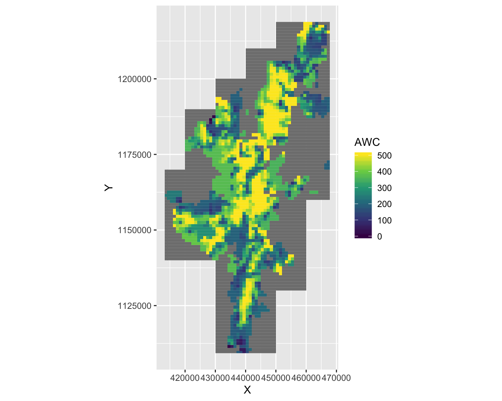

# Discussion

Figure \@ref(fig:heatMapHypoth) ref summarises the support for the hypothesis made in section \#waderHypo. If the results were in agreement across both analysis periods they are marked as strongly supported (SS) and if only in one period partially support (PS). If the hypothesis is not supported by the results at all, or it is not statistically significant, then it is marked as not supported (NS).

(\#fig:heatMapHypoth)Summary of support for hypotheses made in the introduction, for associations between breeding wader density and environmental covariates, between 2002 and 2019 inclusive

## Improved grassland coverage (H1)

In the 1980-90s agricultural subsidies encouraged the farming of high numbers of upland sheep [@Shetland_Islands_Council2016-tz], which in turn supported the "improvement" of marginal in-by grassland so as to produce silage as a winter feed for sheep. Improved fields were also treated with lime and fertiliser so as to artificially boost yields of grass for silage. The practise of rotating re-seeded improved grassland and a spring-sown crop is not widely undertaken in Shetland any longer. The area of ground in cultivation for crops (excluding improved grassland) in Shetland fell by 90% between 1971 and 2008, with much of that decline happening pre 2001 [@Shetland_Islands_Council2016-tz]. This change in farming practices has meant that the grassland sward is typically permanent, and due to sheep grazing is therefore likely to be uniform in structure. The practise of annual fertilising and liming will increase pH which is good for invertebrate abundance, but fast growing and uniform sward, ready to cut in the early summer before the end of the wader nesting season, may not be ideal for breeding waders.

The 2002-2010 analysis period for improved grassland is positively associated with Curlew and Redshank, and negatively associated with Snipe. The second analysis period from 2011-2019 has improved grassland positively associated with all wader species, apart from Snipe which is again negatively associated. The second analysis period validates the hypothesis that there is a positive association between breeding wader density and improved grassland, whilst the first analysis partially supports this. Snipe are known to breed in marshes and bogs [@Robinson2005-qa] and the results agree with this, in that their density response is negatively associated with improved grassland in both analysis periods.

For Lapwing and Oystercatcher, the population change ratio between 2002 and 2019 was positively associated with increased grassland coverage and this agrees with the literature (ref) in that both species prefer to nest in short (grazed) uniform sward in the spring. However Figure \@ref(fig:netChgPlot) clearly shows that between 2002 and 2019 Lapwing abundance has decreased significantly in the south mainland, where improved grassland is the dominant habitat. Current agricultural practices on the more intensively-managed improved grasslands may be incompatible with successful lapwing and Oystercatcher breeding. For example, fast growing silage grass may not provide the open view that lapwings require throughout their nesting period, which could lead to nest abandonment.   

This could be due to a reduction in sheep headage in turn reducing the need for improvement of grassland, between 2002 and 2019. The reduction in cropping and improved grassland together with lower natural food availability in the upland habitat of Shetland, could have driven a declining Oystercatcher and Lapwing populations to increasing densities in the remaining preferred improved grassland habitat. Mccallum et al observed this phenomenon in their paper [@McCallum2018-gx] - *"Lapwing distribution is being constrained between intensively managed lowland farmland with favourable soil conditions and upland sites where lower management intensity favours Lapwings but edaphic conditions limit their distribution"*

## Topsoil organic carbon content (H2)

Peat rich soils have an organic carbon content >40% by weight. Figure \@ref(fig:covarHisto) shows that this is the case for the majority of Shetland soils. A higher organic content is associated with greater soil acidity, which in turn means that a low earthworm abundance [@McCallum2018-gx]. 

Both analysis periods from 2002 to 2019 have strong support for the hypothesis that topsoil organic carbon content is negatively associated with breeding wader abundance. The only exception is for Snipe during 2011-2019 where there was no statistically significant association. In terms of the population change ratio, Snipe population change is positively associated with an increase in topsoil organic carbon content, and Lapwing are not. This is consistent with the literature in that Snipe prefer wetlands which are likely to be acidic bogs that have high organic carbon content, and Lapwing prefer bare fields or short sward grassland that will have relatively low organic carbon content in the topsoil. 

## pH (H3)

Soil pH, together with topsoil organic carbon content, is a key indicator of soil health [@McCallum2016-jt;@McCallum2018-gx] as measured by earthworm density, which falls significantly if the soil pH is less than 5.5. As Shetland soils are mostly acidic peatland, especially in upland areas, a significant proportion of soils have a pH below this level (see Figure \@ref(fig:covarHisto)). It is therefore likely that peatland areas are negatively associated with earthworm abundance. Improved grassland is typically treated with lime and fertiliser in-order to boost growth and therefore this habitat typically has a high pH, giving it a positive association with breeding waders.

The 2002-2010 analysis period for pH has no statistically significant associations with pH, apart from Snipe, which were positively associated. The 2011-2019 analysis period had positive associations for Curlew and Oystercatcher. So it seems that the second analysis period partially supports hypothesis *H3*, but the 2002-2011 analysis period does not. In terms of the population change ratio, pH is positively associated with Lapwing and Oystercatcher population change, and negatively associated with Snipe which is consistent with the literature. Snipe prefer wetlands that are likely to have significant rush vegetation which is typical for a relatively low pH soil.
 
## Heathland percentage coverage (H4)

Farmland in Shetland is currently neither highly intensive nor extensive, and primarily occurs as improved grassland and a very small proportion of barley for animal feed. (> 95% of agricultural land). Wader feeding habitat such as improved grassland or shallow wetland is typically embedded within a mosaic of semi-natural blanket bog unimproved grassland and heath. Heathland habitat within 500m to 2500m [@refJohannesdottir2019-uh] too wetland or improved grassland, makes it ideal for nesting waders such as Curlew, Redshank and Snipe as they can exploit the availability of earthworms and invertebrates too feed their chicks whilst nesting in longer heathland vegetation that gives their nest sites greater protection from predators.

The 2002-2010 analysis period partially supports the hypothesis that heathland is positively associated with all wader species, with only Oystercatcher and Snipe having a positive association with increased heath percentage coverage. This is expected for Snipe, but Oystercatcher are primarily nest on improved or rough grassland. The second analysis period from 2011-2019 shows that all breeding waders have a positive association with increased heath coverage. This results together with the result of the population change ratio association for heathland percentage coverage, suggests that non-heathland species such as Lapwing and Redshank are being displaced from their preferred habitat of improved grassland and wetland respectively, due to changes in habitat between the two analysis periods.

Anecdotal evidence suggests the condition of heathland habitats in Shetland since the late 1990s has improved, due to the disappearance of sheep headage payments that supported very high numbers of sheep in the hills and agri-environment scheme funding for removal of sheep from the hills. Greater vegetation cover and low disturbance levels during the breeding season is possibly providing more suitable nesting conditions in the second survey period.

## Grassland percentage coverage (H5)

Within the EUNIS landcover categorisation dataset, *grassland* contains improved and semi-natural grasslands and so is quite a broad class of habitat. It was expected to have a strong association with all breeding wader species due to the presence of both feeding (earthworms and other invertebrates) and nesting sites, and this is the case across both analysis periods. Perhaps more interesting is that Redshank are the only species to have a statistically significant association in the population change model for grassland association. Breeding Redshank population change is negatively associated with grassland percentage coverage.

The reason for this could be that Redshank require a structurally diverse sward, with areas of tall vegetation to hide their nest, and patches of open vegetation and shallow pools for chicks to feed in [@Sharps2016-jd]. The maintenance of such conditions relies on grazing practices that create a diverse sward, whilst avoiding nest trampling during the breeding season. From an agricultural point of view, suitable redshank habitats are often of poor value and if they have not been agriculturally improved with drainage, they may have become under-grazed leading to habitat which is not suitable for Redshank. Agri-environment schemes have supported the conservation of wetland and wet grassland, primarily through the exclusion of livestock during the breeding season with a light grazing period in the late summer and autumn to remove the annual growth of vegetation. However, if the weather and ground conditions are unsuitable at the end of the year for livestock grazing, these wetlands may be left ungrazed, creating a dense sward of low value as breeding habitat in the following spring.

## Bog percentage coverage (H6)

A significant amount of Shetland is covered in peatland. Healthy peat is relatively acidic due to its permanently water logged state, and so there is unlikely to be a sufficient earthworm supply to support breeding wader populations. The results suggest that this is the case with both analysis periods showing negative association between breeding wader abundance and bog percentage coverage, with the exception of Snipe where association was not statistically significant in the first analysis period. In terms of the population change ratio, it appears that Redshank are positively associated with increased bog percentage coverage. This could be because Redshank prefer a mosaic of wet habitat and grassland when breeding, or it could be that grassland has become less favourable in terms of food availability and so Redshank are nesting in bog habitat as the next best alternative. The population change ratio for Curlew is negatively associated with increased bog percentage landcoverage. This presumably is because nesting Curlew prefer tall vegetation typical of rough grassland and heath.

## Elevation (H7)

Habitat at higher elevations within Shetland is typically heathland, exposed rock or bog and heavily exposed to the extremes of a marine sub-arctic climate. As such food supply for breeding waders will be relatively low compared to lowland areas. This hypothesis is confirmed by the results, which show there is a strongly supported negative association between breeding wader abundance and elevation, except for Snipe, which was not statistically significant. The population change model for elevation has only statistically significant associations for Curlew and Redshank. The fact that breeding Curlew abundance is negatively associated with elevation could again be due to shorter nesting vegetation and availability of earthworms at higher elevations, which are typically peat bog or rock. Redshank population change is positively associated with bog and heath cover, and negatively associated with grassland cover. Whilst lowland habitats are less suitable, higher altitude habitats may have become more attractive.

## Distance from the sea (H8)

The results for the distance from the sea to the nest site vary by significantly by species. In the first analysis period Curlew, Oystercatcher and Snipe have positive associations for distance from the sea to nest locations, whilst Lapwing have a negative association and Redshank is not statistically significant. The second analysis period has the same results apart from Oystercatcher which now have a negative association. Those species that show greater nesting abundance at large distances from the coast may be responding to pressure from coastal predators. Shetland has a significant coastal population of Eurasian Otter *Lutra lutra* [@Jncc2020-tp] and gulls such as the Great black backed gull *Larus marinus* that may predate wader eggs or chicks. For species that respond negatively to the distance from the sea, Lapwing and Oystercatcher, this may be because their preference is for improved grassland that is predominantly in the south mainland and typically only a few hundred meters from the sea. Snipe breeds in moorland habitats that may be further away from the coast.

The only statistically significant results for the population change model are for Curlew and Oystercatcher, which both show a negative association between population change over the two analysis periods and distance from the sea. This maybe due to changes within inland nesting territories, such as the decline in available food resources over time.
 
## Bare peat percentage coverage (H9)

Shetland has a significant amount of degraded peatland, and a proportion of this is degraded to the point where the thin vegetative top layer of sphagna known as the *acrotelm* has completely died, leaving the deep acidic and water logged peat store known as the *catotelm* exposed. The exposed bare peat layer then further degrades overtime. The results for the two analysis periods show that as expected wader breeding abundance is either strongly or partially supported by a negative association with bare peat percentage landcover. This is most likely due to their being very little food resources available and suitable nesting opportunities in such habitat. Although the population change model results show that Redshank are positively associated with this covariate. This could be because bare peatland forms part of upland mosaics that include wetlands and heath, where Redshank are known to nest.

## Available water capacity (H10)

Heathland together with unimproved grassland and blanket bog characterises the majority of habitat within the Shetland archipelago. Breeding wader densities in these semi-natural mosaic are found to be consistently higher when surrounding landscapes had more wetland at scales ranging from 500m to 2500m, indicating the importance of wetland availability [@Johannesdottir2019-uh]. Both analysis periods show that all breeding wader abundance, apart from Snipe, is negatively associated with increasing water capacity of the topsoil. This is contrast to the hypothesis made in the introduction [ref] that postulated that wader abundance would increase as available water capacity increases. It appears that whilst all waders have a preference for damp or wet habitat, only Snipe tolerate water logged habitat that is characteristic of the upland semi-natural mosaic. Although it appears that the population change model shows that Oystercatcher and Redshank are also tending to show a positive association in terms of population change and available water capacity. This association could explain why there have been significant declines of Oystercatcher and Redshank between 2002 and 2019 in the north east of Shetland on the islands of Unst and Fetlar. Here the available water capacity (AWC) in the soil is relatively low (see Figure \@ref(fig:plotAWC)), so if the climate is becomming increasingly dry in the breeding season this could be forcing both Oystercather and Redshank too areas with higher AWC.

(\#fig:plotAWC)Available Water Capacity (kPA) across Shetland

## Landcover heterogeneity (H11)

Marginal entropy is a metric to measure the thematic complexity, or heterogeneity of landcover. As postulated in [@refJohannesdottir2019-uh] landscapes that have relatively low agricultural productivity and that are farmed at low intensity and extent often maximise species diversity and resources. As Shetland is characterised by this type of agriculture practices, which in turn are embedded within a semi-natural mosaic of wetland, heath, rough grassland and peat bogs, it is expected that wader breeding abundance is positively associated with marginal entropy. There appears to be strong support for this hypothesis across all wader species, except Snipe. Snipe are negatively associated with increasing marginal entropy and this is likely due to their preference [@Farm_Advisory_Service2017-xu] for dense wetland and moorland habitat when nesting. This exists extensively in Shetland.

## Landcover homogeneity (H12)

Relative mutual information seeks to measure the degree of spatial aggregation of habitat classes within the wider landscape it is situated in. It is expected that breeding waders prefer a mosaic of distinct habitats that allows chicks to walk between nesting and feeding habitats. The hypothesis that waders would negatively respond to increased spatial aggregation of habitat, is not supported by the results. The results suggest a positive association between all wader species and relative mutual information in the first analysis period, and no statistically significant association apart from Snipe, that are positively associated, in the second analysis period. It is expected that Snipe would be positively associated with increasing relative mutual information as they are specialists of dense wetland and moorland habitats. Despite the non-conclusive evidence for the two individual analysis periods, the population change model does have statistically significant negative associations for increasing relative mutual information and Lapwing and Oystercatcher abundance changes. This suggests that both these species have shown lower nesting densities when habitat homogeneity increases. This result supports the assertion that Lapwing and Oystercatcher prefer nesting habitat of short or bare grassland surrounded by shallow wet scrapes; that is landcover that shows significant heterogeneity.

## Shetland wader population trends and implications for conservation outcomes

The results from the Shetland wader population trends show that breeding waders across Shetland have declined, but not nearly as much as those on the UK mainland. The 2015 BTO Breeding Bird Survey [@Harris_SJ2016-yw] estimates that across Britain farmland wader breeding populations between 1995 and 2015 declined -19% for Oystercatcher, -43% for Lapwing, -48% for Curlew, -39% for Redshank.

A 1993 RSPB wader survey [ref] was conducted inorder to estimate the overall numbers of breeding waders on *lowland* Shetland (a total area of 398 km$^2$ ). In 1986 a survey was undertaken of Shetland *moorland* (ref),  a total area of 1,019km$^2$. Although both surveys are separated by some nine years, the sum of both surveys gives an estimate for the baseline for the results of this study. Table \@ref(tab:prevSurveys) shows the results of the combine 1986 and 1993 surveys, together with the population estimates for the BBS surveys in 2002 and 2019. 

Species    1986   1993   1986 + 1993   2002   2019
--------  -----  -----  ------------  -----  -----
CU         1950   2025          3975   4567   4088
L           650   1950          2600   3474   2638
OC         1700   3300          5000   5269   4760
RK          110   1075          1275   2390   2248
SN          800   2650          3450   6043   7391

It can be seen that for Curlew, Lapwing and Oystercatcher 2019 and 1986/1993 population estimates are broadly similar, but there was a noticeable increase in Redshank and Snipe. For Snipe it is possible that the methodology for estimating their numbers has improved, such that the 1986/1993 survey underestimated their numbers. 

Comparing 2019 to 2002 it does look as if there was a general decline in each species, apart from in Snipe. The most significant decline being Lapwing the analysis shown in Figure xxx shows that Lapwing decline are strongly associated with a reduction in reseeding of improved grassland for agricultural silage. The clear association between declines of lapwing and temporary grassland is statistically significant (p<0.0001) and it suggests that the 24% drop in the Shetland Lapwing population could be due to the significant decline of bare spring-sown grassland and tillage. This finding is also suggested as the major cause of Lapwing declines in a 25 year study of a population of farmland breeding waders [@Bell2017-iy]. Lapwing appear to benefit from agricultural practices that create bare earth or a very short sward (<5cm) every spring, or more generally nesting sites with an open view. It appears that practices over time, driven by subsidies, have created a grass monoculture of low value to lapwings. This evidence could help in shaping agri-environment schemes, where focus to-date focused has been on improving nesting habitats, rather than focusing on ensuring feeding habitats are maintained or improved. Ideally a mosaic of both habitats would be created under these schemes. This result suggests that low intensity agriculture is a critical factor in the success of breeding wader populations, and how farmers can be important stewards of nature. 

## The significance of soil health on wader populations

An important area that has arisen through analysing wader densities and population change is the interaction between semi-natural and improved grassland habitats, and how this interaction drives food availability for wader chicks. Breeding wader research has recently started to focus on understanding the importance of soil health [@McCallum2018-gx;@McCallum2016-jt] in creating adequate food supplies for breeding waders. Understanding earthworm and invertebrate density gradients in different habitat types, and any interaction effects between environmental covariates would be beneficial to improving wader populations and is a potential area of future work. There has been some related work [@Pansu2015-ad] whereby environmental-DNA of soil samples was sequenced to make landscape-scale assessments of soil-biodiversity and its drivers.

As the population change model for Lapwing clearly shows (ref), their population whilst declining, has increased in density on lowland improved grassland cover. The Agricultural Census data(ref) show a decline in this habitat type. This suggests that lack of available feeding habitat could be driving this particular change in spatial distribution. One way of improving feeding habitat in areas where suitable lowland habitat is not available, could be through the application of lime on upland where there is a greater amount of suitable nesting habitats, but where food abundance is not sufficient due to the quality of the soil structure. 

## Covariates that were not explored

Vegetation structure - tall dense vegetation containing rushes is not preferred by Lapwing or Oystercatcher, as they require vegetation that gives them a clear line of sight for predators. when  nesting. However dense and taller vegetation structure is ideal for waders in general as Redshank, Curlew and Snipe can hide their nests in the longer grass and rushes. Recent work [@Howison2018-gc] has focused on developing radar‐based remote sensing technique (Sentinel‐1 C‐band radar) for large‐scale quantification of agricultural land‐use intensity and vegetation, across human‐dominated landscapes. 

Predation - there is significant potential for wader nest and chick predation on Shetland. Possible predators include hedgehogs, rats, corvids and coastal predators including otter and gulls. It was not possible to obtain relevant survey data in order to test this hypothesis and remains an important area of possible future survey work and data analysis. 

Weather - changes in weather patterns might also have a significant long term effect on breeding waders on Shetland. For example very wet spring weather may mean it is not posssible for grassland to be reseeded or spring crops, such as barley, to be sown. As discussed previously, this is a key habitat for Lapwing and Oystercatcher. An important piece of future of work would be to examine the impact of future scenarios of climate change. If the wader breeding season has more severe weather, this may significantly affect wader food sources or productivity in general.

## Conclusion

 
