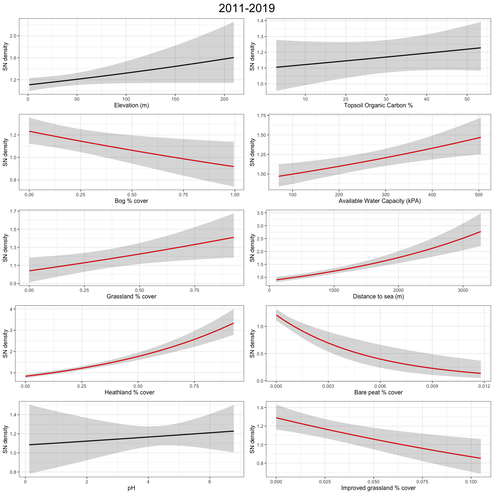
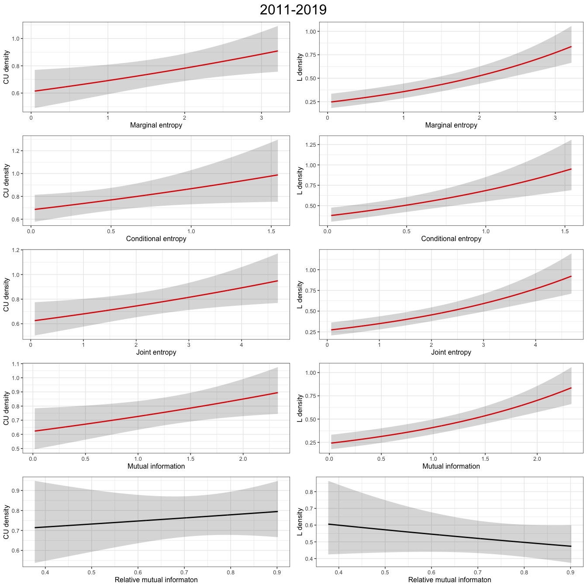
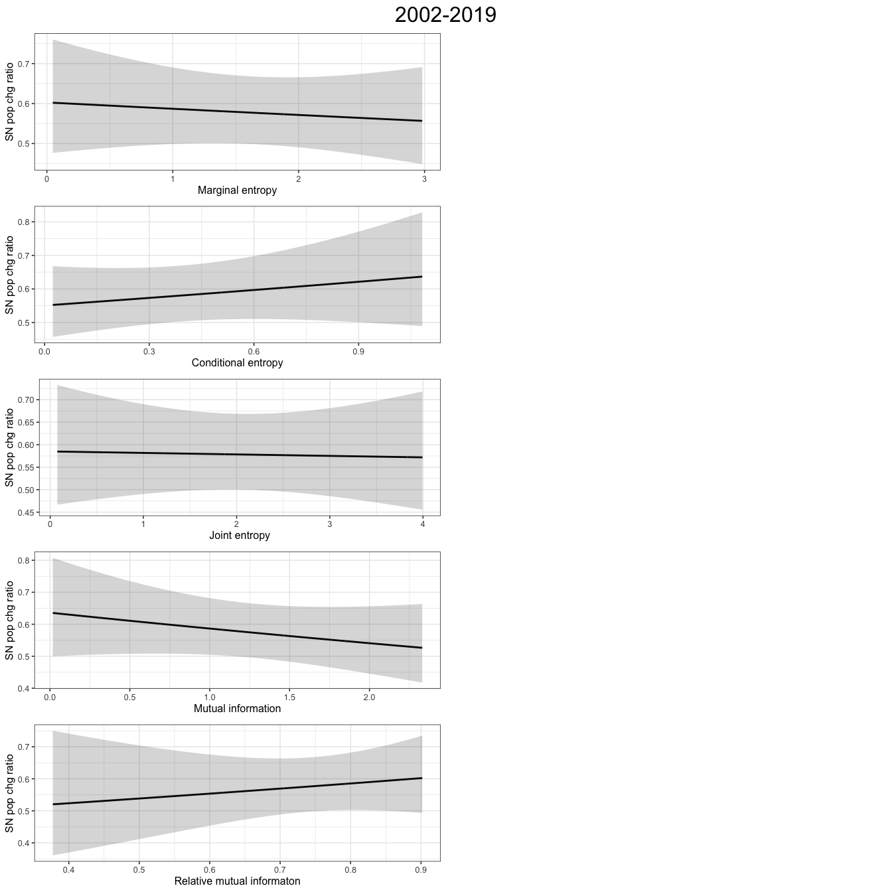
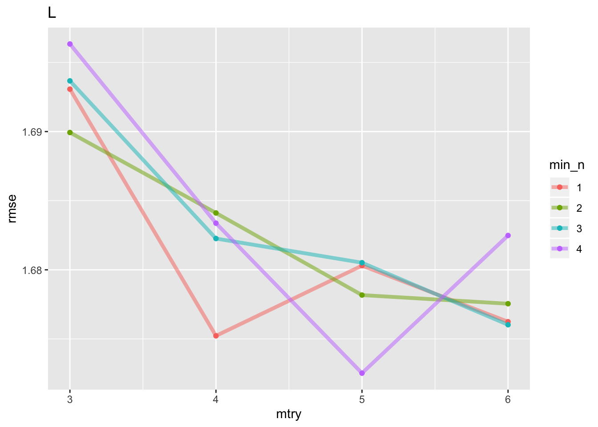
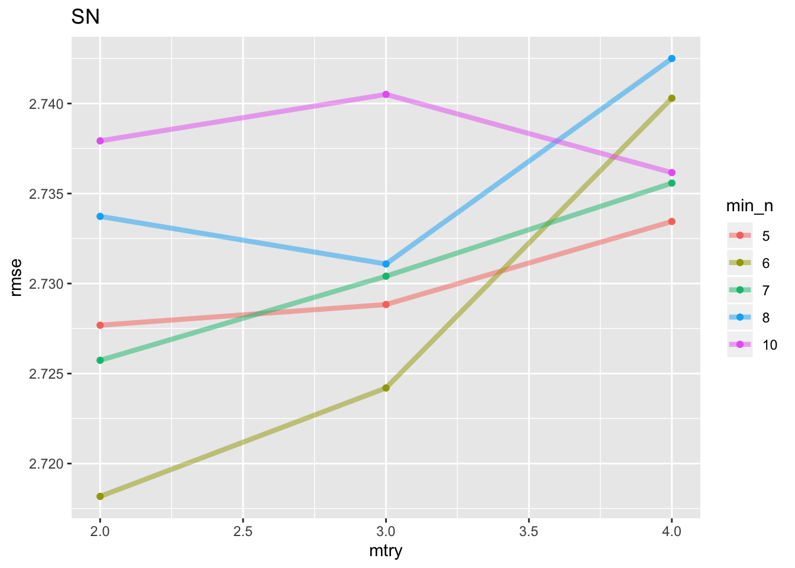

# (APPENDIX) Appendix {-} 


# Parameters for GAM abundance response model

<table class="table" style="font-size: 12px; margin-left: auto; margin-right: auto;">
 <thead>
  <tr>
   <th style="text-align:center;"> Species </th>
   <th style="text-align:left;"> Response </th>
   <th style="text-align:left;"> Covariate </th>
   <th style="text-align:center;"> Estimate </th>
   <th style="text-align:center;"> se </th>
   <th style="text-align:center;"> z </th>
   <th style="text-align:center;"> p-value </th>
  </tr>
 </thead>
<tbody>
  <tr>
   <td style="text-align:center;font-weight: bold;vertical-align: top !important;" rowspan="20"> CU </td>
   <td style="text-align:left;vertical-align: top !important;" rowspan="10"> 2002-2010 </td>
   <td style="text-align:left;"> Elevation (m) </td>
   <td style="text-align:center;"> -0.0047660 </td>
   <td style="text-align:center;"> 0.0012923 </td>
   <td style="text-align:center;"> -3.6881254 </td>
   <td style="text-align:center;"> 0.0002259 </td>
  </tr>
  <tr>
   
   
   <td style="text-align:left;"> Bog % cover </td>
   <td style="text-align:center;"> -0.5978205 </td>
   <td style="text-align:center;"> 0.1431517 </td>
   <td style="text-align:center;"> -4.1761322 </td>
   <td style="text-align:center;"> 0.0000297 </td>
  </tr>
  <tr>
   
   
   <td style="text-align:left;"> Grassland % cover </td>
   <td style="text-align:center;"> 1.5957249 </td>
   <td style="text-align:center;"> 0.1493591 </td>
   <td style="text-align:center;"> 10.6838176 </td>
   <td style="text-align:center;"> 0.0000000 </td>
  </tr>
  <tr>
   
   
   <td style="text-align:left;"> Heathland % cover </td>
   <td style="text-align:center;"> 0.0091149 </td>
   <td style="text-align:center;"> 0.1774234 </td>
   <td style="text-align:center;"> 0.0513737 </td>
   <td style="text-align:center;"> 0.9590277 </td>
  </tr>
  <tr>
   
   
   <td style="text-align:left;"> pH </td>
   <td style="text-align:center;"> -0.0538407 </td>
   <td style="text-align:center;"> 0.0529630 </td>
   <td style="text-align:center;"> -1.0165715 </td>
   <td style="text-align:center;"> 0.3093573 </td>
  </tr>
  <tr>
   
   
   <td style="text-align:left;"> Topsoil Organic Carbon % </td>
   <td style="text-align:center;"> -0.0071180 </td>
   <td style="text-align:center;"> 0.0025020 </td>
   <td style="text-align:center;"> -2.8449063 </td>
   <td style="text-align:center;"> 0.0044424 </td>
  </tr>
  <tr>
   
   
   <td style="text-align:left;"> Available Water Capacity (kPA) </td>
   <td style="text-align:center;"> -0.0016417 </td>
   <td style="text-align:center;"> 0.0003635 </td>
   <td style="text-align:center;"> -4.5160087 </td>
   <td style="text-align:center;"> 0.0000063 </td>
  </tr>
  <tr>
   
   
   <td style="text-align:left;"> Distance to sea (m) </td>
   <td style="text-align:center;"> 0.0003244 </td>
   <td style="text-align:center;"> 0.0000542 </td>
   <td style="text-align:center;"> 5.9833759 </td>
   <td style="text-align:center;"> 0.0000000 </td>
  </tr>
  <tr>
   
   
   <td style="text-align:left;"> Bare peat % cover </td>
   <td style="text-align:center;"> -149.7968058 </td>
   <td style="text-align:center;"> 46.6291133 </td>
   <td style="text-align:center;"> -3.2125167 </td>
   <td style="text-align:center;"> 0.0013158 </td>
  </tr>
  <tr>
   
   
   <td style="text-align:left;"> Improved grassland % cover </td>
   <td style="text-align:center;"> 3.0053196 </td>
   <td style="text-align:center;"> 1.2307390 </td>
   <td style="text-align:center;"> 2.4418821 </td>
   <td style="text-align:center;"> 0.0146109 </td>
  </tr>
  <tr>
   
   <td style="text-align:left;vertical-align: top !important;" rowspan="10"> 2011-2019 </td>
   <td style="text-align:left;"> Elevation (m) </td>
   <td style="text-align:center;"> -0.0029241 </td>
   <td style="text-align:center;"> 0.0011530 </td>
   <td style="text-align:center;"> -2.5361057 </td>
   <td style="text-align:center;"> 0.0112093 </td>
  </tr>
  <tr>
   
   
   <td style="text-align:left;"> Bog % cover </td>
   <td style="text-align:center;"> -0.5285263 </td>
   <td style="text-align:center;"> 0.1417328 </td>
   <td style="text-align:center;"> -3.7290335 </td>
   <td style="text-align:center;"> 0.0001922 </td>
  </tr>
  <tr>
   
   
   <td style="text-align:left;"> Grassland % cover </td>
   <td style="text-align:center;"> 1.3222096 </td>
   <td style="text-align:center;"> 0.1416748 </td>
   <td style="text-align:center;"> 9.3327057 </td>
   <td style="text-align:center;"> 0.0000000 </td>
  </tr>
  <tr>
   
   
   <td style="text-align:left;"> Heathland % cover </td>
   <td style="text-align:center;"> 0.5013633 </td>
   <td style="text-align:center;"> 0.1602352 </td>
   <td style="text-align:center;"> 3.1289210 </td>
   <td style="text-align:center;"> 0.0017545 </td>
  </tr>
  <tr>
   
   
   <td style="text-align:left;"> pH </td>
   <td style="text-align:center;"> 0.1014162 </td>
   <td style="text-align:center;"> 0.0488042 </td>
   <td style="text-align:center;"> 2.0780229 </td>
   <td style="text-align:center;"> 0.0377073 </td>
  </tr>
  <tr>
   
   
   <td style="text-align:left;"> Topsoil Organic Carbon % </td>
   <td style="text-align:center;"> -0.0071234 </td>
   <td style="text-align:center;"> 0.0023084 </td>
   <td style="text-align:center;"> -3.0858314 </td>
   <td style="text-align:center;"> 0.0020298 </td>
  </tr>
  <tr>
   
   
   <td style="text-align:left;"> Available Water Capacity (kPA) </td>
   <td style="text-align:center;"> -0.0010745 </td>
   <td style="text-align:center;"> 0.0003394 </td>
   <td style="text-align:center;"> -3.1659146 </td>
   <td style="text-align:center;"> 0.0015460 </td>
  </tr>
  <tr>
   
   
   <td style="text-align:left;"> Distance to sea (m) </td>
   <td style="text-align:center;"> 0.0001556 </td>
   <td style="text-align:center;"> 0.0000486 </td>
   <td style="text-align:center;"> 3.2015598 </td>
   <td style="text-align:center;"> 0.0013669 </td>
  </tr>
  <tr>
   
   
   <td style="text-align:left;"> Bare peat % cover </td>
   <td style="text-align:center;"> -143.8121516 </td>
   <td style="text-align:center;"> 41.9961883 </td>
   <td style="text-align:center;"> -3.4244096 </td>
   <td style="text-align:center;"> 0.0006161 </td>
  </tr>
  <tr>
   
   
   <td style="text-align:left;"> Improved grassland % cover </td>
   <td style="text-align:center;"> 5.4890572 </td>
   <td style="text-align:center;"> 1.1451489 </td>
   <td style="text-align:center;"> 4.7933132 </td>
   <td style="text-align:center;"> 0.0000016 </td>
  </tr>
  <tr>
   <td style="text-align:center;font-weight: bold;vertical-align: top !important;" rowspan="20"> L </td>
   <td style="text-align:left;vertical-align: top !important;" rowspan="10"> 2002-2010 </td>
   <td style="text-align:left;"> Elevation (m) </td>
   <td style="text-align:center;"> -0.0116020 </td>
   <td style="text-align:center;"> 0.0018571 </td>
   <td style="text-align:center;"> -6.2474785 </td>
   <td style="text-align:center;"> 0.0000000 </td>
  </tr>
  <tr>
   
   
   <td style="text-align:left;"> Bog % cover </td>
   <td style="text-align:center;"> -1.1722359 </td>
   <td style="text-align:center;"> 0.1998145 </td>
   <td style="text-align:center;"> -5.8666201 </td>
   <td style="text-align:center;"> 0.0000000 </td>
  </tr>
  <tr>
   
   
   <td style="text-align:left;"> Grassland % cover </td>
   <td style="text-align:center;"> 1.4793656 </td>
   <td style="text-align:center;"> 0.1722758 </td>
   <td style="text-align:center;"> 8.5871951 </td>
   <td style="text-align:center;"> 0.0000000 </td>
  </tr>
  <tr>
   
   
   <td style="text-align:left;"> Heathland % cover </td>
   <td style="text-align:center;"> 0.7753116 </td>
   <td style="text-align:center;"> 0.1910296 </td>
   <td style="text-align:center;"> 4.0585943 </td>
   <td style="text-align:center;"> 0.0000494 </td>
  </tr>
  <tr>
   
   
   <td style="text-align:left;"> pH </td>
   <td style="text-align:center;"> -0.0956080 </td>
   <td style="text-align:center;"> 0.0521447 </td>
   <td style="text-align:center;"> -1.8335129 </td>
   <td style="text-align:center;"> 0.0667263 </td>
  </tr>
  <tr>
   
   
   <td style="text-align:left;"> Topsoil Organic Carbon % </td>
   <td style="text-align:center;"> -0.0050744 </td>
   <td style="text-align:center;"> 0.0028493 </td>
   <td style="text-align:center;"> -1.7809448 </td>
   <td style="text-align:center;"> 0.0749215 </td>
  </tr>
  <tr>
   
   
   <td style="text-align:left;"> Available Water Capacity (kPA) </td>
   <td style="text-align:center;"> -0.0027432 </td>
   <td style="text-align:center;"> 0.0004465 </td>
   <td style="text-align:center;"> -6.1441209 </td>
   <td style="text-align:center;"> 0.0000000 </td>
  </tr>
  <tr>
   
   
   <td style="text-align:left;"> Distance to sea (m) </td>
   <td style="text-align:center;"> -0.0001574 </td>
   <td style="text-align:center;"> 0.0000716 </td>
   <td style="text-align:center;"> -2.1970063 </td>
   <td style="text-align:center;"> 0.0280200 </td>
  </tr>
  <tr>
   
   
   <td style="text-align:left;"> Bare peat % cover </td>
   <td style="text-align:center;"> -48.6255298 </td>
   <td style="text-align:center;"> 32.9964191 </td>
   <td style="text-align:center;"> -1.4736608 </td>
   <td style="text-align:center;"> 0.1405729 </td>
  </tr>
  <tr>
   
   
   <td style="text-align:left;"> Improved grassland % cover </td>
   <td style="text-align:center;"> -0.8575667 </td>
   <td style="text-align:center;"> 1.4587527 </td>
   <td style="text-align:center;"> -0.5878767 </td>
   <td style="text-align:center;"> 0.5566151 </td>
  </tr>
  <tr>
   
   <td style="text-align:left;vertical-align: top !important;" rowspan="10"> 2011-2019 </td>
   <td style="text-align:left;"> Elevation (m) </td>
   <td style="text-align:center;"> -0.0085036 </td>
   <td style="text-align:center;"> 0.0017825 </td>
   <td style="text-align:center;"> -4.7706336 </td>
   <td style="text-align:center;"> 0.0000018 </td>
  </tr>
  <tr>
   
   
   <td style="text-align:left;"> Bog % cover </td>
   <td style="text-align:center;"> -1.7422696 </td>
   <td style="text-align:center;"> 0.2446933 </td>
   <td style="text-align:center;"> -7.1202169 </td>
   <td style="text-align:center;"> 0.0000000 </td>
  </tr>
  <tr>
   
   
   <td style="text-align:left;"> Grassland % cover </td>
   <td style="text-align:center;"> 1.3640855 </td>
   <td style="text-align:center;"> 0.1733790 </td>
   <td style="text-align:center;"> 7.8676499 </td>
   <td style="text-align:center;"> 0.0000000 </td>
  </tr>
  <tr>
   
   
   <td style="text-align:left;"> Heathland % cover </td>
   <td style="text-align:center;"> 0.8882417 </td>
   <td style="text-align:center;"> 0.1890840 </td>
   <td style="text-align:center;"> 4.6976030 </td>
   <td style="text-align:center;"> 0.0000026 </td>
  </tr>
  <tr>
   
   
   <td style="text-align:left;"> pH </td>
   <td style="text-align:center;"> 0.0362716 </td>
   <td style="text-align:center;"> 0.0563323 </td>
   <td style="text-align:center;"> 0.6438867 </td>
   <td style="text-align:center;"> 0.5196489 </td>
  </tr>
  <tr>
   
   
   <td style="text-align:left;"> Topsoil Organic Carbon % </td>
   <td style="text-align:center;"> -0.0103562 </td>
   <td style="text-align:center;"> 0.0029467 </td>
   <td style="text-align:center;"> -3.5144487 </td>
   <td style="text-align:center;"> 0.0004407 </td>
  </tr>
  <tr>
   
   
   <td style="text-align:left;"> Available Water Capacity (kPA) </td>
   <td style="text-align:center;"> -0.0023495 </td>
   <td style="text-align:center;"> 0.0004682 </td>
   <td style="text-align:center;"> -5.0182718 </td>
   <td style="text-align:center;"> 0.0000005 </td>
  </tr>
  <tr>
   
   
   <td style="text-align:left;"> Distance to sea (m) </td>
   <td style="text-align:center;"> -0.0001670 </td>
   <td style="text-align:center;"> 0.0000696 </td>
   <td style="text-align:center;"> -2.3982314 </td>
   <td style="text-align:center;"> 0.0164745 </td>
  </tr>
  <tr>
   
   
   <td style="text-align:left;"> Bare peat % cover </td>
   <td style="text-align:center;"> -611.2812790 </td>
   <td style="text-align:center;"> 154.3431183 </td>
   <td style="text-align:center;"> -3.9605347 </td>
   <td style="text-align:center;"> 0.0000748 </td>
  </tr>
  <tr>
   
   
   <td style="text-align:left;"> Improved grassland % cover </td>
   <td style="text-align:center;"> 3.7644091 </td>
   <td style="text-align:center;"> 1.3459139 </td>
   <td style="text-align:center;"> 2.7969167 </td>
   <td style="text-align:center;"> 0.0051593 </td>
  </tr>
  <tr>
   <td style="text-align:center;font-weight: bold;vertical-align: top !important;" rowspan="20"> OC </td>
   <td style="text-align:left;vertical-align: top !important;" rowspan="10"> 2002-2010 </td>
   <td style="text-align:left;"> Elevation (m) </td>
   <td style="text-align:center;"> -0.0069456 </td>
   <td style="text-align:center;"> 0.0013528 </td>
   <td style="text-align:center;"> -5.1341978 </td>
   <td style="text-align:center;"> 0.0000003 </td>
  </tr>
  <tr>
   
   
   <td style="text-align:left;"> Bog % cover </td>
   <td style="text-align:center;"> -1.5159619 </td>
   <td style="text-align:center;"> 0.1685326 </td>
   <td style="text-align:center;"> -8.9950669 </td>
   <td style="text-align:center;"> 0.0000000 </td>
  </tr>
  <tr>
   
   
   <td style="text-align:left;"> Grassland % cover </td>
   <td style="text-align:center;"> 1.9029425 </td>
   <td style="text-align:center;"> 0.1413390 </td>
   <td style="text-align:center;"> 13.4636751 </td>
   <td style="text-align:center;"> 0.0000000 </td>
  </tr>
  <tr>
   
   
   <td style="text-align:left;"> Heathland % cover </td>
   <td style="text-align:center;"> 0.5420250 </td>
   <td style="text-align:center;"> 0.1596300 </td>
   <td style="text-align:center;"> 3.3955074 </td>
   <td style="text-align:center;"> 0.0006850 </td>
  </tr>
  <tr>
   
   
   <td style="text-align:left;"> pH </td>
   <td style="text-align:center;"> 0.0167137 </td>
   <td style="text-align:center;"> 0.0464099 </td>
   <td style="text-align:center;"> 0.3601316 </td>
   <td style="text-align:center;"> 0.7187487 </td>
  </tr>
  <tr>
   
   
   <td style="text-align:left;"> Topsoil Organic Carbon % </td>
   <td style="text-align:center;"> -0.0141199 </td>
   <td style="text-align:center;"> 0.0023567 </td>
   <td style="text-align:center;"> -5.9914867 </td>
   <td style="text-align:center;"> 0.0000000 </td>
  </tr>
  <tr>
   
   
   <td style="text-align:left;"> Available Water Capacity (kPA) </td>
   <td style="text-align:center;"> -0.0027407 </td>
   <td style="text-align:center;"> 0.0003489 </td>
   <td style="text-align:center;"> -7.8560777 </td>
   <td style="text-align:center;"> 0.0000000 </td>
  </tr>
  <tr>
   
   
   <td style="text-align:left;"> Distance to sea (m) </td>
   <td style="text-align:center;"> 0.0001348 </td>
   <td style="text-align:center;"> 0.0000515 </td>
   <td style="text-align:center;"> 2.6185702 </td>
   <td style="text-align:center;"> 0.0088299 </td>
  </tr>
  <tr>
   
   
   <td style="text-align:left;"> Bare peat % cover </td>
   <td style="text-align:center;"> -48.4679745 </td>
   <td style="text-align:center;"> 26.4110348 </td>
   <td style="text-align:center;"> -1.8351411 </td>
   <td style="text-align:center;"> 0.0664848 </td>
  </tr>
  <tr>
   
   
   <td style="text-align:left;"> Improved grassland % cover </td>
   <td style="text-align:center;"> -0.2004924 </td>
   <td style="text-align:center;"> 1.1809486 </td>
   <td style="text-align:center;"> -0.1697723 </td>
   <td style="text-align:center;"> 0.8651892 </td>
  </tr>
  <tr>
   
   <td style="text-align:left;vertical-align: top !important;" rowspan="10"> 2011-2019 </td>
   <td style="text-align:left;"> Elevation (m) </td>
   <td style="text-align:center;"> -0.0046176 </td>
   <td style="text-align:center;"> 0.0010919 </td>
   <td style="text-align:center;"> -4.2290824 </td>
   <td style="text-align:center;"> 0.0000235 </td>
  </tr>
  <tr>
   
   
   <td style="text-align:left;"> Bog % cover </td>
   <td style="text-align:center;"> -1.3024217 </td>
   <td style="text-align:center;"> 0.1507293 </td>
   <td style="text-align:center;"> -8.6407972 </td>
   <td style="text-align:center;"> 0.0000000 </td>
  </tr>
  <tr>
   
   
   <td style="text-align:left;"> Grassland % cover </td>
   <td style="text-align:center;"> 1.6716694 </td>
   <td style="text-align:center;"> 0.1274199 </td>
   <td style="text-align:center;"> 13.1193729 </td>
   <td style="text-align:center;"> 0.0000000 </td>
  </tr>
  <tr>
   
   
   <td style="text-align:left;"> Heathland % cover </td>
   <td style="text-align:center;"> 0.4353141 </td>
   <td style="text-align:center;"> 0.1415596 </td>
   <td style="text-align:center;"> 3.0751299 </td>
   <td style="text-align:center;"> 0.0021041 </td>
  </tr>
  <tr>
   
   
   <td style="text-align:left;"> pH </td>
   <td style="text-align:center;"> 0.1295746 </td>
   <td style="text-align:center;"> 0.0416677 </td>
   <td style="text-align:center;"> 3.1097135 </td>
   <td style="text-align:center;"> 0.0018727 </td>
  </tr>
  <tr>
   
   
   <td style="text-align:left;"> Topsoil Organic Carbon % </td>
   <td style="text-align:center;"> -0.0084269 </td>
   <td style="text-align:center;"> 0.0020514 </td>
   <td style="text-align:center;"> -4.1078160 </td>
   <td style="text-align:center;"> 0.0000399 </td>
  </tr>
  <tr>
   
   
   <td style="text-align:left;"> Available Water Capacity (kPA) </td>
   <td style="text-align:center;"> -0.0016516 </td>
   <td style="text-align:center;"> 0.0003100 </td>
   <td style="text-align:center;"> -5.3282818 </td>
   <td style="text-align:center;"> 0.0000001 </td>
  </tr>
  <tr>
   
   
   <td style="text-align:left;"> Distance to sea (m) </td>
   <td style="text-align:center;"> -0.0001179 </td>
   <td style="text-align:center;"> 0.0000461 </td>
   <td style="text-align:center;"> -2.5554062 </td>
   <td style="text-align:center;"> 0.0106064 </td>
  </tr>
  <tr>
   
   
   <td style="text-align:left;"> Bare peat % cover </td>
   <td style="text-align:center;"> -566.7981796 </td>
   <td style="text-align:center;"> 108.6161007 </td>
   <td style="text-align:center;"> -5.2183624 </td>
   <td style="text-align:center;"> 0.0000002 </td>
  </tr>
  <tr>
   
   
   <td style="text-align:left;"> Improved grassland % cover </td>
   <td style="text-align:center;"> 2.9790008 </td>
   <td style="text-align:center;"> 1.0430428 </td>
   <td style="text-align:center;"> 2.8560678 </td>
   <td style="text-align:center;"> 0.0042892 </td>
  </tr>
  <tr>
   <td style="text-align:center;font-weight: bold;vertical-align: top !important;" rowspan="20"> RK </td>
   <td style="text-align:left;vertical-align: top !important;" rowspan="10"> 2002-2010 </td>
   <td style="text-align:left;"> Elevation (m) </td>
   <td style="text-align:center;"> -0.0217511 </td>
   <td style="text-align:center;"> 0.0025999 </td>
   <td style="text-align:center;"> -8.3661544 </td>
   <td style="text-align:center;"> 0.0000000 </td>
  </tr>
  <tr>
   
   
   <td style="text-align:left;"> Bog % cover </td>
   <td style="text-align:center;"> -1.8520374 </td>
   <td style="text-align:center;"> 0.2704231 </td>
   <td style="text-align:center;"> -6.8486651 </td>
   <td style="text-align:center;"> 0.0000000 </td>
  </tr>
  <tr>
   
   
   <td style="text-align:left;"> Grassland % cover </td>
   <td style="text-align:center;"> 1.8121030 </td>
   <td style="text-align:center;"> 0.2037015 </td>
   <td style="text-align:center;"> 8.8958740 </td>
   <td style="text-align:center;"> 0.0000000 </td>
  </tr>
  <tr>
   
   
   <td style="text-align:left;"> Heathland % cover </td>
   <td style="text-align:center;"> 0.0692450 </td>
   <td style="text-align:center;"> 0.2258397 </td>
   <td style="text-align:center;"> 0.3066112 </td>
   <td style="text-align:center;"> 0.7591394 </td>
  </tr>
  <tr>
   
   
   <td style="text-align:left;"> pH </td>
   <td style="text-align:center;"> -0.0516209 </td>
   <td style="text-align:center;"> 0.0657742 </td>
   <td style="text-align:center;"> -0.7848204 </td>
   <td style="text-align:center;"> 0.4325588 </td>
  </tr>
  <tr>
   
   
   <td style="text-align:left;"> Topsoil Organic Carbon % </td>
   <td style="text-align:center;"> -0.0092177 </td>
   <td style="text-align:center;"> 0.0033311 </td>
   <td style="text-align:center;"> -2.7671471 </td>
   <td style="text-align:center;"> 0.0056549 </td>
  </tr>
  <tr>
   
   
   <td style="text-align:left;"> Available Water Capacity (kPA) </td>
   <td style="text-align:center;"> -0.0035239 </td>
   <td style="text-align:center;"> 0.0005318 </td>
   <td style="text-align:center;"> -6.6265269 </td>
   <td style="text-align:center;"> 0.0000000 </td>
  </tr>
  <tr>
   
   
   <td style="text-align:left;"> Distance to sea (m) </td>
   <td style="text-align:center;"> -0.0001484 </td>
   <td style="text-align:center;"> 0.0000848 </td>
   <td style="text-align:center;"> -1.7503084 </td>
   <td style="text-align:center;"> 0.0800651 </td>
  </tr>
  <tr>
   
   
   <td style="text-align:left;"> Bare peat % cover </td>
   <td style="text-align:center;"> -222.4706573 </td>
   <td style="text-align:center;"> 81.2839584 </td>
   <td style="text-align:center;"> -2.7369565 </td>
   <td style="text-align:center;"> 0.0062010 </td>
  </tr>
  <tr>
   
   
   <td style="text-align:left;"> Improved grassland % cover </td>
   <td style="text-align:center;"> 3.9142068 </td>
   <td style="text-align:center;"> 1.5788757 </td>
   <td style="text-align:center;"> 2.4791101 </td>
   <td style="text-align:center;"> 0.0131711 </td>
  </tr>
  <tr>
   
   <td style="text-align:left;vertical-align: top !important;" rowspan="10"> 2011-2019 </td>
   <td style="text-align:left;"> Elevation (m) </td>
   <td style="text-align:center;"> -0.0117473 </td>
   <td style="text-align:center;"> 0.0022212 </td>
   <td style="text-align:center;"> -5.2886287 </td>
   <td style="text-align:center;"> 0.0000001 </td>
  </tr>
  <tr>
   
   
   <td style="text-align:left;"> Bog % cover </td>
   <td style="text-align:center;"> -1.8457222 </td>
   <td style="text-align:center;"> 0.2704145 </td>
   <td style="text-align:center;"> -6.8255304 </td>
   <td style="text-align:center;"> 0.0000000 </td>
  </tr>
  <tr>
   
   
   <td style="text-align:left;"> Grassland % cover </td>
   <td style="text-align:center;"> 1.6009581 </td>
   <td style="text-align:center;"> 0.2016600 </td>
   <td style="text-align:center;"> 7.9388980 </td>
   <td style="text-align:center;"> 0.0000000 </td>
  </tr>
  <tr>
   
   
   <td style="text-align:left;"> Heathland % cover </td>
   <td style="text-align:center;"> 0.8966410 </td>
   <td style="text-align:center;"> 0.2119171 </td>
   <td style="text-align:center;"> 4.2310926 </td>
   <td style="text-align:center;"> 0.0000233 </td>
  </tr>
  <tr>
   
   
   <td style="text-align:left;"> pH </td>
   <td style="text-align:center;"> 0.1101980 </td>
   <td style="text-align:center;"> 0.0647762 </td>
   <td style="text-align:center;"> 1.7012115 </td>
   <td style="text-align:center;"> 0.0889033 </td>
  </tr>
  <tr>
   
   
   <td style="text-align:left;"> Topsoil Organic Carbon % </td>
   <td style="text-align:center;"> -0.0140561 </td>
   <td style="text-align:center;"> 0.0032904 </td>
   <td style="text-align:center;"> -4.2718490 </td>
   <td style="text-align:center;"> 0.0000194 </td>
  </tr>
  <tr>
   
   
   <td style="text-align:left;"> Available Water Capacity (kPA) </td>
   <td style="text-align:center;"> -0.0027088 </td>
   <td style="text-align:center;"> 0.0005260 </td>
   <td style="text-align:center;"> -5.1500606 </td>
   <td style="text-align:center;"> 0.0000003 </td>
  </tr>
  <tr>
   
   
   <td style="text-align:left;"> Distance to sea (m) </td>
   <td style="text-align:center;"> -0.0000609 </td>
   <td style="text-align:center;"> 0.0000765 </td>
   <td style="text-align:center;"> -0.7959369 </td>
   <td style="text-align:center;"> 0.4260687 </td>
  </tr>
  <tr>
   
   
   <td style="text-align:left;"> Bare peat % cover </td>
   <td style="text-align:center;"> -414.1379412 </td>
   <td style="text-align:center;"> 147.9790931 </td>
   <td style="text-align:center;"> -2.7986247 </td>
   <td style="text-align:center;"> 0.0051321 </td>
  </tr>
  <tr>
   
   
   <td style="text-align:left;"> Improved grassland % cover </td>
   <td style="text-align:center;"> 6.4344180 </td>
   <td style="text-align:center;"> 1.5839643 </td>
   <td style="text-align:center;"> 4.0622240 </td>
   <td style="text-align:center;"> 0.0000486 </td>
  </tr>
  <tr>
   <td style="text-align:center;font-weight: bold;vertical-align: top !important;" rowspan="20"> SN </td>
   <td style="text-align:left;vertical-align: top !important;" rowspan="10"> 2002-2010 </td>
   <td style="text-align:left;"> Elevation (m) </td>
   <td style="text-align:center;"> 0.0018441 </td>
   <td style="text-align:center;"> 0.0010938 </td>
   <td style="text-align:center;"> 1.6860074 </td>
   <td style="text-align:center;"> 0.0917944 </td>
  </tr>
  <tr>
   
   
   <td style="text-align:left;"> Bog % cover </td>
   <td style="text-align:center;"> -0.2308204 </td>
   <td style="text-align:center;"> 0.1186574 </td>
   <td style="text-align:center;"> -1.9452675 </td>
   <td style="text-align:center;"> 0.0517428 </td>
  </tr>
  <tr>
   
   
   <td style="text-align:left;"> Grassland % cover </td>
   <td style="text-align:center;"> 0.4118038 </td>
   <td style="text-align:center;"> 0.1380146 </td>
   <td style="text-align:center;"> 2.9837704 </td>
   <td style="text-align:center;"> 0.0028472 </td>
  </tr>
  <tr>
   
   
   <td style="text-align:left;"> Heathland % cover </td>
   <td style="text-align:center;"> 1.1818400 </td>
   <td style="text-align:center;"> 0.1253160 </td>
   <td style="text-align:center;"> 9.4308795 </td>
   <td style="text-align:center;"> 0.0000000 </td>
  </tr>
  <tr>
   
   
   <td style="text-align:left;"> pH </td>
   <td style="text-align:center;"> 0.1096664 </td>
   <td style="text-align:center;"> 0.0413008 </td>
   <td style="text-align:center;"> 2.6553081 </td>
   <td style="text-align:center;"> 0.0079236 </td>
  </tr>
  <tr>
   
   
   <td style="text-align:left;"> Topsoil Organic Carbon % </td>
   <td style="text-align:center;"> -0.0064149 </td>
   <td style="text-align:center;"> 0.0021637 </td>
   <td style="text-align:center;"> -2.9648495 </td>
   <td style="text-align:center;"> 0.0030283 </td>
  </tr>
  <tr>
   
   
   <td style="text-align:left;"> Available Water Capacity (kPA) </td>
   <td style="text-align:center;"> -0.0001379 </td>
   <td style="text-align:center;"> 0.0003122 </td>
   <td style="text-align:center;"> -0.4417631 </td>
   <td style="text-align:center;"> 0.6586606 </td>
  </tr>
  <tr>
   
   
   <td style="text-align:left;"> Distance to sea (m) </td>
   <td style="text-align:center;"> 0.0005127 </td>
   <td style="text-align:center;"> 0.0000496 </td>
   <td style="text-align:center;"> 10.3312840 </td>
   <td style="text-align:center;"> 0.0000000 </td>
  </tr>
  <tr>
   
   
   <td style="text-align:left;"> Bare peat % cover </td>
   <td style="text-align:center;"> -231.6826310 </td>
   <td style="text-align:center;"> 62.7317169 </td>
   <td style="text-align:center;"> -3.6932296 </td>
   <td style="text-align:center;"> 0.0002214 </td>
  </tr>
  <tr>
   
   
   <td style="text-align:left;"> Improved grassland % cover </td>
   <td style="text-align:center;"> -5.0266110 </td>
   <td style="text-align:center;"> 1.2228559 </td>
   <td style="text-align:center;"> -4.1105504 </td>
   <td style="text-align:center;"> 0.0000395 </td>
  </tr>
  <tr>
   
   <td style="text-align:left;vertical-align: top !important;" rowspan="10"> 2011-2019 </td>
   <td style="text-align:left;"> Elevation (m) </td>
   <td style="text-align:center;"> 0.0017756 </td>
   <td style="text-align:center;"> 0.0009556 </td>
   <td style="text-align:center;"> 1.8580979 </td>
   <td style="text-align:center;"> 0.0631551 </td>
  </tr>
  <tr>
   
   
   <td style="text-align:left;"> Bog % cover </td>
   <td style="text-align:center;"> -0.2958454 </td>
   <td style="text-align:center;"> 0.1204209 </td>
   <td style="text-align:center;"> -2.4567614 </td>
   <td style="text-align:center;"> 0.0140196 </td>
  </tr>
  <tr>
   
   
   <td style="text-align:left;"> Grassland % cover </td>
   <td style="text-align:center;"> 0.3284704 </td>
   <td style="text-align:center;"> 0.1348396 </td>
   <td style="text-align:center;"> 2.4360084 </td>
   <td style="text-align:center;"> 0.0148503 </td>
  </tr>
  <tr>
   
   
   <td style="text-align:left;"> Heathland % cover </td>
   <td style="text-align:center;"> 1.4971897 </td>
   <td style="text-align:center;"> 0.1258042 </td>
   <td style="text-align:center;"> 11.9009559 </td>
   <td style="text-align:center;"> 0.0000000 </td>
  </tr>
  <tr>
   
   
   <td style="text-align:left;"> pH </td>
   <td style="text-align:center;"> 0.0186663 </td>
   <td style="text-align:center;"> 0.0381012 </td>
   <td style="text-align:center;"> 0.4899129 </td>
   <td style="text-align:center;"> 0.6241955 </td>
  </tr>
  <tr>
   
   
   <td style="text-align:left;"> Topsoil Organic Carbon % </td>
   <td style="text-align:center;"> 0.0020863 </td>
   <td style="text-align:center;"> 0.0020773 </td>
   <td style="text-align:center;"> 1.0043440 </td>
   <td style="text-align:center;"> 0.3152129 </td>
  </tr>
  <tr>
   
   
   <td style="text-align:left;"> Available Water Capacity (kPA) </td>
   <td style="text-align:center;"> 0.0009557 </td>
   <td style="text-align:center;"> 0.0002903 </td>
   <td style="text-align:center;"> 3.2923069 </td>
   <td style="text-align:center;"> 0.0009937 </td>
  </tr>
  <tr>
   
   
   <td style="text-align:left;"> Distance to sea (m) </td>
   <td style="text-align:center;"> 0.0003552 </td>
   <td style="text-align:center;"> 0.0000451 </td>
   <td style="text-align:center;"> 7.8698317 </td>
   <td style="text-align:center;"> 0.0000000 </td>
  </tr>
  <tr>
   
   
   <td style="text-align:left;"> Bare peat % cover </td>
   <td style="text-align:center;"> -184.9356476 </td>
   <td style="text-align:center;"> 43.2356138 </td>
   <td style="text-align:center;"> -4.2773915 </td>
   <td style="text-align:center;"> 0.0000189 </td>
  </tr>
  <tr>
   
   
   <td style="text-align:left;"> Improved grassland % cover </td>
   <td style="text-align:center;"> -3.9498741 </td>
   <td style="text-align:center;"> 1.2345209 </td>
   <td style="text-align:center;"> -3.1995198 </td>
   <td style="text-align:center;"> 0.0013766 </td>
  </tr>
</tbody>
</table>

# Plots for GAM abundance response model


```
## [[1]]
```

<div class="figure" style="text-align: center">

<p class="caption">(\#fig:responsePlots1)Plots show abundance response to environmental covariates for a GAM</p>
</div><div class="figure" style="text-align: center">

<p class="caption">(\#fig:responsePlots2)Plots show abundance response to environmental covariates for a GAM</p>
</div><div class="figure" style="text-align: center">

<p class="caption">(\#fig:responsePlots3)Plots show abundance response to environmental covariates for a GAM</p>
</div><div class="figure" style="text-align: center">

<p class="caption">(\#fig:responsePlots4)Plots show abundance response to environmental covariates for a GAM</p>
</div><div class="figure" style="text-align: center">

<p class="caption">(\#fig:responsePlots5)Plots show abundance response to environmental covariates for a GAM</p>
</div>

```
## 
## [[2]]
```

<div class="figure" style="text-align: center">

<p class="caption">(\#fig:responsePlots6)Plots show abundance response to environmental covariates for a GAM</p>
</div><div class="figure" style="text-align: center">

<p class="caption">(\#fig:responsePlots7)Plots show abundance response to environmental covariates for a GAM</p>
</div><div class="figure" style="text-align: center">

<p class="caption">(\#fig:responsePlots8)Plots show abundance response to environmental covariates for a GAM</p>
</div><div class="figure" style="text-align: center">

<p class="caption">(\#fig:responsePlots9)Plots show abundance response to environmental covariates for a GAM</p>
</div><div class="figure" style="text-align: center">

<p class="caption">(\#fig:responsePlots10)Plots show abundance response to environmental covariates for a GAM</p>
</div>

# Parameters for GAM population change response model

<table class="table" style="font-size: 12px; margin-left: auto; margin-right: auto;">
 <thead>
  <tr>
   <th style="text-align:center;"> Species </th>
   <th style="text-align:left;"> Period </th>
   <th style="text-align:left;"> Covariate </th>
   <th style="text-align:center;"> Estimate </th>
   <th style="text-align:center;"> se </th>
   <th style="text-align:center;"> z </th>
   <th style="text-align:center;"> p-value </th>
  </tr>
 </thead>
<tbody>
  <tr>
   <td style="text-align:center;font-weight: bold;vertical-align: top !important;" rowspan="10"> CU </td>
   <td style="text-align:left;vertical-align: top !important;" rowspan="50"> 2002-2019 </td>
   <td style="text-align:left;"> Elevation (m) </td>
   <td style="text-align:center;"> -0.0044252 </td>
   <td style="text-align:center;"> 0.0016221 </td>
   <td style="text-align:center;"> -2.7280256 </td>
   <td style="text-align:center;"> 0.0063715 </td>
  </tr>
  <tr>
   
   
   <td style="text-align:left;"> Bog % cover </td>
   <td style="text-align:center;"> -0.4903977 </td>
   <td style="text-align:center;"> 0.2077126 </td>
   <td style="text-align:center;"> -2.3609436 </td>
   <td style="text-align:center;"> 0.0182285 </td>
  </tr>
  <tr>
   
   
   <td style="text-align:left;"> Grassland % cover </td>
   <td style="text-align:center;"> 0.0611598 </td>
   <td style="text-align:center;"> 0.1739180 </td>
   <td style="text-align:center;"> 0.3516588 </td>
   <td style="text-align:center;"> 0.7250942 </td>
  </tr>
  <tr>
   
   
   <td style="text-align:left;"> Heathland % cover </td>
   <td style="text-align:center;"> 0.4971792 </td>
   <td style="text-align:center;"> 0.1950054 </td>
   <td style="text-align:center;"> 2.5495660 </td>
   <td style="text-align:center;"> 0.0107857 </td>
  </tr>
  <tr>
   
   
   <td style="text-align:left;"> pH </td>
   <td style="text-align:center;"> -0.0755352 </td>
   <td style="text-align:center;"> 0.0677069 </td>
   <td style="text-align:center;"> -1.1156208 </td>
   <td style="text-align:center;"> 0.2645845 </td>
  </tr>
  <tr>
   
   
   <td style="text-align:left;"> Topsoil Organic Carbon % </td>
   <td style="text-align:center;"> 0.0006391 </td>
   <td style="text-align:center;"> 0.0030657 </td>
   <td style="text-align:center;"> 0.2084719 </td>
   <td style="text-align:center;"> 0.8348605 </td>
  </tr>
  <tr>
   
   
   <td style="text-align:left;"> Available Water Capacity (kPA) </td>
   <td style="text-align:center;"> -0.0005634 </td>
   <td style="text-align:center;"> 0.0005096 </td>
   <td style="text-align:center;"> -1.1055718 </td>
   <td style="text-align:center;"> 0.2689119 </td>
  </tr>
  <tr>
   
   
   <td style="text-align:left;"> Distance to sea (m) </td>
   <td style="text-align:center;"> -0.0002346 </td>
   <td style="text-align:center;"> 0.0000688 </td>
   <td style="text-align:center;"> -3.4087409 </td>
   <td style="text-align:center;"> 0.0006526 </td>
  </tr>
  <tr>
   
   
   <td style="text-align:left;"> Bare peat % cover </td>
   <td style="text-align:center;"> -242.9908022 </td>
   <td style="text-align:center;"> 131.2538344 </td>
   <td style="text-align:center;"> -1.8513044 </td>
   <td style="text-align:center;"> 0.0641258 </td>
  </tr>
  <tr>
   
   
   <td style="text-align:left;"> Improved grassland % cover </td>
   <td style="text-align:center;"> 1.9681856 </td>
   <td style="text-align:center;"> 1.6910521 </td>
   <td style="text-align:center;"> 1.1638823 </td>
   <td style="text-align:center;"> 0.2444717 </td>
  </tr>
  <tr>
   <td style="text-align:center;font-weight: bold;vertical-align: top !important;" rowspan="10"> L </td>
   
   <td style="text-align:left;"> Elevation (m) </td>
   <td style="text-align:center;"> 0.0033806 </td>
   <td style="text-align:center;"> 0.0029251 </td>
   <td style="text-align:center;"> 1.1557450 </td>
   <td style="text-align:center;"> 0.2477855 </td>
  </tr>
  <tr>
   
   
   <td style="text-align:left;"> Bog % cover </td>
   <td style="text-align:center;"> -0.6382168 </td>
   <td style="text-align:center;"> 0.3484742 </td>
   <td style="text-align:center;"> -1.8314610 </td>
   <td style="text-align:center;"> 0.0670318 </td>
  </tr>
  <tr>
   
   
   <td style="text-align:left;"> Grassland % cover </td>
   <td style="text-align:center;"> -0.1568682 </td>
   <td style="text-align:center;"> 0.2349447 </td>
   <td style="text-align:center;"> -0.6676816 </td>
   <td style="text-align:center;"> 0.5043369 </td>
  </tr>
  <tr>
   
   
   <td style="text-align:left;"> Heathland % cover </td>
   <td style="text-align:center;"> 0.5662540 </td>
   <td style="text-align:center;"> 0.2304386 </td>
   <td style="text-align:center;"> 2.4572877 </td>
   <td style="text-align:center;"> 0.0139991 </td>
  </tr>
  <tr>
   
   
   <td style="text-align:left;"> pH </td>
   <td style="text-align:center;"> 0.1977710 </td>
   <td style="text-align:center;"> 0.0831372 </td>
   <td style="text-align:center;"> 2.3788523 </td>
   <td style="text-align:center;"> 0.0173666 </td>
  </tr>
  <tr>
   
   
   <td style="text-align:left;"> Topsoil Organic Carbon % </td>
   <td style="text-align:center;"> -0.0107078 </td>
   <td style="text-align:center;"> 0.0037154 </td>
   <td style="text-align:center;"> -2.8819962 </td>
   <td style="text-align:center;"> 0.0039516 </td>
  </tr>
  <tr>
   
   
   <td style="text-align:left;"> Available Water Capacity (kPA) </td>
   <td style="text-align:center;"> -0.0019982 </td>
   <td style="text-align:center;"> 0.0007977 </td>
   <td style="text-align:center;"> -2.5050305 </td>
   <td style="text-align:center;"> 0.0122441 </td>
  </tr>
  <tr>
   
   
   <td style="text-align:left;"> Distance to sea (m) </td>
   <td style="text-align:center;"> -0.0002214 </td>
   <td style="text-align:center;"> 0.0001142 </td>
   <td style="text-align:center;"> -1.9381908 </td>
   <td style="text-align:center;"> 0.0525999 </td>
  </tr>
  <tr>
   
   
   <td style="text-align:left;"> Bare peat % cover </td>
   <td style="text-align:center;"> -155.4986378 </td>
   <td style="text-align:center;"> 118.8693119 </td>
   <td style="text-align:center;"> -1.3081479 </td>
   <td style="text-align:center;"> 0.1908232 </td>
  </tr>
  <tr>
   
   
   <td style="text-align:left;"> Improved grassland % cover </td>
   <td style="text-align:center;"> 6.2869114 </td>
   <td style="text-align:center;"> 2.4281821 </td>
   <td style="text-align:center;"> 2.5891433 </td>
   <td style="text-align:center;"> 0.0096215 </td>
  </tr>
  <tr>
   <td style="text-align:center;font-weight: bold;vertical-align: top !important;" rowspan="10"> OC </td>
   
   <td style="text-align:left;"> Elevation (m) </td>
   <td style="text-align:center;"> -0.0001056 </td>
   <td style="text-align:center;"> 0.0017256 </td>
   <td style="text-align:center;"> -0.0612144 </td>
   <td style="text-align:center;"> 0.9511885 </td>
  </tr>
  <tr>
   
   
   <td style="text-align:left;"> Bog % cover </td>
   <td style="text-align:center;"> 0.1669456 </td>
   <td style="text-align:center;"> 0.2395117 </td>
   <td style="text-align:center;"> 0.6970250 </td>
   <td style="text-align:center;"> 0.4857872 </td>
  </tr>
  <tr>
   
   
   <td style="text-align:left;"> Grassland % cover </td>
   <td style="text-align:center;"> 0.2525266 </td>
   <td style="text-align:center;"> 0.1858332 </td>
   <td style="text-align:center;"> 1.3588881 </td>
   <td style="text-align:center;"> 0.1741820 </td>
  </tr>
  <tr>
   
   
   <td style="text-align:left;"> Heathland % cover </td>
   <td style="text-align:center;"> 0.0407075 </td>
   <td style="text-align:center;"> 0.1873938 </td>
   <td style="text-align:center;"> 0.2172295 </td>
   <td style="text-align:center;"> 0.8280295 </td>
  </tr>
  <tr>
   
   
   <td style="text-align:left;"> pH </td>
   <td style="text-align:center;"> 0.1284483 </td>
   <td style="text-align:center;"> 0.0619126 </td>
   <td style="text-align:center;"> 2.0746704 </td>
   <td style="text-align:center;"> 0.0380171 </td>
  </tr>
  <tr>
   
   
   <td style="text-align:left;"> Topsoil Organic Carbon % </td>
   <td style="text-align:center;"> 0.0013767 </td>
   <td style="text-align:center;"> 0.0027713 </td>
   <td style="text-align:center;"> 0.4967733 </td>
   <td style="text-align:center;"> 0.6193489 </td>
  </tr>
  <tr>
   
   
   <td style="text-align:left;"> Available Water Capacity (kPA) </td>
   <td style="text-align:center;"> 0.0018330 </td>
   <td style="text-align:center;"> 0.0005206 </td>
   <td style="text-align:center;"> 3.5206627 </td>
   <td style="text-align:center;"> 0.0004305 </td>
  </tr>
  <tr>
   
   
   <td style="text-align:left;"> Distance to sea (m) </td>
   <td style="text-align:center;"> -0.0001906 </td>
   <td style="text-align:center;"> 0.0000660 </td>
   <td style="text-align:center;"> -2.8884168 </td>
   <td style="text-align:center;"> 0.0038719 </td>
  </tr>
  <tr>
   
   
   <td style="text-align:left;"> Bare peat % cover </td>
   <td style="text-align:center;"> -130.1217388 </td>
   <td style="text-align:center;"> 85.8613117 </td>
   <td style="text-align:center;"> -1.5154874 </td>
   <td style="text-align:center;"> 0.1296490 </td>
  </tr>
  <tr>
   
   
   <td style="text-align:left;"> Improved grassland % cover </td>
   <td style="text-align:center;"> 12.7061648 </td>
   <td style="text-align:center;"> 1.7518061 </td>
   <td style="text-align:center;"> 7.2531799 </td>
   <td style="text-align:center;"> 0.0000000 </td>
  </tr>
  <tr>
   <td style="text-align:center;font-weight: bold;vertical-align: top !important;" rowspan="10"> RK </td>
   
   <td style="text-align:left;"> Elevation (m) </td>
   <td style="text-align:center;"> 0.0133841 </td>
   <td style="text-align:center;"> 0.0036436 </td>
   <td style="text-align:center;"> 3.6732797 </td>
   <td style="text-align:center;"> 0.0002395 </td>
  </tr>
  <tr>
   
   
   <td style="text-align:left;"> Bog % cover </td>
   <td style="text-align:center;"> 1.2431232 </td>
   <td style="text-align:center;"> 0.3974623 </td>
   <td style="text-align:center;"> 3.1276503 </td>
   <td style="text-align:center;"> 0.0017621 </td>
  </tr>
  <tr>
   
   
   <td style="text-align:left;"> Grassland % cover </td>
   <td style="text-align:center;"> -1.1501105 </td>
   <td style="text-align:center;"> 0.3028565 </td>
   <td style="text-align:center;"> -3.7975431 </td>
   <td style="text-align:center;"> 0.0001461 </td>
  </tr>
  <tr>
   
   
   <td style="text-align:left;"> Heathland % cover </td>
   <td style="text-align:center;"> 0.8222708 </td>
   <td style="text-align:center;"> 0.2862284 </td>
   <td style="text-align:center;"> 2.8727788 </td>
   <td style="text-align:center;"> 0.0040688 </td>
  </tr>
  <tr>
   
   
   <td style="text-align:left;"> pH </td>
   <td style="text-align:center;"> -0.1761409 </td>
   <td style="text-align:center;"> 0.0964009 </td>
   <td style="text-align:center;"> -1.8271695 </td>
   <td style="text-align:center;"> 0.0676743 </td>
  </tr>
  <tr>
   
   
   <td style="text-align:left;"> Topsoil Organic Carbon % </td>
   <td style="text-align:center;"> -0.0017683 </td>
   <td style="text-align:center;"> 0.0049190 </td>
   <td style="text-align:center;"> -0.3594784 </td>
   <td style="text-align:center;"> 0.7192372 </td>
  </tr>
  <tr>
   
   
   <td style="text-align:left;"> Available Water Capacity (kPA) </td>
   <td style="text-align:center;"> 0.0042310 </td>
   <td style="text-align:center;"> 0.0010834 </td>
   <td style="text-align:center;"> 3.9052274 </td>
   <td style="text-align:center;"> 0.0000941 </td>
  </tr>
  <tr>
   
   
   <td style="text-align:left;"> Distance to sea (m) </td>
   <td style="text-align:center;"> -0.0002003 </td>
   <td style="text-align:center;"> 0.0001415 </td>
   <td style="text-align:center;"> -1.4159660 </td>
   <td style="text-align:center;"> 0.1567854 </td>
  </tr>
  <tr>
   
   
   <td style="text-align:left;"> Bare peat % cover </td>
   <td style="text-align:center;"> -65.3178017 </td>
   <td style="text-align:center;"> 162.5477586 </td>
   <td style="text-align:center;"> -0.4018376 </td>
   <td style="text-align:center;"> 0.6878035 </td>
  </tr>
  <tr>
   
   
   <td style="text-align:left;"> Improved grassland % cover </td>
   <td style="text-align:center;"> 3.6568260 </td>
   <td style="text-align:center;"> 2.9188267 </td>
   <td style="text-align:center;"> 1.2528411 </td>
   <td style="text-align:center;"> 0.2102635 </td>
  </tr>
  <tr>
   <td style="text-align:center;font-weight: bold;vertical-align: top !important;" rowspan="10"> SN </td>
   
   <td style="text-align:left;"> Elevation (m) </td>
   <td style="text-align:center;"> 0.0002584 </td>
   <td style="text-align:center;"> 0.0014553 </td>
   <td style="text-align:center;"> 0.1775626 </td>
   <td style="text-align:center;"> 0.8590665 </td>
  </tr>
  <tr>
   
   
   <td style="text-align:left;"> Bog % cover </td>
   <td style="text-align:center;"> -0.0977489 </td>
   <td style="text-align:center;"> 0.1549711 </td>
   <td style="text-align:center;"> -0.6307555 </td>
   <td style="text-align:center;"> 0.5282004 </td>
  </tr>
  <tr>
   
   
   <td style="text-align:left;"> Grassland % cover </td>
   <td style="text-align:center;"> -0.1703948 </td>
   <td style="text-align:center;"> 0.1644825 </td>
   <td style="text-align:center;"> -1.0359448 </td>
   <td style="text-align:center;"> 0.3002279 </td>
  </tr>
  <tr>
   
   
   <td style="text-align:left;"> Heathland % cover </td>
   <td style="text-align:center;"> 0.2975359 </td>
   <td style="text-align:center;"> 0.1646754 </td>
   <td style="text-align:center;"> 1.8068030 </td>
   <td style="text-align:center;"> 0.0707930 </td>
  </tr>
  <tr>
   
   
   <td style="text-align:left;"> pH </td>
   <td style="text-align:center;"> -0.2574097 </td>
   <td style="text-align:center;"> 0.0662196 </td>
   <td style="text-align:center;"> -3.8872141 </td>
   <td style="text-align:center;"> 0.0001014 </td>
  </tr>
  <tr>
   
   
   <td style="text-align:left;"> Topsoil Organic Carbon % </td>
   <td style="text-align:center;"> 0.0128373 </td>
   <td style="text-align:center;"> 0.0028554 </td>
   <td style="text-align:center;"> 4.4958027 </td>
   <td style="text-align:center;"> 0.0000069 </td>
  </tr>
  <tr>
   
   
   <td style="text-align:left;"> Available Water Capacity (kPA) </td>
   <td style="text-align:center;"> 0.0011336 </td>
   <td style="text-align:center;"> 0.0004332 </td>
   <td style="text-align:center;"> 2.6170099 </td>
   <td style="text-align:center;"> 0.0088704 </td>
  </tr>
  <tr>
   
   
   <td style="text-align:left;"> Distance to sea (m) </td>
   <td style="text-align:center;"> -0.0000646 </td>
   <td style="text-align:center;"> 0.0000707 </td>
   <td style="text-align:center;"> -0.9131343 </td>
   <td style="text-align:center;"> 0.3611719 </td>
  </tr>
  <tr>
   
   
   <td style="text-align:left;"> Bare peat % cover </td>
   <td style="text-align:center;"> -10.6491505 </td>
   <td style="text-align:center;"> 99.1348896 </td>
   <td style="text-align:center;"> -0.1074208 </td>
   <td style="text-align:center;"> 0.9144551 </td>
  </tr>
  <tr>
   
   
   <td style="text-align:left;"> Improved grassland % cover </td>
   <td style="text-align:center;"> -1.2811085 </td>
   <td style="text-align:center;"> 1.5645570 </td>
   <td style="text-align:center;"> -0.8188315 </td>
   <td style="text-align:center;"> 0.4128826 </td>
  </tr>
</tbody>
</table>

# Plots for GAM population change response model


```
## [[1]]
```

<div class="figure" style="text-align: center">

<p class="caption">(\#fig:popChgPlots1)Plots show population change to environmental covariates for a GAM, acrossall wader species</p>
</div><div class="figure" style="text-align: center">

<p class="caption">(\#fig:popChgPlots2)Plots show population change to environmental covariates for a GAM, acrossall wader species</p>
</div><div class="figure" style="text-align: center">

<p class="caption">(\#fig:popChgPlots3)Plots show population change to environmental covariates for a GAM, acrossall wader species</p>
</div><div class="figure" style="text-align: center">

<p class="caption">(\#fig:popChgPlots4)Plots show population change to environmental covariates for a GAM, acrossall wader species</p>
</div><div class="figure" style="text-align: center">

<p class="caption">(\#fig:popChgPlots5)Plots show population change to environmental covariates for a GAM, acrossall wader species</p>
</div>

# Parameters for abundance response with information theory covariates

<table class="table" style="font-size: 12px; margin-left: auto; margin-right: auto;">
 <thead>
  <tr>
   <th style="text-align:center;"> Species </th>
   <th style="text-align:left;"> Response </th>
   <th style="text-align:left;"> Covariate </th>
   <th style="text-align:center;"> Estimate </th>
   <th style="text-align:center;"> se </th>
   <th style="text-align:center;"> z </th>
   <th style="text-align:center;"> p-value </th>
  </tr>
 </thead>
<tbody>
  <tr>
   <td style="text-align:center;font-weight: bold;vertical-align: top !important;" rowspan="10"> CU </td>
   <td style="text-align:left;vertical-align: top !important;" rowspan="5"> 2002-2010 </td>
   <td style="text-align:left;"> Marginal entropy </td>
   <td style="text-align:center;"> 0.0146677 </td>
   <td style="text-align:center;"> 0.0536137 </td>
   <td style="text-align:center;"> 0.2735805 </td>
   <td style="text-align:center;"> 0.7844071 </td>
  </tr>
  <tr>
   
   
   <td style="text-align:left;"> Conditional entropy </td>
   <td style="text-align:center;"> -0.2421870 </td>
   <td style="text-align:center;"> 0.1329494 </td>
   <td style="text-align:center;"> -1.8216484 </td>
   <td style="text-align:center;"> 0.0685084 </td>
  </tr>
  <tr>
   
   
   <td style="text-align:left;"> Joint entropy </td>
   <td style="text-align:center;"> -0.0136522 </td>
   <td style="text-align:center;"> 0.0394730 </td>
   <td style="text-align:center;"> -0.3458625 </td>
   <td style="text-align:center;"> 0.7294461 </td>
  </tr>
  <tr>
   
   
   <td style="text-align:left;"> Mutual information </td>
   <td style="text-align:center;"> 0.1084873 </td>
   <td style="text-align:center;"> 0.0763370 </td>
   <td style="text-align:center;"> 1.4211618 </td>
   <td style="text-align:center;"> 0.1552697 </td>
  </tr>
  <tr>
   
   
   <td style="text-align:left;"> Relative mutual informaton </td>
   <td style="text-align:center;"> 0.8447465 </td>
   <td style="text-align:center;"> 0.3850731 </td>
   <td style="text-align:center;"> 2.1937304 </td>
   <td style="text-align:center;"> 0.0282548 </td>
  </tr>
  <tr>
   
   <td style="text-align:left;vertical-align: top !important;" rowspan="5"> 2011-2019 </td>
   <td style="text-align:left;"> Marginal entropy </td>
   <td style="text-align:center;"> 0.1236513 </td>
   <td style="text-align:center;"> 0.0511373 </td>
   <td style="text-align:center;"> 2.4180282 </td>
   <td style="text-align:center;"> 0.0156049 </td>
  </tr>
  <tr>
   
   
   <td style="text-align:left;"> Conditional entropy </td>
   <td style="text-align:center;"> 0.2407611 </td>
   <td style="text-align:center;"> 0.1185323 </td>
   <td style="text-align:center;"> 2.0311847 </td>
   <td style="text-align:center;"> 0.0422363 </td>
  </tr>
  <tr>
   
   
   <td style="text-align:left;"> Joint entropy </td>
   <td style="text-align:center;"> 0.0903451 </td>
   <td style="text-align:center;"> 0.0374825 </td>
   <td style="text-align:center;"> 2.4103258 </td>
   <td style="text-align:center;"> 0.0159383 </td>
  </tr>
  <tr>
   
   
   <td style="text-align:left;"> Mutual information </td>
   <td style="text-align:center;"> 0.1565311 </td>
   <td style="text-align:center;"> 0.0711833 </td>
   <td style="text-align:center;"> 2.1989866 </td>
   <td style="text-align:center;"> 0.0278789 </td>
  </tr>
  <tr>
   
   
   <td style="text-align:left;"> Relative mutual informaton </td>
   <td style="text-align:center;"> 0.2041695 </td>
   <td style="text-align:center;"> 0.3598637 </td>
   <td style="text-align:center;"> 0.5673522 </td>
   <td style="text-align:center;"> 0.5704749 </td>
  </tr>
  <tr>
   <td style="text-align:center;font-weight: bold;vertical-align: top !important;" rowspan="10"> L </td>
   <td style="text-align:left;vertical-align: top !important;" rowspan="5"> 2002-2010 </td>
   <td style="text-align:left;"> Marginal entropy </td>
   <td style="text-align:center;"> 0.1844326 </td>
   <td style="text-align:center;"> 0.0642893 </td>
   <td style="text-align:center;"> 2.8687910 </td>
   <td style="text-align:center;"> 0.0041204 </td>
  </tr>
  <tr>
   
   
   <td style="text-align:left;"> Conditional entropy </td>
   <td style="text-align:center;"> -0.2714342 </td>
   <td style="text-align:center;"> 0.1466646 </td>
   <td style="text-align:center;"> -1.8507130 </td>
   <td style="text-align:center;"> 0.0642109 </td>
  </tr>
  <tr>
   
   
   <td style="text-align:left;"> Joint entropy </td>
   <td style="text-align:center;"> 0.0694717 </td>
   <td style="text-align:center;"> 0.0458718 </td>
   <td style="text-align:center;"> 1.5144770 </td>
   <td style="text-align:center;"> 0.1299049 </td>
  </tr>
  <tr>
   
   
   <td style="text-align:left;"> Mutual information </td>
   <td style="text-align:center;"> 0.4851591 </td>
   <td style="text-align:center;"> 0.0940679 </td>
   <td style="text-align:center;"> 5.1575411 </td>
   <td style="text-align:center;"> 0.0000003 </td>
  </tr>
  <tr>
   
   
   <td style="text-align:left;"> Relative mutual informaton </td>
   <td style="text-align:center;"> 2.1152313 </td>
   <td style="text-align:center;"> 0.4586081 </td>
   <td style="text-align:center;"> 4.6122854 </td>
   <td style="text-align:center;"> 0.0000040 </td>
  </tr>
  <tr>
   
   <td style="text-align:left;vertical-align: top !important;" rowspan="5"> 2011-2019 </td>
   <td style="text-align:left;"> Marginal entropy </td>
   <td style="text-align:center;"> 0.3855698 </td>
   <td style="text-align:center;"> 0.0646452 </td>
   <td style="text-align:center;"> 5.9643991 </td>
   <td style="text-align:center;"> 0.0000000 </td>
  </tr>
  <tr>
   
   
   <td style="text-align:left;"> Conditional entropy </td>
   <td style="text-align:center;"> 0.6048805 </td>
   <td style="text-align:center;"> 0.1352258 </td>
   <td style="text-align:center;"> 4.4731131 </td>
   <td style="text-align:center;"> 0.0000077 </td>
  </tr>
  <tr>
   
   
   <td style="text-align:left;"> Joint entropy </td>
   <td style="text-align:center;"> 0.2633951 </td>
   <td style="text-align:center;"> 0.0457607 </td>
   <td style="text-align:center;"> 5.7559285 </td>
   <td style="text-align:center;"> 0.0000000 </td>
  </tr>
  <tr>
   
   
   <td style="text-align:left;"> Mutual information </td>
   <td style="text-align:center;"> 0.5368301 </td>
   <td style="text-align:center;"> 0.0929781 </td>
   <td style="text-align:center;"> 5.7737260 </td>
   <td style="text-align:center;"> 0.0000000 </td>
  </tr>
  <tr>
   
   
   <td style="text-align:left;"> Relative mutual informaton </td>
   <td style="text-align:center;"> -0.4699113 </td>
   <td style="text-align:center;"> 0.4405284 </td>
   <td style="text-align:center;"> -1.0666993 </td>
   <td style="text-align:center;"> 0.2861077 </td>
  </tr>
  <tr>
   <td style="text-align:center;font-weight: bold;vertical-align: top !important;" rowspan="10"> OC </td>
   <td style="text-align:left;vertical-align: top !important;" rowspan="5"> 2002-2010 </td>
   <td style="text-align:left;"> Marginal entropy </td>
   <td style="text-align:center;"> 0.0363394 </td>
   <td style="text-align:center;"> 0.0497067 </td>
   <td style="text-align:center;"> 0.7310776 </td>
   <td style="text-align:center;"> 0.4647317 </td>
  </tr>
  <tr>
   
   
   <td style="text-align:left;"> Conditional entropy </td>
   <td style="text-align:center;"> -0.3181738 </td>
   <td style="text-align:center;"> 0.1232162 </td>
   <td style="text-align:center;"> -2.5822400 </td>
   <td style="text-align:center;"> 0.0098161 </td>
  </tr>
  <tr>
   
   
   <td style="text-align:left;"> Joint entropy </td>
   <td style="text-align:center;"> -0.0086856 </td>
   <td style="text-align:center;"> 0.0365371 </td>
   <td style="text-align:center;"> -0.2377214 </td>
   <td style="text-align:center;"> 0.8120972 </td>
  </tr>
  <tr>
   
   
   <td style="text-align:left;"> Mutual information </td>
   <td style="text-align:center;"> 0.1749038 </td>
   <td style="text-align:center;"> 0.0706402 </td>
   <td style="text-align:center;"> 2.4759798 </td>
   <td style="text-align:center;"> 0.0132871 </td>
  </tr>
  <tr>
   
   
   <td style="text-align:left;"> Relative mutual informaton </td>
   <td style="text-align:center;"> 1.8040401 </td>
   <td style="text-align:center;"> 0.3825695 </td>
   <td style="text-align:center;"> 4.7155885 </td>
   <td style="text-align:center;"> 0.0000024 </td>
  </tr>
  <tr>
   
   <td style="text-align:left;vertical-align: top !important;" rowspan="5"> 2011-2019 </td>
   <td style="text-align:left;"> Marginal entropy </td>
   <td style="text-align:center;"> 0.1642554 </td>
   <td style="text-align:center;"> 0.0447858 </td>
   <td style="text-align:center;"> 3.6675732 </td>
   <td style="text-align:center;"> 0.0002449 </td>
  </tr>
  <tr>
   
   
   <td style="text-align:left;"> Conditional entropy </td>
   <td style="text-align:center;"> 0.1749297 </td>
   <td style="text-align:center;"> 0.1017500 </td>
   <td style="text-align:center;"> 1.7192100 </td>
   <td style="text-align:center;"> 0.0855761 </td>
  </tr>
  <tr>
   
   
   <td style="text-align:left;"> Joint entropy </td>
   <td style="text-align:center;"> 0.1051199 </td>
   <td style="text-align:center;"> 0.0324920 </td>
   <td style="text-align:center;"> 3.2352543 </td>
   <td style="text-align:center;"> 0.0012153 </td>
  </tr>
  <tr>
   
   
   <td style="text-align:left;"> Mutual information </td>
   <td style="text-align:center;"> 0.2598414 </td>
   <td style="text-align:center;"> 0.0630789 </td>
   <td style="text-align:center;"> 4.1193060 </td>
   <td style="text-align:center;"> 0.0000380 </td>
  </tr>
  <tr>
   
   
   <td style="text-align:left;"> Relative mutual informaton </td>
   <td style="text-align:center;"> 0.2962538 </td>
   <td style="text-align:center;"> 0.3213465 </td>
   <td style="text-align:center;"> 0.9219141 </td>
   <td style="text-align:center;"> 0.3565734 </td>
  </tr>
  <tr>
   <td style="text-align:center;font-weight: bold;vertical-align: top !important;" rowspan="10"> RK </td>
   <td style="text-align:left;vertical-align: top !important;" rowspan="5"> 2002-2010 </td>
   <td style="text-align:left;"> Marginal entropy </td>
   <td style="text-align:center;"> 0.3370049 </td>
   <td style="text-align:center;"> 0.0787904 </td>
   <td style="text-align:center;"> 4.2772304 </td>
   <td style="text-align:center;"> 0.0000189 </td>
  </tr>
  <tr>
   
   
   <td style="text-align:left;"> Conditional entropy </td>
   <td style="text-align:center;"> -0.0155368 </td>
   <td style="text-align:center;"> 0.1723386 </td>
   <td style="text-align:center;"> -0.0901526 </td>
   <td style="text-align:center;"> 0.9281660 </td>
  </tr>
  <tr>
   
   
   <td style="text-align:left;"> Joint entropy </td>
   <td style="text-align:center;"> 0.1727040 </td>
   <td style="text-align:center;"> 0.0555448 </td>
   <td style="text-align:center;"> 3.1092762 </td>
   <td style="text-align:center;"> 0.0018755 </td>
  </tr>
  <tr>
   
   
   <td style="text-align:left;"> Mutual information </td>
   <td style="text-align:center;"> 0.7005377 </td>
   <td style="text-align:center;"> 0.1156684 </td>
   <td style="text-align:center;"> 6.0564291 </td>
   <td style="text-align:center;"> 0.0000000 </td>
  </tr>
  <tr>
   
   
   <td style="text-align:left;"> Relative mutual informaton </td>
   <td style="text-align:center;"> 1.7594285 </td>
   <td style="text-align:center;"> 0.5220999 </td>
   <td style="text-align:center;"> 3.3699075 </td>
   <td style="text-align:center;"> 0.0007519 </td>
  </tr>
  <tr>
   
   <td style="text-align:left;vertical-align: top !important;" rowspan="5"> 2011-2019 </td>
   <td style="text-align:left;"> Marginal entropy </td>
   <td style="text-align:center;"> 0.3837114 </td>
   <td style="text-align:center;"> 0.0748693 </td>
   <td style="text-align:center;"> 5.1250799 </td>
   <td style="text-align:center;"> 0.0000003 </td>
  </tr>
  <tr>
   
   
   <td style="text-align:left;"> Conditional entropy </td>
   <td style="text-align:center;"> 0.4635703 </td>
   <td style="text-align:center;"> 0.1550127 </td>
   <td style="text-align:center;"> 2.9905322 </td>
   <td style="text-align:center;"> 0.0027849 </td>
  </tr>
  <tr>
   
   
   <td style="text-align:left;"> Joint entropy </td>
   <td style="text-align:center;"> 0.2460470 </td>
   <td style="text-align:center;"> 0.0525811 </td>
   <td style="text-align:center;"> 4.6793848 </td>
   <td style="text-align:center;"> 0.0000029 </td>
  </tr>
  <tr>
   
   
   <td style="text-align:left;"> Mutual information </td>
   <td style="text-align:center;"> 0.5947576 </td>
   <td style="text-align:center;"> 0.1088624 </td>
   <td style="text-align:center;"> 5.4633912 </td>
   <td style="text-align:center;"> 0.0000000 </td>
  </tr>
  <tr>
   
   
   <td style="text-align:left;"> Relative mutual informaton </td>
   <td style="text-align:center;"> -0.1561187 </td>
   <td style="text-align:center;"> 0.5017587 </td>
   <td style="text-align:center;"> -0.3111429 </td>
   <td style="text-align:center;"> 0.7556920 </td>
  </tr>
  <tr>
   <td style="text-align:center;font-weight: bold;vertical-align: top !important;" rowspan="10"> SN </td>
   <td style="text-align:left;vertical-align: top !important;" rowspan="5"> 2002-2010 </td>
   <td style="text-align:left;"> Marginal entropy </td>
   <td style="text-align:center;"> -0.4583426 </td>
   <td style="text-align:center;"> 0.0420378 </td>
   <td style="text-align:center;"> -10.9031085 </td>
   <td style="text-align:center;"> 0.0000000 </td>
  </tr>
  <tr>
   
   
   <td style="text-align:left;"> Conditional entropy </td>
   <td style="text-align:center;"> -1.3051528 </td>
   <td style="text-align:center;"> 0.1232023 </td>
   <td style="text-align:center;"> -10.5935739 </td>
   <td style="text-align:center;"> 0.0000000 </td>
  </tr>
  <tr>
   
   
   <td style="text-align:left;"> Joint entropy </td>
   <td style="text-align:center;"> -0.3616883 </td>
   <td style="text-align:center;"> 0.0321375 </td>
   <td style="text-align:center;"> -11.2544093 </td>
   <td style="text-align:center;"> 0.0000000 </td>
  </tr>
  <tr>
   
   
   <td style="text-align:left;"> Mutual information </td>
   <td style="text-align:center;"> -0.5476632 </td>
   <td style="text-align:center;"> 0.0583563 </td>
   <td style="text-align:center;"> -9.3848097 </td>
   <td style="text-align:center;"> 0.0000000 </td>
  </tr>
  <tr>
   
   
   <td style="text-align:left;"> Relative mutual informaton </td>
   <td style="text-align:center;"> 1.2271535 </td>
   <td style="text-align:center;"> 0.3580540 </td>
   <td style="text-align:center;"> 3.4272858 </td>
   <td style="text-align:center;"> 0.0006096 </td>
  </tr>
  <tr>
   
   <td style="text-align:left;vertical-align: top !important;" rowspan="5"> 2011-2019 </td>
   <td style="text-align:left;"> Marginal entropy </td>
   <td style="text-align:center;"> -0.3989068 </td>
   <td style="text-align:center;"> 0.0397469 </td>
   <td style="text-align:center;"> -10.0361788 </td>
   <td style="text-align:center;"> 0.0000000 </td>
  </tr>
  <tr>
   
   
   <td style="text-align:left;"> Conditional entropy </td>
   <td style="text-align:center;"> -0.9562571 </td>
   <td style="text-align:center;"> 0.1131197 </td>
   <td style="text-align:center;"> -8.4534968 </td>
   <td style="text-align:center;"> 0.0000000 </td>
  </tr>
  <tr>
   
   
   <td style="text-align:left;"> Joint entropy </td>
   <td style="text-align:center;"> -0.3025560 </td>
   <td style="text-align:center;"> 0.0303087 </td>
   <td style="text-align:center;"> -9.9824711 </td>
   <td style="text-align:center;"> 0.0000000 </td>
  </tr>
  <tr>
   
   
   <td style="text-align:left;"> Mutual information </td>
   <td style="text-align:center;"> -0.5133646 </td>
   <td style="text-align:center;"> 0.0552080 </td>
   <td style="text-align:center;"> -9.2987274 </td>
   <td style="text-align:center;"> 0.0000000 </td>
  </tr>
  <tr>
   
   
   <td style="text-align:left;"> Relative mutual informaton </td>
   <td style="text-align:center;"> 1.0307061 </td>
   <td style="text-align:center;"> 0.3369643 </td>
   <td style="text-align:center;"> 3.0587992 </td>
   <td style="text-align:center;"> 0.0022223 </td>
  </tr>
</tbody>
</table>

# Plots for abundance response with information theory covariates


```
## [[1]]
```

<div class="figure" style="text-align: center">

<p class="caption">(\#fig:itResponsePlots1)Plots show abundance response to information theory covariates for a GAM</p>
</div><div class="figure" style="text-align: center">

<p class="caption">(\#fig:itResponsePlots2)Plots show abundance response to information theory covariates for a GAM</p>
</div><div class="figure" style="text-align: center">

<p class="caption">(\#fig:itResponsePlots3)Plots show abundance response to information theory covariates for a GAM</p>
</div>

```
## 
## [[2]]
```

<div class="figure" style="text-align: center">

<p class="caption">(\#fig:itResponsePlots4)Plots show abundance response to information theory covariates for a GAM</p>
</div><div class="figure" style="text-align: center">

<p class="caption">(\#fig:itResponsePlots5)Plots show abundance response to information theory covariates for a GAM</p>
</div><div class="figure" style="text-align: center">

<p class="caption">(\#fig:itResponsePlots6)Plots show abundance response to information theory covariates for a GAM</p>
</div>

# Parameters for population change response model with informtion theory covariates

<table class="table" style="font-size: 12px; margin-left: auto; margin-right: auto;">
 <thead>
  <tr>
   <th style="text-align:center;"> Species </th>
   <th style="text-align:left;"> Period </th>
   <th style="text-align:left;"> Covariate </th>
   <th style="text-align:center;"> Estimate </th>
   <th style="text-align:center;"> se </th>
   <th style="text-align:center;"> z </th>
   <th style="text-align:center;"> p-value </th>
  </tr>
 </thead>
<tbody>
  <tr>
   <td style="text-align:center;font-weight: bold;vertical-align: top !important;" rowspan="5"> CU </td>
   <td style="text-align:left;vertical-align: top !important;" rowspan="25"> 2002-2019 </td>
   <td style="text-align:left;"> Marginal entropy </td>
   <td style="text-align:center;"> 0.1118467 </td>
   <td style="text-align:center;"> 0.0675516 </td>
   <td style="text-align:center;"> 1.6557234 </td>
   <td style="text-align:center;"> 0.0977779 </td>
  </tr>
  <tr>
   
   
   <td style="text-align:left;"> Conditional entropy </td>
   <td style="text-align:center;"> 0.5590287 </td>
   <td style="text-align:center;"> 0.1909809 </td>
   <td style="text-align:center;"> 2.9271438 </td>
   <td style="text-align:center;"> 0.0034209 </td>
  </tr>
  <tr>
   
   
   <td style="text-align:left;"> Joint entropy </td>
   <td style="text-align:center;"> 0.1073756 </td>
   <td style="text-align:center;"> 0.0520611 </td>
   <td style="text-align:center;"> 2.0624910 </td>
   <td style="text-align:center;"> 0.0391610 </td>
  </tr>
  <tr>
   
   
   <td style="text-align:left;"> Mutual information </td>
   <td style="text-align:center;"> 0.0753227 </td>
   <td style="text-align:center;"> 0.0903742 </td>
   <td style="text-align:center;"> 0.8334540 </td>
   <td style="text-align:center;"> 0.4045887 </td>
  </tr>
  <tr>
   
   
   <td style="text-align:left;"> Relative mutual informaton </td>
   <td style="text-align:center;"> 0.1498643 </td>
   <td style="text-align:center;"> 0.5677852 </td>
   <td style="text-align:center;"> 0.2639455 </td>
   <td style="text-align:center;"> 0.7918219 </td>
  </tr>
  <tr>
   <td style="text-align:center;font-weight: bold;vertical-align: top !important;" rowspan="5"> L </td>
   
   <td style="text-align:left;"> Marginal entropy </td>
   <td style="text-align:center;"> 0.1462746 </td>
   <td style="text-align:center;"> 0.0912263 </td>
   <td style="text-align:center;"> 1.6034268 </td>
   <td style="text-align:center;"> 0.1088405 </td>
  </tr>
  <tr>
   
   
   <td style="text-align:left;"> Conditional entropy </td>
   <td style="text-align:center;"> 0.8672945 </td>
   <td style="text-align:center;"> 0.2439751 </td>
   <td style="text-align:center;"> 3.5548492 </td>
   <td style="text-align:center;"> 0.0003782 </td>
  </tr>
  <tr>
   
   
   <td style="text-align:left;"> Joint entropy </td>
   <td style="text-align:center;"> 0.1563824 </td>
   <td style="text-align:center;"> 0.0696562 </td>
   <td style="text-align:center;"> 2.2450618 </td>
   <td style="text-align:center;"> 0.0247642 </td>
  </tr>
  <tr>
   
   
   <td style="text-align:left;"> Mutual information </td>
   <td style="text-align:center;"> 0.0398334 </td>
   <td style="text-align:center;"> 0.1222759 </td>
   <td style="text-align:center;"> 0.3257667 </td>
   <td style="text-align:center;"> 0.7446009 </td>
  </tr>
  <tr>
   
   
   <td style="text-align:left;"> Relative mutual informaton </td>
   <td style="text-align:center;"> -3.0830321 </td>
   <td style="text-align:center;"> 0.8224450 </td>
   <td style="text-align:center;"> -3.7486180 </td>
   <td style="text-align:center;"> 0.0001778 </td>
  </tr>
  <tr>
   <td style="text-align:center;font-weight: bold;vertical-align: top !important;" rowspan="5"> OC </td>
   
   <td style="text-align:left;"> Marginal entropy </td>
   <td style="text-align:center;"> 0.0984170 </td>
   <td style="text-align:center;"> 0.0671045 </td>
   <td style="text-align:center;"> 1.4666221 </td>
   <td style="text-align:center;"> 0.1424789 </td>
  </tr>
  <tr>
   
   
   <td style="text-align:left;"> Conditional entropy </td>
   <td style="text-align:center;"> 0.7690937 </td>
   <td style="text-align:center;"> 0.1853413 </td>
   <td style="text-align:center;"> 4.1496065 </td>
   <td style="text-align:center;"> 0.0000333 </td>
  </tr>
  <tr>
   
   
   <td style="text-align:left;"> Joint entropy </td>
   <td style="text-align:center;"> 0.1217885 </td>
   <td style="text-align:center;"> 0.0524607 </td>
   <td style="text-align:center;"> 2.3215185 </td>
   <td style="text-align:center;"> 0.0202589 </td>
  </tr>
  <tr>
   
   
   <td style="text-align:left;"> Mutual information </td>
   <td style="text-align:center;"> -0.0049392 </td>
   <td style="text-align:center;"> 0.0855585 </td>
   <td style="text-align:center;"> -0.0577294 </td>
   <td style="text-align:center;"> 0.9539642 </td>
  </tr>
  <tr>
   
   
   <td style="text-align:left;"> Relative mutual informaton </td>
   <td style="text-align:center;"> -2.1515689 </td>
   <td style="text-align:center;"> 0.5307584 </td>
   <td style="text-align:center;"> -4.0537632 </td>
   <td style="text-align:center;"> 0.0000504 </td>
  </tr>
  <tr>
   <td style="text-align:center;font-weight: bold;vertical-align: top !important;" rowspan="5"> RK </td>
   
   <td style="text-align:left;"> Marginal entropy </td>
   <td style="text-align:center;"> -0.0295331 </td>
   <td style="text-align:center;"> 0.1291955 </td>
   <td style="text-align:center;"> -0.2285920 </td>
   <td style="text-align:center;"> 0.8191861 </td>
  </tr>
  <tr>
   
   
   <td style="text-align:left;"> Conditional entropy </td>
   <td style="text-align:center;"> 0.2382062 </td>
   <td style="text-align:center;"> 0.2970304 </td>
   <td style="text-align:center;"> 0.8019590 </td>
   <td style="text-align:center;"> 0.4225767 </td>
  </tr>
  <tr>
   
   
   <td style="text-align:left;"> Joint entropy </td>
   <td style="text-align:center;"> 0.0080518 </td>
   <td style="text-align:center;"> 0.0953466 </td>
   <td style="text-align:center;"> 0.0844475 </td>
   <td style="text-align:center;"> 0.9327007 </td>
  </tr>
  <tr>
   
   
   <td style="text-align:left;"> Mutual information </td>
   <td style="text-align:center;"> -0.1371250 </td>
   <td style="text-align:center;"> 0.1766698 </td>
   <td style="text-align:center;"> -0.7761657 </td>
   <td style="text-align:center;"> 0.4376512 </td>
  </tr>
  <tr>
   
   
   <td style="text-align:left;"> Relative mutual informaton </td>
   <td style="text-align:center;"> -1.1267983 </td>
   <td style="text-align:center;"> 0.9416540 </td>
   <td style="text-align:center;"> -1.1966161 </td>
   <td style="text-align:center;"> 0.2314562 </td>
  </tr>
  <tr>
   <td style="text-align:center;font-weight: bold;vertical-align: top !important;" rowspan="5"> SN </td>
   
   <td style="text-align:left;"> Marginal entropy </td>
   <td style="text-align:center;"> -0.0266655 </td>
   <td style="text-align:center;"> 0.0594140 </td>
   <td style="text-align:center;"> -0.4488075 </td>
   <td style="text-align:center;"> 0.6535705 </td>
  </tr>
  <tr>
   
   
   <td style="text-align:left;"> Conditional entropy </td>
   <td style="text-align:center;"> 0.1340918 </td>
   <td style="text-align:center;"> 0.1667186 </td>
   <td style="text-align:center;"> 0.8042999 </td>
   <td style="text-align:center;"> 0.4212238 </td>
  </tr>
  <tr>
   
   
   <td style="text-align:left;"> Joint entropy </td>
   <td style="text-align:center;"> -0.0056983 </td>
   <td style="text-align:center;"> 0.0453185 </td>
   <td style="text-align:center;"> -0.1257393 </td>
   <td style="text-align:center;"> 0.8999383 </td>
  </tr>
  <tr>
   
   
   <td style="text-align:left;"> Mutual information </td>
   <td style="text-align:center;"> -0.0813365 </td>
   <td style="text-align:center;"> 0.0813280 </td>
   <td style="text-align:center;"> -1.0001037 </td>
   <td style="text-align:center;"> 0.3172603 </td>
  </tr>
  <tr>
   
   
   <td style="text-align:left;"> Relative mutual informaton </td>
   <td style="text-align:center;"> 0.2789059 </td>
   <td style="text-align:center;"> 0.4576770 </td>
   <td style="text-align:center;"> 0.6093947 </td>
   <td style="text-align:center;"> 0.5422629 </td>
  </tr>
</tbody>
</table>

# Plots for population change response model with informtion theory covariates


```
## [[1]]
```

<div class="figure" style="text-align: center">

<p class="caption">(\#fig:itPopChgPlots1)Plots show population change to information theory covariates for a GAM, across all wader species</p>
</div><div class="figure" style="text-align: center">

<p class="caption">(\#fig:itPopChgPlots2)Plots show population change to information theory covariates for a GAM, across all wader species</p>
</div><div class="figure" style="text-align: center">

<p class="caption">(\#fig:itPopChgPlots3)Plots show population change to information theory covariates for a GAM, across all wader species</p>
</div>

# Abundance model hyper parameters for initial fit


```
## [[1]]
```

<div class="figure" style="text-align: center">

<p class="caption">(\#fig:showTuneResults1)Root mean squared evaluation of hyper parameters across all species</p>
</div>

```
## 
## [[2]]
```

<div class="figure" style="text-align: center">

<p class="caption">(\#fig:showTuneResults2)Root mean squared evaluation of hyper parameters across all species</p>
</div>

```
## 
## [[3]]
```

<div class="figure" style="text-align: center">

<p class="caption">(\#fig:showTuneResults3)Root mean squared evaluation of hyper parameters across all species</p>
</div>

```
## 
## [[4]]
```

<div class="figure" style="text-align: center">

<p class="caption">(\#fig:showTuneResults4)Root mean squared evaluation of hyper parameters across all species</p>
</div>

```
## 
## [[5]]
```

<div class="figure" style="text-align: center">

<p class="caption">(\#fig:showTuneResults5)Root mean squared evaluation of hyper parameters across all species</p>
</div>

# Abundance model hyper parameters final fit


```
## [[1]]
```


```
## 
## [[2]]
```



```
## 
## [[3]]
```


```
## 
## [[4]]
```


```
## 
## [[5]]
```



# Abundance model variable importance plots


```r
pl <- readRDS("~/Documents/GitHub/shetlandwaders/data/cacheddata/vip_plots")
pl$vip_plots
```

```
## [[1]]
```

<div class="figure">

<p class="caption">(\#fig:varImpPlots1)Variable importance in breeding wader abundance model fit</p>
</div>

```
## 
## [[2]]
```

<div class="figure">

<p class="caption">(\#fig:varImpPlots2)Variable importance in breeding wader abundance model fit</p>
</div>

```
## 
## [[3]]
```

<div class="figure">

<p class="caption">(\#fig:varImpPlots3)Variable importance in breeding wader abundance model fit</p>
</div>

```
## 
## [[4]]
```

<div class="figure">

<p class="caption">(\#fig:varImpPlots4)Variable importance in breeding wader abundance model fit</p>
</div>

```
## 
## [[5]]
```

<div class="figure">

<p class="caption">(\#fig:varImpPlots5)Variable importance in breeding wader abundance model fit</p>
</div>
# Shetland breeding wader abundance estimates

<table class="table" style="font-size: 12px; margin-left: auto; margin-right: auto;">
 <thead>
  <tr>
   <th style="text-align:center;"> Species </th>
   <th style="text-align:center;"> Year </th>
   <th style="text-align:center;"> Mean </th>
   <th style="text-align:center;"> Lower CI </th>
   <th style="text-align:center;"> Upper CI </th>
  </tr>
 </thead>
<tbody>
  <tr>
   <td style="text-align:center;font-weight: bold;vertical-align: top !important;" rowspan="18"> CU </td>
   <td style="text-align:center;"> 2002 </td>
   <td style="text-align:center;"> 4607 </td>
   <td style="text-align:center;"> 3930 </td>
   <td style="text-align:center;"> 5284 </td>
  </tr>
  <tr>
   
   <td style="text-align:center;"> 2003 </td>
   <td style="text-align:center;"> 4589 </td>
   <td style="text-align:center;"> 3931 </td>
   <td style="text-align:center;"> 5246 </td>
  </tr>
  <tr>
   
   <td style="text-align:center;"> 2004 </td>
   <td style="text-align:center;"> 4489 </td>
   <td style="text-align:center;"> 3835 </td>
   <td style="text-align:center;"> 5142 </td>
  </tr>
  <tr>
   
   <td style="text-align:center;"> 2005 </td>
   <td style="text-align:center;"> 4608 </td>
   <td style="text-align:center;"> 3967 </td>
   <td style="text-align:center;"> 5248 </td>
  </tr>
  <tr>
   
   <td style="text-align:center;"> 2006 </td>
   <td style="text-align:center;"> 4638 </td>
   <td style="text-align:center;"> 3968 </td>
   <td style="text-align:center;"> 5308 </td>
  </tr>
  <tr>
   
   <td style="text-align:center;"> 2007 </td>
   <td style="text-align:center;"> 4451 </td>
   <td style="text-align:center;"> 3779 </td>
   <td style="text-align:center;"> 5122 </td>
  </tr>
  <tr>
   
   <td style="text-align:center;"> 2008 </td>
   <td style="text-align:center;"> 4385 </td>
   <td style="text-align:center;"> 3764 </td>
   <td style="text-align:center;"> 5007 </td>
  </tr>
  <tr>
   
   <td style="text-align:center;"> 2009 </td>
   <td style="text-align:center;"> 4292 </td>
   <td style="text-align:center;"> 3685 </td>
   <td style="text-align:center;"> 4899 </td>
  </tr>
  <tr>
   
   <td style="text-align:center;"> 2010 </td>
   <td style="text-align:center;"> 4239 </td>
   <td style="text-align:center;"> 3632 </td>
   <td style="text-align:center;"> 4845 </td>
  </tr>
  <tr>
   
   <td style="text-align:center;"> 2011 </td>
   <td style="text-align:center;"> 4179 </td>
   <td style="text-align:center;"> 3574 </td>
   <td style="text-align:center;"> 4785 </td>
  </tr>
  <tr>
   
   <td style="text-align:center;"> 2012 </td>
   <td style="text-align:center;"> 4167 </td>
   <td style="text-align:center;"> 3534 </td>
   <td style="text-align:center;"> 4800 </td>
  </tr>
  <tr>
   
   <td style="text-align:center;"> 2013 </td>
   <td style="text-align:center;"> 4054 </td>
   <td style="text-align:center;"> 3453 </td>
   <td style="text-align:center;"> 4656 </td>
  </tr>
  <tr>
   
   <td style="text-align:center;"> 2014 </td>
   <td style="text-align:center;"> 3988 </td>
   <td style="text-align:center;"> 3396 </td>
   <td style="text-align:center;"> 4580 </td>
  </tr>
  <tr>
   
   <td style="text-align:center;"> 2015 </td>
   <td style="text-align:center;"> 3980 </td>
   <td style="text-align:center;"> 3321 </td>
   <td style="text-align:center;"> 4639 </td>
  </tr>
  <tr>
   
   <td style="text-align:center;"> 2016 </td>
   <td style="text-align:center;"> 4080 </td>
   <td style="text-align:center;"> 3473 </td>
   <td style="text-align:center;"> 4687 </td>
  </tr>
  <tr>
   
   <td style="text-align:center;"> 2017 </td>
   <td style="text-align:center;"> 4057 </td>
   <td style="text-align:center;"> 3469 </td>
   <td style="text-align:center;"> 4646 </td>
  </tr>
  <tr>
   
   <td style="text-align:center;"> 2018 </td>
   <td style="text-align:center;"> 4117 </td>
   <td style="text-align:center;"> 3484 </td>
   <td style="text-align:center;"> 4750 </td>
  </tr>
  <tr>
   
   <td style="text-align:center;"> 2019 </td>
   <td style="text-align:center;"> 4142 </td>
   <td style="text-align:center;"> 3596 </td>
   <td style="text-align:center;"> 4687 </td>
  </tr>
  <tr>
   <td style="text-align:center;font-weight: bold;vertical-align: top !important;" rowspan="18"> L </td>
   <td style="text-align:center;"> 2002 </td>
   <td style="text-align:center;"> 3393 </td>
   <td style="text-align:center;"> 2626 </td>
   <td style="text-align:center;"> 4160 </td>
  </tr>
  <tr>
   
   <td style="text-align:center;"> 2003 </td>
   <td style="text-align:center;"> 3382 </td>
   <td style="text-align:center;"> 2628 </td>
   <td style="text-align:center;"> 4136 </td>
  </tr>
  <tr>
   
   <td style="text-align:center;"> 2004 </td>
   <td style="text-align:center;"> 3301 </td>
   <td style="text-align:center;"> 2587 </td>
   <td style="text-align:center;"> 4015 </td>
  </tr>
  <tr>
   
   <td style="text-align:center;"> 2005 </td>
   <td style="text-align:center;"> 3226 </td>
   <td style="text-align:center;"> 2512 </td>
   <td style="text-align:center;"> 3940 </td>
  </tr>
  <tr>
   
   <td style="text-align:center;"> 2006 </td>
   <td style="text-align:center;"> 3173 </td>
   <td style="text-align:center;"> 2483 </td>
   <td style="text-align:center;"> 3864 </td>
  </tr>
  <tr>
   
   <td style="text-align:center;"> 2007 </td>
   <td style="text-align:center;"> 3063 </td>
   <td style="text-align:center;"> 2289 </td>
   <td style="text-align:center;"> 3836 </td>
  </tr>
  <tr>
   
   <td style="text-align:center;"> 2008 </td>
   <td style="text-align:center;"> 2848 </td>
   <td style="text-align:center;"> 2203 </td>
   <td style="text-align:center;"> 3493 </td>
  </tr>
  <tr>
   
   <td style="text-align:center;"> 2009 </td>
   <td style="text-align:center;"> 2799 </td>
   <td style="text-align:center;"> 2026 </td>
   <td style="text-align:center;"> 3573 </td>
  </tr>
  <tr>
   
   <td style="text-align:center;"> 2010 </td>
   <td style="text-align:center;"> 2596 </td>
   <td style="text-align:center;"> 1948 </td>
   <td style="text-align:center;"> 3244 </td>
  </tr>
  <tr>
   
   <td style="text-align:center;"> 2011 </td>
   <td style="text-align:center;"> 2551 </td>
   <td style="text-align:center;"> 1994 </td>
   <td style="text-align:center;"> 3109 </td>
  </tr>
  <tr>
   
   <td style="text-align:center;"> 2012 </td>
   <td style="text-align:center;"> 2413 </td>
   <td style="text-align:center;"> 1696 </td>
   <td style="text-align:center;"> 3130 </td>
  </tr>
  <tr>
   
   <td style="text-align:center;"> 2013 </td>
   <td style="text-align:center;"> 2393 </td>
   <td style="text-align:center;"> 1676 </td>
   <td style="text-align:center;"> 3110 </td>
  </tr>
  <tr>
   
   <td style="text-align:center;"> 2014 </td>
   <td style="text-align:center;"> 2429 </td>
   <td style="text-align:center;"> 1832 </td>
   <td style="text-align:center;"> 3025 </td>
  </tr>
  <tr>
   
   <td style="text-align:center;"> 2015 </td>
   <td style="text-align:center;"> 2421 </td>
   <td style="text-align:center;"> 1663 </td>
   <td style="text-align:center;"> 3178 </td>
  </tr>
  <tr>
   
   <td style="text-align:center;"> 2016 </td>
   <td style="text-align:center;"> 2474 </td>
   <td style="text-align:center;"> 1922 </td>
   <td style="text-align:center;"> 3025 </td>
  </tr>
  <tr>
   
   <td style="text-align:center;"> 2017 </td>
   <td style="text-align:center;"> 2510 </td>
   <td style="text-align:center;"> 1836 </td>
   <td style="text-align:center;"> 3185 </td>
  </tr>
  <tr>
   
   <td style="text-align:center;"> 2018 </td>
   <td style="text-align:center;"> 2622 </td>
   <td style="text-align:center;"> 1881 </td>
   <td style="text-align:center;"> 3362 </td>
  </tr>
  <tr>
   
   <td style="text-align:center;"> 2019 </td>
   <td style="text-align:center;"> 2660 </td>
   <td style="text-align:center;"> 1902 </td>
   <td style="text-align:center;"> 3419 </td>
  </tr>
  <tr>
   <td style="text-align:center;font-weight: bold;vertical-align: top !important;" rowspan="18"> OC </td>
   <td style="text-align:center;"> 2002 </td>
   <td style="text-align:center;"> 5275 </td>
   <td style="text-align:center;"> 4495 </td>
   <td style="text-align:center;"> 6054 </td>
  </tr>
  <tr>
   
   <td style="text-align:center;"> 2003 </td>
   <td style="text-align:center;"> 5182 </td>
   <td style="text-align:center;"> 4426 </td>
   <td style="text-align:center;"> 5939 </td>
  </tr>
  <tr>
   
   <td style="text-align:center;"> 2004 </td>
   <td style="text-align:center;"> 5120 </td>
   <td style="text-align:center;"> 4570 </td>
   <td style="text-align:center;"> 5670 </td>
  </tr>
  <tr>
   
   <td style="text-align:center;"> 2005 </td>
   <td style="text-align:center;"> 5141 </td>
   <td style="text-align:center;"> 4443 </td>
   <td style="text-align:center;"> 5839 </td>
  </tr>
  <tr>
   
   <td style="text-align:center;"> 2006 </td>
   <td style="text-align:center;"> 5081 </td>
   <td style="text-align:center;"> 4448 </td>
   <td style="text-align:center;"> 5714 </td>
  </tr>
  <tr>
   
   <td style="text-align:center;"> 2007 </td>
   <td style="text-align:center;"> 4968 </td>
   <td style="text-align:center;"> 4226 </td>
   <td style="text-align:center;"> 5710 </td>
  </tr>
  <tr>
   
   <td style="text-align:center;"> 2008 </td>
   <td style="text-align:center;"> 4801 </td>
   <td style="text-align:center;"> 4258 </td>
   <td style="text-align:center;"> 5345 </td>
  </tr>
  <tr>
   
   <td style="text-align:center;"> 2009 </td>
   <td style="text-align:center;"> 4723 </td>
   <td style="text-align:center;"> 4114 </td>
   <td style="text-align:center;"> 5331 </td>
  </tr>
  <tr>
   
   <td style="text-align:center;"> 2010 </td>
   <td style="text-align:center;"> 4695 </td>
   <td style="text-align:center;"> 4025 </td>
   <td style="text-align:center;"> 5365 </td>
  </tr>
  <tr>
   
   <td style="text-align:center;"> 2011 </td>
   <td style="text-align:center;"> 4681 </td>
   <td style="text-align:center;"> 4069 </td>
   <td style="text-align:center;"> 5293 </td>
  </tr>
  <tr>
   
   <td style="text-align:center;"> 2012 </td>
   <td style="text-align:center;"> 4643 </td>
   <td style="text-align:center;"> 4087 </td>
   <td style="text-align:center;"> 5199 </td>
  </tr>
  <tr>
   
   <td style="text-align:center;"> 2013 </td>
   <td style="text-align:center;"> 4607 </td>
   <td style="text-align:center;"> 3939 </td>
   <td style="text-align:center;"> 5275 </td>
  </tr>
  <tr>
   
   <td style="text-align:center;"> 2014 </td>
   <td style="text-align:center;"> 4569 </td>
   <td style="text-align:center;"> 4024 </td>
   <td style="text-align:center;"> 5115 </td>
  </tr>
  <tr>
   
   <td style="text-align:center;"> 2015 </td>
   <td style="text-align:center;"> 4579 </td>
   <td style="text-align:center;"> 3934 </td>
   <td style="text-align:center;"> 5224 </td>
  </tr>
  <tr>
   
   <td style="text-align:center;"> 2016 </td>
   <td style="text-align:center;"> 4608 </td>
   <td style="text-align:center;"> 4018 </td>
   <td style="text-align:center;"> 5198 </td>
  </tr>
  <tr>
   
   <td style="text-align:center;"> 2017 </td>
   <td style="text-align:center;"> 4609 </td>
   <td style="text-align:center;"> 4067 </td>
   <td style="text-align:center;"> 5151 </td>
  </tr>
  <tr>
   
   <td style="text-align:center;"> 2018 </td>
   <td style="text-align:center;"> 4607 </td>
   <td style="text-align:center;"> 3924 </td>
   <td style="text-align:center;"> 5290 </td>
  </tr>
  <tr>
   
   <td style="text-align:center;"> 2019 </td>
   <td style="text-align:center;"> 4767 </td>
   <td style="text-align:center;"> 4152 </td>
   <td style="text-align:center;"> 5383 </td>
  </tr>
  <tr>
   <td style="text-align:center;font-weight: bold;vertical-align: top !important;" rowspan="18"> RK </td>
   <td style="text-align:center;"> 2002 </td>
   <td style="text-align:center;"> 2306 </td>
   <td style="text-align:center;"> 1447 </td>
   <td style="text-align:center;"> 3165 </td>
  </tr>
  <tr>
   
   <td style="text-align:center;"> 2003 </td>
   <td style="text-align:center;"> 2269 </td>
   <td style="text-align:center;"> 1503 </td>
   <td style="text-align:center;"> 3035 </td>
  </tr>
  <tr>
   
   <td style="text-align:center;"> 2004 </td>
   <td style="text-align:center;"> 2250 </td>
   <td style="text-align:center;"> 1472 </td>
   <td style="text-align:center;"> 3028 </td>
  </tr>
  <tr>
   
   <td style="text-align:center;"> 2005 </td>
   <td style="text-align:center;"> 2156 </td>
   <td style="text-align:center;"> 1258 </td>
   <td style="text-align:center;"> 3053 </td>
  </tr>
  <tr>
   
   <td style="text-align:center;"> 2006 </td>
   <td style="text-align:center;"> 2169 </td>
   <td style="text-align:center;"> 1397 </td>
   <td style="text-align:center;"> 2941 </td>
  </tr>
  <tr>
   
   <td style="text-align:center;"> 2007 </td>
   <td style="text-align:center;"> 2145 </td>
   <td style="text-align:center;"> 1390 </td>
   <td style="text-align:center;"> 2900 </td>
  </tr>
  <tr>
   
   <td style="text-align:center;"> 2008 </td>
   <td style="text-align:center;"> 2091 </td>
   <td style="text-align:center;"> 1227 </td>
   <td style="text-align:center;"> 2956 </td>
  </tr>
  <tr>
   
   <td style="text-align:center;"> 2009 </td>
   <td style="text-align:center;"> 2014 </td>
   <td style="text-align:center;"> 1219 </td>
   <td style="text-align:center;"> 2809 </td>
  </tr>
  <tr>
   
   <td style="text-align:center;"> 2010 </td>
   <td style="text-align:center;"> 1860 </td>
   <td style="text-align:center;"> 1169 </td>
   <td style="text-align:center;"> 2550 </td>
  </tr>
  <tr>
   
   <td style="text-align:center;"> 2011 </td>
   <td style="text-align:center;"> 1778 </td>
   <td style="text-align:center;"> 1036 </td>
   <td style="text-align:center;"> 2520 </td>
  </tr>
  <tr>
   
   <td style="text-align:center;"> 2012 </td>
   <td style="text-align:center;"> 1713 </td>
   <td style="text-align:center;"> 1012 </td>
   <td style="text-align:center;"> 2414 </td>
  </tr>
  <tr>
   
   <td style="text-align:center;"> 2013 </td>
   <td style="text-align:center;"> 1730 </td>
   <td style="text-align:center;"> 995 </td>
   <td style="text-align:center;"> 2464 </td>
  </tr>
  <tr>
   
   <td style="text-align:center;"> 2014 </td>
   <td style="text-align:center;"> 1782 </td>
   <td style="text-align:center;"> 1065 </td>
   <td style="text-align:center;"> 2499 </td>
  </tr>
  <tr>
   
   <td style="text-align:center;"> 2015 </td>
   <td style="text-align:center;"> 1817 </td>
   <td style="text-align:center;"> 1043 </td>
   <td style="text-align:center;"> 2590 </td>
  </tr>
  <tr>
   
   <td style="text-align:center;"> 2016 </td>
   <td style="text-align:center;"> 1900 </td>
   <td style="text-align:center;"> 1089 </td>
   <td style="text-align:center;"> 2712 </td>
  </tr>
  <tr>
   
   <td style="text-align:center;"> 2017 </td>
   <td style="text-align:center;"> 1934 </td>
   <td style="text-align:center;"> 1206 </td>
   <td style="text-align:center;"> 2663 </td>
  </tr>
  <tr>
   
   <td style="text-align:center;"> 2018 </td>
   <td style="text-align:center;"> 2051 </td>
   <td style="text-align:center;"> 1248 </td>
   <td style="text-align:center;"> 2855 </td>
  </tr>
  <tr>
   
   <td style="text-align:center;"> 2019 </td>
   <td style="text-align:center;"> 2257 </td>
   <td style="text-align:center;"> 1498 </td>
   <td style="text-align:center;"> 3015 </td>
  </tr>
  <tr>
   <td style="text-align:center;font-weight: bold;vertical-align: top !important;" rowspan="18"> SN </td>
   <td style="text-align:center;"> 2002 </td>
   <td style="text-align:center;"> 5981 </td>
   <td style="text-align:center;"> 3454 </td>
   <td style="text-align:center;"> 8507 </td>
  </tr>
  <tr>
   
   <td style="text-align:center;"> 2003 </td>
   <td style="text-align:center;"> 6017 </td>
   <td style="text-align:center;"> 4797 </td>
   <td style="text-align:center;"> 7237 </td>
  </tr>
  <tr>
   
   <td style="text-align:center;"> 2004 </td>
   <td style="text-align:center;"> 5880 </td>
   <td style="text-align:center;"> 4775 </td>
   <td style="text-align:center;"> 6985 </td>
  </tr>
  <tr>
   
   <td style="text-align:center;"> 2005 </td>
   <td style="text-align:center;"> 5797 </td>
   <td style="text-align:center;"> 4625 </td>
   <td style="text-align:center;"> 6970 </td>
  </tr>
  <tr>
   
   <td style="text-align:center;"> 2006 </td>
   <td style="text-align:center;"> 5789 </td>
   <td style="text-align:center;"> 4829 </td>
   <td style="text-align:center;"> 6749 </td>
  </tr>
  <tr>
   
   <td style="text-align:center;"> 2007 </td>
   <td style="text-align:center;"> 5726 </td>
   <td style="text-align:center;"> 4697 </td>
   <td style="text-align:center;"> 6754 </td>
  </tr>
  <tr>
   
   <td style="text-align:center;"> 2008 </td>
   <td style="text-align:center;"> 5688 </td>
   <td style="text-align:center;"> 4681 </td>
   <td style="text-align:center;"> 6696 </td>
  </tr>
  <tr>
   
   <td style="text-align:center;"> 2009 </td>
   <td style="text-align:center;"> 5670 </td>
   <td style="text-align:center;"> 4582 </td>
   <td style="text-align:center;"> 6758 </td>
  </tr>
  <tr>
   
   <td style="text-align:center;"> 2010 </td>
   <td style="text-align:center;"> 5490 </td>
   <td style="text-align:center;"> 4372 </td>
   <td style="text-align:center;"> 6608 </td>
  </tr>
  <tr>
   
   <td style="text-align:center;"> 2011 </td>
   <td style="text-align:center;"> 5434 </td>
   <td style="text-align:center;"> 4568 </td>
   <td style="text-align:center;"> 6300 </td>
  </tr>
  <tr>
   
   <td style="text-align:center;"> 2012 </td>
   <td style="text-align:center;"> 5427 </td>
   <td style="text-align:center;"> 4575 </td>
   <td style="text-align:center;"> 6278 </td>
  </tr>
  <tr>
   
   <td style="text-align:center;"> 2013 </td>
   <td style="text-align:center;"> 5405 </td>
   <td style="text-align:center;"> 4374 </td>
   <td style="text-align:center;"> 6437 </td>
  </tr>
  <tr>
   
   <td style="text-align:center;"> 2014 </td>
   <td style="text-align:center;"> 5431 </td>
   <td style="text-align:center;"> 4481 </td>
   <td style="text-align:center;"> 6381 </td>
  </tr>
  <tr>
   
   <td style="text-align:center;"> 2015 </td>
   <td style="text-align:center;"> 5768 </td>
   <td style="text-align:center;"> 4751 </td>
   <td style="text-align:center;"> 6785 </td>
  </tr>
  <tr>
   
   <td style="text-align:center;"> 2016 </td>
   <td style="text-align:center;"> 6016 </td>
   <td style="text-align:center;"> 4864 </td>
   <td style="text-align:center;"> 7168 </td>
  </tr>
  <tr>
   
   <td style="text-align:center;"> 2017 </td>
   <td style="text-align:center;"> 6124 </td>
   <td style="text-align:center;"> 4952 </td>
   <td style="text-align:center;"> 7296 </td>
  </tr>
  <tr>
   
   <td style="text-align:center;"> 2018 </td>
   <td style="text-align:center;"> 6384 </td>
   <td style="text-align:center;"> 5287 </td>
   <td style="text-align:center;"> 7480 </td>
  </tr>
  <tr>
   
   <td style="text-align:center;"> 2019 </td>
   <td style="text-align:center;"> 7207 </td>
   <td style="text-align:center;"> 3652 </td>
   <td style="text-align:center;"> 10763 </td>
  </tr>
</tbody>
</table>

